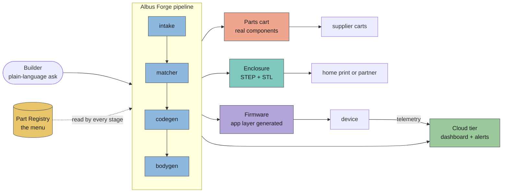
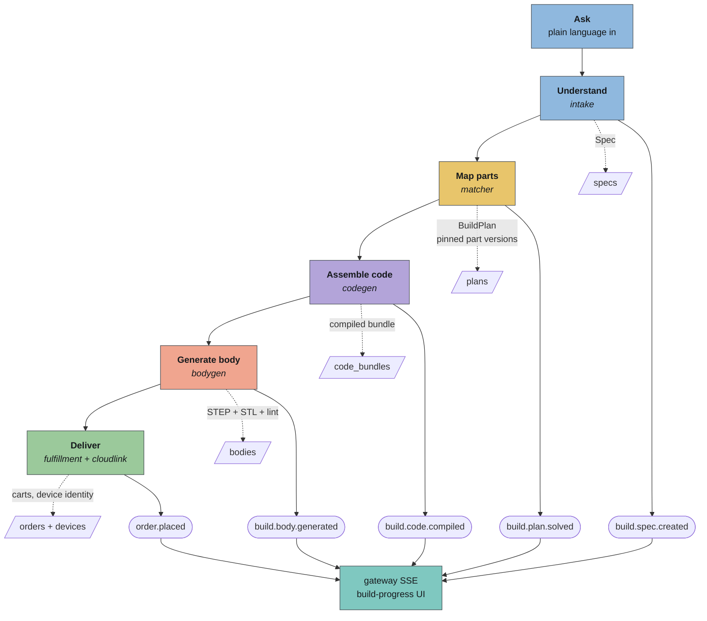
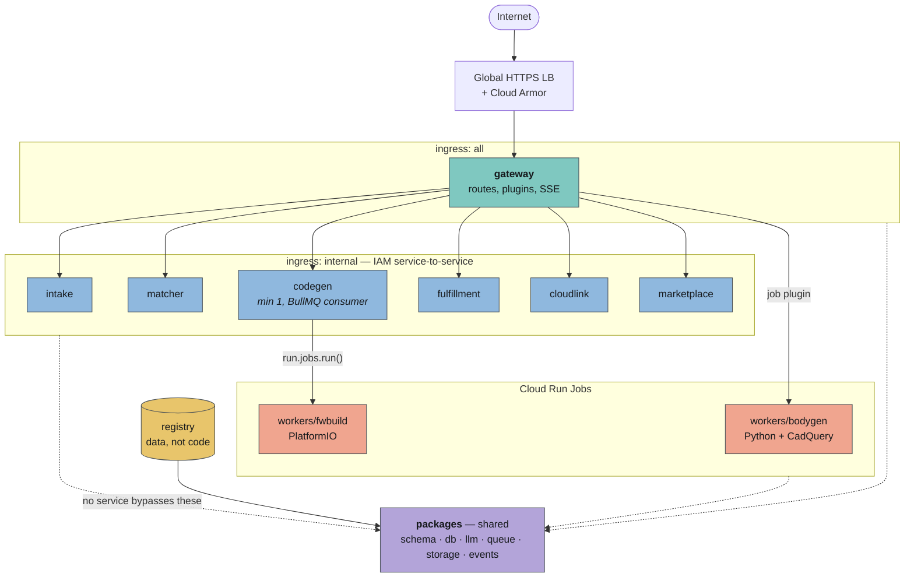
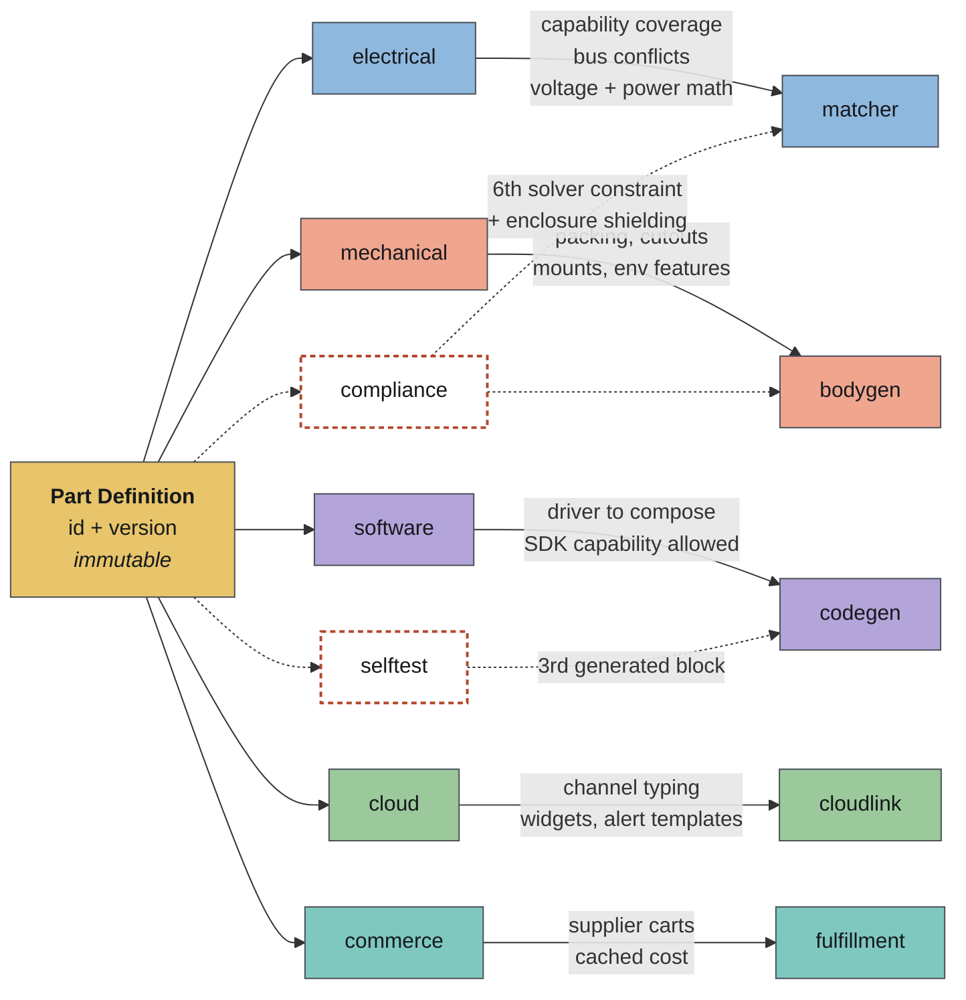
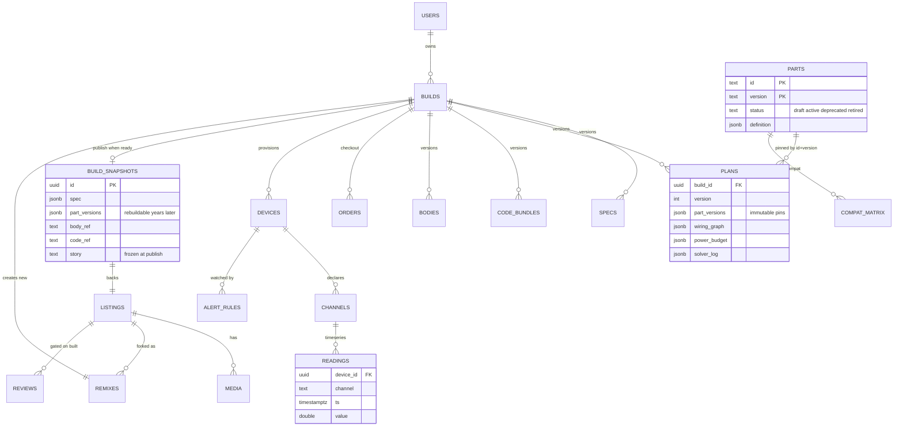
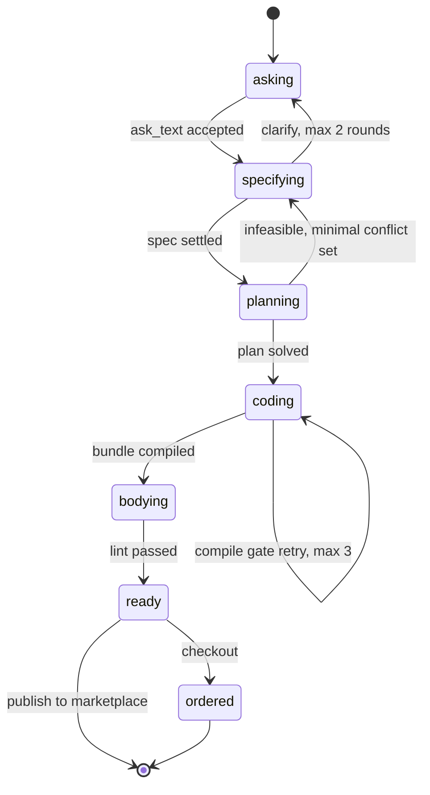
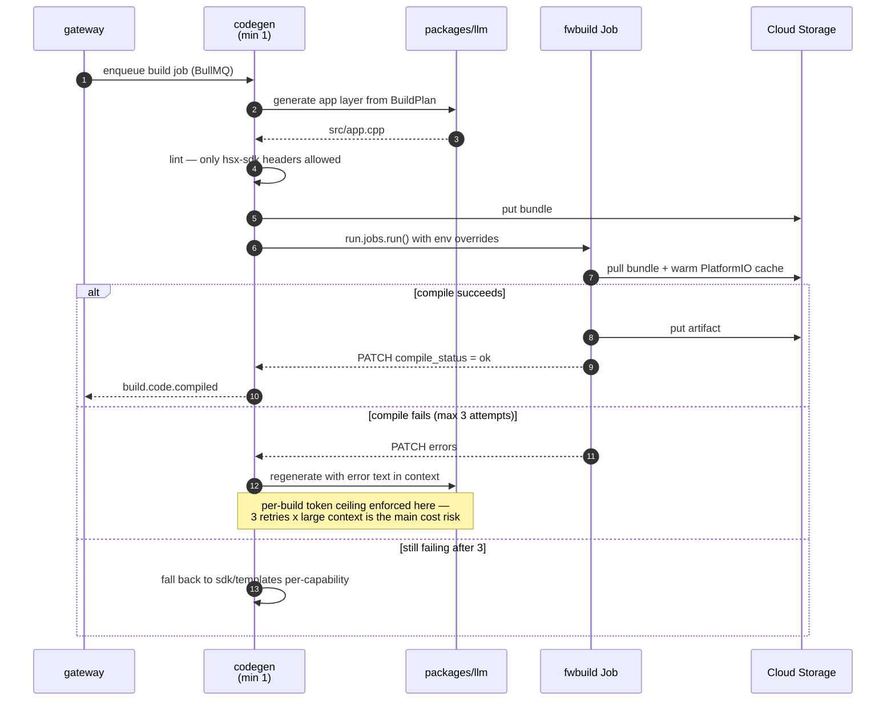
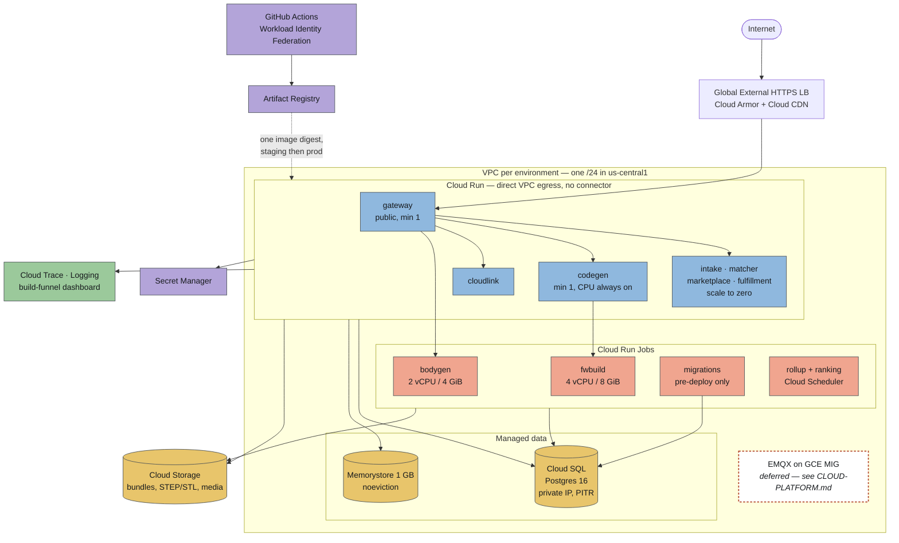

# Albus Forge — Architecture

**Status:** draft, pre-M0. Derived from the backend spec v1.0, the GCP build plan v1.0 (decisions dated 2026-08-10), and the investor deck v1.

One question in. Cart, enclosure, firmware, dashboard out.

> **Companion document:** [`CLOUD-PLATFORM.md`](CLOUD-PLATFORM.md) specifies the cloud tier end to end —
> transport, ingestion, storage tiering, the UI derivation, and the three-tier intelligence layer.
> The source spec covers that surface in two sentences while the business model rests ~90% of revenue
> on it, so it is given its own document rather than a subsection. §7.6 and §11.3 below summarize it.

---

## 1. System context

A plain-language question becomes four artifacts:

1. **A parts cart** — real, purchasable components drawn from a curated registry.
2. **A 3D-printable enclosure** — generated around those exact parts.
3. **Working firmware** — scaffold and drivers are pre-written; only the app layer is generated.
4. **An optional cloud tier** — dashboard, alerts, and (as pitched) fleet intelligence.



### 1.1 The core invariant

> One data object — the **Part Definition** — threads through every service. No service may hard-code knowledge about a specific part. Everything reads the registry.

Every design argument downstream traces back to this rule. It is what makes the solver deterministic, the app layer part-agnostic, the enclosure parametric, and a marketplace snapshot rebuildable years later. Violating it anywhere collapses the rest.

### 1.2 Scope markers

- `[MVP]` — in scope for the first build.
- `[LATER]` — ships as an interface only, stubbed.

The spec is written to be handed to a coding agent, so the boundary matters more than usual: **a stub that isn't obviously a stub becomes a silent gap.** Every `[LATER]` surface must fail loudly or be visibly inert.

---

## 2. The pipeline

Six stages. (The deck says five — it folds *Ask* into *Understand* and drops *Deliver*. Cosmetic, but pick one before anything external quotes it. This document uses six.)



Each stage is a separate service, communicates over Redis streams, and emits a pipeline event the gateway relays over SSE for the build-progress UI.

---

## 3. Services and repository layout

```
albusforge/
├── apps/
│   ├── gateway/        Fastify BFF: session-authenticated routes, plugins and SSE
│   ├── intake/         ask → Spec: extract, clarify, scope-filter, prompts/
│   ├── matcher/        Spec → BuildPlan: solver, power, rank, explain
│   ├── codegen/        BuildPlan → firmware: scaffold, applayer, edits, compilegate
│   ├── fulfillment/    BOM → supplier carts; STL → print partner
│   ├── cloudlink/      standalone device-authenticated ingest (merged); separate edge backend
│   ├── ask/            bounded single-sensor queries and small-model intent (merged; rollout tracked below)
│   └── marketplace/    listings, snapshots, remix, media, reviews, payouts
├── workers/
│   ├── bodygen/        Python + CadQuery: layout, shell, flags, lint, export, qr
│   └── fwbuild/        Dockerfile + entry.sh — code bundle ref in, artifact or errors out
├── packages/
│   ├── schema/         SINGLE SOURCE OF TRUTH: part, spec, plan, snapshot, events
│   ├── db/             Drizzle schema + migrations for ALL services
│   ├── llm/ queue/ storage/ events/ config/
├── registry/           THE MENU — parts/, connectors/, schemas/, scripts/
├── sdk/                hsx-rt, hsx-sdk, drivers/*, templates/app-esp32s3
├── e2e/                golden-build tests
└── docs/adr/
```



Structural rules worth stating explicitly:

- **Prompts are versioned files on disk** (`extract.v1.md`, `clarify.v1.md`), never string literals in code.
- **`packages/db` owns every migration.** No service migrates its own tables, and migrations run only in the pre-deploy Job — two Cloud Run instances booting concurrently would otherwise race.
- **`policy.ts` lives in intake but is imported by marketplace**, so scope refusals and listing safety classes use one set of categories.
- Each app carries fixture-driven goldens: intake's are asks → expected specs; bodygen's are plan fixtures → dimension assertions.

---

## 4. The Part Definition

Defined in `packages/schema/src/part.ts` as a zod schema, exported as JSON Schema for the registry validator. **A part is unpublishable unless all blocks validate.**

```jsonc
{
  "id": "P-002", "version": "1.0.0",
  "name": "DS18B20 Waterproof Temperature Probe",
  "category": "physical",        // visual|physical|location|communication|motion|energy
  "status": "active",            // draft|active|deprecated|retired
  "successor": null,

  "electrical": {
    "interface": "1-wire",       // i2c|spi|uart|1-wire|pwm|adc|gpio
    "connector": "hsx-3pin-v1",
    "voltage_range": [3.0, 5.5],
    "current_draw_ma": { "idle": 0.001, "active": 1.5 },
    "requires": ["gpio.digital"], "conflicts": [], "i2c_address": null
  },
  "mechanical": {
    "footprint_file": "footprint.step",
    "bounding_mm": [6, 6, 50],
    "mount": { "type": "cable-gland", "d_mm": 6.2 },
    "exposure": "probe-external", // none|vent|window|probe-external
    "environment_flags": ["waterproof", "temp:-55..125C"]
  },
  "software": {
    "driver_pkg": "hsx-driver-ds18b20", "driver_version": "1.0.0",
    "sdk_module": "sensors/temperature",
    "capabilities": ["read.temperature_c"], "min_runtime": ">=0.1.0"
  },
  "cloud": {
    "telemetry_schema": "temperature.v1",
    "default_widgets": ["line-chart"],
    "alert_templates": ["out_of_range"]
  },
  "commerce": {
    "suppliers": [{ "vendor": "adafruit", "sku": "381", "url": "…" }],
    "unit_cost_usd": 9.95
  }
}
```

Each block has exactly one consumer, which is why the invariant holds:

| Block | Consumer | What it decides |
| --- | --- | --- |
| `electrical` | matcher | capability coverage, bus conflicts, voltage windows, power math |
| `mechanical` | bodygen | packing, cutouts, mounts, environment features |
| `software` | codegen | which driver to compose, which SDK capability the app layer may call |
| `cloud` | cloudlink | channel typing, dashboard widgets, alert templates |
| `commerce` | fulfillment | supplier carts, cached cost |



> Solid edges exist today. **Dashed blocks are promised on slides and absent from the schema** — see §4.2.

### 4.1 The MVP registry — exactly twelve parts

`P-001` BME280 · `P-002` DS18B20 · `P-004` MPU-6050 · `P-005` soil probe · `V-004` HC-SR04 · `V-005` BH1750 · `L-003` HC-SR501 PIR · `C-001` ESP32-S3 · `M-001` SG90 servo · `E-001` 18650 pack · `E-004` TP4056 · `E-005` USB-C supply

ESP32-S3 is the only brain in MVP. The set is chosen to cover exactly the three golden builds: **fridge monitor, presence alert, plant waterer.**

### 4.2 Blocks the deck requires that the schema lacks

These are commitments already made on slides with no field behind them:

| Missing | Why it's needed |
| --- | --- |
| `compliance` | modular approval, radio bands, vetted antenna, SDoC scope, mains capability (§9) |
| `longevity_until` | vendor part-longevity date — what makes a pinned version safe to promise |
| `cert_status` | `inherited \| pending \| none` — treated as a guarantee stamp |
| `selftest` | per-capability power-on self-test and health codes (§10) |
| `price_tiers` | replaces scalar `unit_cost_usd`; pricing is quoted at qty 1–5, 10–50, 100–500 |
| `alternatives` | off-the-shelf products that already solve this, for honest routing (§11.2) |

The slides claim four guarantee stamps (wiring map, print footprint, driver + SDK, cloud service); the strategy appendix adds two more (certification status, vendor longevity). **Six stamps, four fields.** Settle the canonical count before it appears on a slide again.

---

## 5. Data model

Six schemas in one Postgres 16 cluster: `users`, `registry`, `builds`, `orders`, `market`, `cloud`.

```sql
-- builds
builds(id, user_id, status, ask_text, created_at, updated_at)
  status: asking|specifying|planning|coding|bodying|ready|ordered
specs(build_id, version, data, confidence, open_questions)
plans(build_id, version, part_versions, wiring_graph, power_budget, bom, solver_log)
code_bundles(build_id, version, storage_ref, compile_status, compile_log)
bodies(build_id, version, step_ref, stl_refs, lint_report, serial)

-- registry (loaded from /registry by scripts/load.ts)
parts(id, version, status, definition, PK(id, version))
compat_matrix(driver_pkg, driver_ver, runtime_ver, brain_id, status)

-- orders
orders(id, build_id, kind /*parts|print|bundle*/, status, vendor_refs, total)

-- market
build_snapshots(id, project_build_id, spec, part_versions, body_ref, code_ref, pipeline_versions,
                story)   -- as confirmed at publish; never the chat transcript (PORTAL.md §3)
listings(id, snapshot_id, creator_id, title, ask_quote, story, tags[],
         hero_media_id, parts_cost_cached, difficulty, status, safety_class)
media(id, listing_id, kind, original_ref, variants, verified_build)
remixes(id, listing_id, snapshot_id, new_build_id, user_id, order_id, outcome)
reviews(id, listing_id, user_id, rating, body, verified_built)

-- cloud
devices(id, build_id, cert_fingerprint, claimed_at)
channels(device_id, name, schema_id)
readings(device_id, channel, ts, value)
alert_rules(id, device_id, channel, rule, notify)
```



Six schemas, one cluster: `users`, `registry`, `builds`, `orders`, `market`, `cloud`.

A build walks a single status machine, and each transition is the event the SSE stream relays:



### 5.1 Two rules that bind the whole system

1. **Part versions are immutable.** Plans pin `{part_id, version}` pairs forever. This is what makes a marketplace snapshot rebuildable years later.
2. **Every service writes pipeline events to Redis streams** — `build.spec.created`, `build.plan.solved`, `build.code.compiled`, `build.body.generated`, `order.placed`, `remix.created`, `remix.built`. The gateway relays them over SSE.

### 5.2 Storage decisions

- Cloud SQL, private IP only, PITR on, 7-day backups. Prod `db-custom-2-7680`, staging `db-g1-small`.
- `readings` uses **native Postgres declarative partitioning**, not TimescaleDB (decided 2026-08-10). All timeseries access is confined to `packages/db` — no raw SQL in services — so the decision stays reversible.
- Revisit above ~50M rows/month. Note that one advertised tenant (2.1M readings/day ≈ 63M rows/month) already exceeds this design point.

---

## 6. Gateway API contract

All routes under `/v1`, zod-validated, cookie session auth (6-digit email code, sessions in Postgres — [ADR 0008](adr/0008-sign-in-by-email-code.md), replacing Lucia + magic link). **Anonymous builds are allowed until checkout.** Error shape everywhere: `{ error: { code, message, details? } }`.

```
POST   /v1/builds                  { ask_text } → { build_id, status }
GET    /v1/builds/:id              full state (spec, plan, refs)
GET    /v1/builds/:id/events       SSE stage progress
PATCH  /v1/builds/:id/spec         { answers | edits } → updated spec, re-triggers pipeline
POST   /v1/builds/:id/plan         solve, idempotent per spec version
GET    /v1/builds/:id/code         presigned bundle + file tree summary
POST   /v1/builds/:id/code/edits   { instruction } → new version, compile-gated
GET    /v1/builds/:id/body         presigned STEP/STLs + lint report
POST   /v1/builds/:id/checkout     { fulfillment: home_print|full_ship, address? }
GET    /v1/parts?category=&q=      registry browse (active parts)
GET    /v1/parts/:id               part page, all blocks

# portal additions — PORTAL.md §3
POST   /v1/auth/code               { email } → 204
POST   /v1/auth/verify             { email, code } → Me = { user, tenant, tenants } + session cookie
POST   /v1/auth/signout            → 204
GET    /v1/me                      → Me = { user, tenant, tenants } | 401
PUT    /v1/me/active-tenant        { tenant_id } → 204, membership checked
GET    /v1/builds?status=          tenant's builds + display_status
GET    /v1/builds/:id/messages     chat transcript
POST   /v1/builds/:id/messages     { text } → 202, reply over events
GET    /v1/showcase                curated public live cards
GET    /v1/usage                   current UTC month: recorded model calls/costs and accepted readings/payload bytes; physical storage not measured

GET    /v1/listings?query=&tags=&sort=trending|built
GET    /v1/listings/:id            listing + snapshot summary + remix tree
POST   /v1/listings                { build_id, title, story, tags }
POST   /v1/listings/:id/remix      → { new_build_id, resolve_diff }
POST   /v1/listings/:id/reviews    403 unless verified_built
POST   /v1/media/uploads           { listing_id, content_type } → presigned PUT

POST   /v1/devices/claim           { build_id, claim_code } → device credentials
GET    /v1/devices/:id/dashboard   widget config + recent readings
PUT    /v1/devices/:id/alerts      { rules[] }
POST   /v1/devices/:id/ask         { text } → answer; /v1/ask with device bound — PORTAL.md §3
```

The web portal is a client of this contract and adds no API of its own. Its routes, the screens that read each endpoint, and how anonymous builds are claimed are in [`PORTAL.md`](PORTAL.md).

**Browser acceptance:** `apps/web/e2e` runs production Next.js and the bundled gateway against disposable PostgreSQL with the normal migrations/app role. The committed Playwright journey covers real email-code/session/anonymous-claim behavior, project resume, Usage, seeded telemetry history, cross-tenant refusal and sign-out. Email delivery uses the native local log adapter captured in memory; deterministic intake replaces provider generation only. A scoped `ui-browser` CI job runs the harness. Deployment, external email, Ask-provider and hardware acceptance remain separate; commands and precise fixture boundaries are in [`UI-BROWSER-ACCEPTANCE.md`](UI-BROWSER-ACCEPTANCE.md).

**Public guides implemented:** `/docs` is a server-rendered guide with accessible in-page navigation for the build conversation, preparation for flashing, telemetry semantics and troubleshooting. `/security` describes code-backed session, tenant-read and ingestion controls, separately from pending production verification and policy commitments. These pages make no API calls; guided flashing, production onboarding, signed OTA and approved legal/pricing copy remain separate work. Scope and evidence are recorded in [`PUBLIC-GUIDES.md`](PUBLIC-GUIDES.md).

Projects, Usage and device telemetry now have segment-specific loading and recovery states; project/device 404s return opaque missing-resource views with list navigation. Recovery focuses a safe heading and uses Next’s `retry()` to refetch, while the existing session redirects, gateway authorization and no-store transport remain unchanged. See [`UI-PAGE-STATES.md`](UI-PAGE-STATES.md) for the state boundaries and browser evidence.

**Project workspace UI:** the authenticated projects list opens a build overview backed by `BuildDetail`, with stored spec/version, capability matches, server display state and a link to the existing transcript/reply flow. `SpecPanel` derives its defensive draft display from shared `Spec` fields, including capabilities, assumptions and open questions. Candidate matches remain distinct from supplied ready summaries. Ready-card actions use a memoized server session outcome: open the current project when signed in, otherwise preserve its encoded destination through signup and anonymous-build claim. Session resolution streams behind the ready card’s own Suspense boundary; the public hero and chat do not wait for authentication, and failed session lookups log once per request. Generated artifacts and order tracking remain explicit unavailable states until their APIs land; fixture enclosure assets are not shown as project outputs. See [`PROJECT-WORKSPACE.md`](PROJECT-WORKSPACE.md) for delivered behavior, validation and remaining B3–B8 work.

**Build-event authorization snapshots:** each gateway SSE poll resolves the session and tenant membership, checks build ownership, and reads state/messages inside one short PostgreSQL `REPEATABLE READ READ ONLY` transaction. It commits before writing events or waiting for socket backpressure. An admitted batch may finish after access is revoked; messages committed after that snapshot cannot enter it, and the next poll closes after revocation, expiry, membership removal or ownership loss. The poll owns its lease explicitly from BEGIN through bounded cleanup, handles checked-out socket errors, and discards uncertain connections; no stream-lifetime transaction or extra pool is introduced. See [`BUILD-EVENT-SECURITY.md`](BUILD-EVENT-SECURITY.md).

**Email-code recovery UI:** signup/signin support changing email without dropping the guarded destination, local 30-second resend pacing, and separately tracked request/verify cooldowns derived from sanitized backend `Retry-After`. Local pacing does not block verification or sending to an edited address; backend limits persist through email changes because they can be per IP. Wrong/expired/exhausted codes remain intentionally indistinguishable. Delivery/network failures preserve input and offer retry; signup success no longer asserts a specific saved build. See [`AUTH-RECOVERY-UI.md`](AUTH-RECOVERY-UI.md).

### 6.1 Edge and service-to-service auth

- Global External HTTPS LB → serverless NEG → gateway, with Cloud Armor rate-limit rules. The in-app rate-limit plugin stays as defense in depth.
- Cloud CDN in front of the media bucket.
- **Gateway is the only service with `ingress: all`.** Everything else is internal, each app with its own service account; gateway's SA holds `run.invoker` on the rest.

### 6.2 Surfaces the deck shows that have no route

Tenant-scoped fleet reads (sensor counts, readings/day, per-device series vs baseline) · a conversational "ask anything about your fleet" endpoint that computes and can trigger a work order · tenant/membership/role/audit-log management · subscription and billing-ledger reads · per-tenant app hosting at a subdomain. See §8 and §13. Recorded workspace consumption is implemented by `GET /v1/usage`; see [`USAGE-UI.md`](USAGE-UI.md).

---

## 7. Stage internals

### 7.1 Intake — ask to spec

Extraction is **constrained to a fixed template**. JSON mode, zod parse, one repair retry. The model never emits free-form design.

```ts
{
  sense: { what: string[], accuracy?: string, interval_s?: number },
  act?: { what: string[] },
  environment: { location: string, flags: string[] },
  connect: { transport: "wifi"|"ble"|"lora"|"none", experience: string[] },
  power: { source: "battery"|"solar"|"usb"|"unknown", target_life_days?: number },
  experience: { alerts?: string[], dashboard?: boolean }
}
```

Three behaviors:

- **Clarification has a test.** A question is asked only if the unfilled field changes the solver outcome, *proven by solving with both candidate values*. Max two rounds, then defaults with visible assumptions. This is the most load-bearing idea in the stage: it makes question count a function of solver sensitivity rather than model chattiness, and it is directly unit-testable.
- **Scope filtering runs before extraction.** Deny list: weapons and harm-capable devices, mains voltage, medical monitoring claims, covert tracking of people. Refusals return `{code:"OUT_OF_SCOPE", category}`.

### 7.2 Matcher — the deterministic core

**Five hard constraints, no LLM:**

1. **Capability coverage** — every `spec.sense`/`act` item maps to at least one part capability.
2. **Brain compatibility** — all `electrical.requires` satisfied; I²C addresses unique; `conflicts` respected.
3. **Electrical fit** — voltage windows overlap across the assembly; connector standards match.
4. **Power** — `usable_battery_capacity_mah / weighted_avg_source_current_ma / 24 ≥ target_life_days`, duty cycle derived from `interval_s` and measured active durations. Capacity accounts for cutoff and reserve; current includes conversion losses and board overhead.
5. **Compat matrix** — the `(driver_version, runtime, brain)` triple must be green.

Infeasible returns a **minimal conflict set** to `explain.ts`, which renders it as a human trade-off question rather than a failure.

`solver.ts` is pure and unit-tested. `rank.ts` chooses among *already-feasible* assignments — **nothing a model returns can produce an infeasible build.** This milestone needs no cloud work at all and holds the highest-value tests in the project; it is the one not to let get thin.

A **sixth constraint is implied by the compliance block** (§9): generation restricted to configurations that preserve modular approval.

### 7.3 Codegen and the compile gate

Invariants:

- Generated app code may import **only `hsx-sdk` headers**. A lint step fails the bundle if raw driver headers appear.
- **Compile gate:** enqueue `fwbuild`; on failure, regenerate with the error text in context, max three attempts, then fall back to the per-capability template in `sdk/templates`.
- Output bundle is a PlatformIO project — template + generated `src/app.cpp` + pinned lib deps — in object storage, referenced by `code_bundles`.

Execution shape on Cloud Run (Jobs are pull-free and must be triggered):



`codegen` is the only `min-instances=1` worker. `bodygen` is triggered the same way from a small consumer inside the gateway's job plugin — one always-warm worker, not one per queue.

**Cost risk:** three compile-gate retries × a large context per build is the dominant LLM spend. Mitigated by a per-build token ceiling in `packages/llm`, with budget alerts live from M2 rather than after the first spike.

**Missing:** self-test is a third generated block (§10) and nothing in codegen produces it today.

### 7.4 Bodygen — enclosure generation

**Printability is a gate, not a suggestion.** Output must pass `lint.py`: minimum wall 1.6 mm, overhang ≤ 55° or supported, part clearance from the tolerance table. QR of the build serial is embedded on the inner lid.

Environment flags become real geometry:

| Flag | Feature |
| --- | --- |
| `fridge` | condensation drains + food-safe filament note |
| `battery` | tool-free door |
| `exposure:probe-external` | cable gland sized from `mount.d_mm` |
| `exposure:vent` | vent grid over the sensor |

Infra: Cloud Run Job at 2 vCPU / 4 GiB. **The CadQuery image is multi-GB** — pin a prebuilt CadQuery base and layer only project code on top, or every deploy is slow. Budget roughly a day on the image alone.

**The fit loop is the contested piece.** The spec seeds the tolerance table with generic FDM defaults and marks the feedback loop `[LATER]`. The deck calls it the moat — every print feeds tolerances back, fit compounds with volume — and names first-print fit ≥ 90% as the riskiest assumption, tested first. If the deck is right, the feedback path, its data model, and a builder-supplied outcome signal are **MVP**, and the tolerance table is a versioned, per-printer-profile data asset rather than a config file.

### 7.5 SDK and driver management

```
hsx-rt          scheduler, wifi/provisioning, OTA stub, logging
  └─ drivers/*    one package per part, declares min_runtime
      └─ hsx-sdk    capability API: sensors/, motion/, cloud/, power/
          └─ generated app   hsx::sensors::temperature().read_c()
```

App code is part-agnostic by construction: swapping a DS18B20 for a BME280 changes the plan and the driver pin, not the app layer.

Rules: SemVer at every boundary · a CI matrix job rebuilds every driver against the current runtime and **writes `compat_matrix`** (generated, never hand-maintained) · `registry/scripts/validate.ts` checks every `part.json` and confirms the footprint file exists · channels are `stable` (default pin) and `next` (CI-only in MVP) · **old builds never auto-upgrade** — upgrades are explicit build actions producing a visible diff · `status:"deprecated"` + `successor` stops matcher selection and makes the remix engine propose the successor as a diff.

### 7.6 Device ingest — HTTPS first

**Sensor cloud rollout, 2026-09-13:** ingestion/storage/read APIs, telemetry monitor, bounded Ask service, authenticated gateway/portal integration and sensor infrastructure are merged. Staging infrastructure has been provisioned and converged; gateway/schema, intake, cloudlink, Ask, processing jobs and web releases at `03f40c1` succeeded. Deployed simulator ingestion, model-free Ask with zero-cost audit, post-ingest rollup, bounded HTTP load and polling-dashboard/chat browser checks passed. The durable quota SQL audit/cleanup and one real-provider Haiku call with attributed usage also passed. Staging model calls and schedules are now enabled; automatic execution observation and pipeline fixture cleanup remain pending. Backend telemetry SSE remains unavailable. Production infrastructure apply is underway after a fresh reviewed plan; production model/schedule settings remain disabled and no production acceptance is claimed. [SENSOR-CLOUD-ROLLOUT.md](SENSOR-CLOUD-ROLLOUT.md) tracks ownership, observed deployed resources, dependency order and acceptance evidence. The initial Ask slice is a user-selected sensor/channel/window with a small hosted model interpreting bounded questions and deterministic code supplying the numerical answer. It does not implement the later cross-sensor agent, anomaly detectors or write tools.


The wire envelope is the transport contract: devices upload authenticated `POST /ingest/v1` batches, and the server acknowledges only after durable storage. MQTT and its broker/bridge remain deferred to M8; see [`CLOUD-PLATFORM.md`](CLOUD-PLATFORM.md) §3.

**M6a implementation (merged PR #32, 2026-09-13):** `apps/cloudlink` is the standalone stateless ingest service, with its own Dockerfile and CI Docker smoke job. It authenticates devices, validates shared envelope/channel schemas, normalizes timestamps and atomically stores raw readings, latest values, status, deduplication receipts and usage in PostgreSQL. Gateway has no ingest code or route. A local provisioning CLI and simulator exercise retries without hardware.

Per Sukrit’s confirmed decision and [ADR 0003](adr/0003-edge-lb-only-ingress-and-separate-ingest-backend.md), production uses cloudlink’s own Cloud Run service, NEG/backend and Authorization-keyed Armor policy behind `/ingest/*`, with LB-only ingress. The runtime uses a small direct PostgreSQL pool over private VPC networking and bounded admission; production needs a warm instance floor and a maximum derived from the shared Cloud SQL connection budget. The merged sensor Terraform implements this boundary; staging provisioning and production rollout gates are recorded in the rollout ledger. No external IoT/telemetry application participates in ingestion.

M6b (merged PR #40) adds daily PostgreSQL partitions, transactionally queued minute/hour rollups and guarded retention; see [`TELEMETRY-STORAGE.md`](TELEMETRY-STORAGE.md) for the job/rollout contract. Production BuildPlan provisioning, event delivery, dashboards and alerts remain pending. [`TELEMETRY-INGEST.md`](TELEMETRY-INGEST.md) records the service/env contract, scaling budget, verification and remaining work.

M6c read API (merged PR #44) adds gateway `/v1/telemetry/devices` list/detail/latest/history endpoints. Existing PostgreSQL sessions and current tenant membership authorize each read in a consistent read-only transaction. Queries bind tenant identity server-side, bound raw/rollup windows and response sizes, expose dirty-rollup freshness and explicitly report expired history. Sign-in issuance is merged; the richer provisioned dashboard contract and SSE remain pending; see [`TELEMETRY-READ-API.md`](TELEMETRY-READ-API.md).

The portal now uses those read endpoints for a minimal stored-telemetry monitor at `/live` and `/live/:deviceId`: session-bound fleet pagination, latest provisioned channels/health and selectable bounded UTC history. Timestamp-positioned dots and sample tables preserve gaps, zero values and exact sequence identity; expiry, excessive point counts and pending rollups are explicit. This is refresh-based UI, without fabricated build metadata, Ask/rules or production SSE. See [`TELEMETRY-UI.md`](TELEMETRY-UI.md).

### 7.7 Marketplace

- **Publish** requires a build in `ready` state (compiled and linted). Creates an immutable `build_snapshot`, then a listing. The story is written and confirmed at publish time and stored on the snapshot; the private chat transcript is never readable through a listing (PORTAL.md §3). MVP sets `status:"live"` with no review queue but still sets `safety_class` from the same `policy.ts` categories intake uses.
- **Media** — presigned upload → EXIF strip with sharp → thumb/card/hero variants → storage proxy route. Moderation model and QR verified-build detection are `[LATER]`, schema fields present now.
- **Remix** — copy snapshot → new build in `planning` → matcher runs in **pin-preserving mode**, keeping pinned versions unless retired or unavailable and proposing successors as a diff.
- **Reviews** — gated on a `remixes` row with `outcome:"built"` for that user.
- **Ranking** — `sort=built` is remix→built conversion from a nightly Cloud Scheduler job; `trending` is a time-decayed remix count.

The deck adds public build/remix counts and an **earn** promise: remixes route through our rails and the original builder is credited. That is a payout obligation against a `payouts.ts` marked `[LATER], ledger only` — a credit promised on a slide needs at least ledger entries from launch. The compounding argument ("every recipe shortens the next builder's first weekend") makes remix→built conversion the metric to instrument early.

---

## 8. Tenancy and provisioning — the largest gap

**The spec has no tenant concept at all.** Everything hangs off `build_id`; the deck hangs everything off a tenant.

- **Provisioning at order time.** The deck ships devices already knowing their cloud identity — keys, endpoint and schema flashed at order time, with `tenant_id = h(order)` joining a customer's devices into one tenant automatically. The spec does the opposite: `POST /v1/devices/claim` issues credentials after the fact. Pre-provisioning means credentials are minted during checkout and baked into the code bundle — which changes both the orders flow and codegen's output. [ADR 0009](adr/0009-tenant-created-at-sign-up.md) keeps order-time provisioning but **takes `tenant_id` from the build, not from `h(order)`**: the tenant exists from sign-up, and checkout requires a session, so every order already has one. `/v1/devices/claim` likewise takes the tenant from the session.
- **Multi-user tenants.** The platform slide shows twelve members and three roles (ops manager as admin; maintenance crew with alerts + acknowledge; customer auditor read-only), plus SSO, an audit log and per-tenant keys. The spec has `users`, session cookies, and anonymous builds. No organisation, membership, role, audit table, or per-tenant key material. This is a schema addition, an authorization layer across **every** route, and an SSO integration.
- **Per-tenant app hosting** at `acme-plant.albusforge.ai` — subdomain routing and per-tenant isolation, against an LB config that assumes one public hostname.

> Deciding tenant-vs-build as the root is cheap now and expensive across seven services later. This is the highest-regret item on the open list.

---

## 9. Compliance and longevity

The stated moat is **not** any generated artifact — schematic AI, PCB assembly, OTA fleet management and snap-together kits are all named as commodities. The defensible asset is the **Part Registry with guarantee stamps**, plus **certification status** and a **vendor longevity date** — neither of which exists in the schema.

What's promised: certification inheritance (pre-certified modules cut FCC cost 60–80%, $3–10K vs $18–58K+ for custom RF; every radio carries full modular approval, SDoC scope auto-generated) · longevity stamps (Espressif's 12-year commitment, stamped per part) · low-voltage DC only on the base platform, no mains switching without a certified relay module · Matter on flagship SKUs only (~$30K+), with certification-by-similarity for derivatives.

The implied block:

```jsonc
"compliance": {
  "modular_approval": { "fcc_id": "…", "scope": "…",
                        "voids_on": ["antenna_change", "shielded_enclosure"] },
  "radio": { "bands": [...], "antenna": "integrated|external:vetted" },
  "sdoc_tests": ["…"],
  "longevity_until": "2037-01",
  "cert_status": "inherited|pending|none",
  "mains_capable": false
}
```

This makes **bodygen a compliance surface, not just a geometry one.** Modular approval is voided by antenna changes, enclosure shielding, or co-located radios — precisely the variations a generator produces. Nothing in bodygen today knows what a radio is.

---

## 10. Trust: self-test, OTA and the patch pledge

- **Power-on self-test.** 68% of electronics returns are "no fault found." Every generated firmware ships a power-on self-test plus health codes, escalating diagnostics → AI chat on self-test telemetry → human, with community forums holding RMA authority. Concretely this is a **third generated block**: a `selftest` routine per part capability, a health-code vocabulary in `hsx-rt`, and self-test telemetry as a cloud channel the assistant can read. Committed for day one of Stage 1; absent from the spec.
- **Security patch pledge.** Free critical patches for life, automatic OTA, never paywalled — stated as EU CRA-ready. `hsx-rt` currently lists "OTA stub." **Signed OTA with secure boot, staged rollouts and a fleet-wide patch path is a substantial subsystem, arguably its own milestone**, and the deck makes it a launch-day promise.
- **The monoculture counter-risk.** Templated firmware means one patch protects the fleet and one vulnerability compromises it. Mitigations named: signed OTA, secure boot, staged rollouts, external audits, bug bounty. The pledge is also an unfunded obligation growing with every unit sold — reserve accrual per unit is the proposed answer.

---

## 11. Commerce and the intelligence layer

### 11.1 Why the supplier adapters aren't a business

Electronics referral rates run 2–5%, and Adafruit operates no affiliate programme at all. The strategy verdict is blunt: referrals are a rounding error. `suppliers/adafruit.ts` and `sparkfun.ts` implement exactly the model the strategy rejects. Three lines replace it:

| Line | Implication |
| --- | --- |
| Curated first-party kits | ~30% channel margin instead of ~3% referral — but implies inventory, SKUs, pick-pack and returns, the opposite of the "zero inventory" claim |
| Consolidated PCBA upsell | "graduate to a custom board" — paid, human-reviewed, ~100+ units. A services product with a review queue, not an endpoint |
| Recurring cloud + OTA | usage-based freemium with a generous free tier, metering OTA data and event ingress |

Unit economics driving the consolidation pitch: qty 1–5 → $30–70/unit (setup and extended-part fees dominate; modular wins, no NRE) · qty 10–50 → $10–25/unit (the gray zone) · qty 100–500 → $8–15/unit (near true BOM; consolidated carrier board wins). Inputs: ~$2 per bare PCB, $0.0017 per solder joint, ~$3 per unique extended part — the last being the prototype cost driver.

**AI layout is explicitly not one-click:** a 2026 head-to-head produced 168 design-rule violations from AI layout versus zero from a professional. Consolidation is a paid, expert-reviewed service by design.

### 11.2 Honest routing

A stated product behavior: when a $25 commercial product already covers the need, **say so**, and keep the user for the build that doesn't exist yet. This is a new intake outcome alongside `OUT_OF_SCOPE` — call it `REDIRECT` — and it needs a catalogue of off-the-shelf alternatives to check against (the `alternatives` field, §4.2). Nothing in `scope-filter.ts` does this today.

### 11.3 The intelligence layer — where the revenue is

The spec's entire cloud intelligence surface is: dashboard config is the union of parts' `default_widgets`, and alerts are `out_of_range {min,max}` to email. **Roughly 90% of projected revenue depends on considerably more:**

| Capability | What's missing |
| --- | --- |
| Typed pipelines | Closest to shipping — `registry/schemas/` validation already does most of it |
| Learned baselines | Per-device model store, a fitting job, a notion of "normal" with a warm-up period. None of it is in the schema |
| Plain-language querying | Text-to-query over `readings` + tenant-scoped retrieval; answers shown are quantitative, so it must **compute**, not summarize |
| Data fusion | A connector story (weather, schedules, ERP) that appears in neither document |

"Work order sent to maintenance" means **outbound integrations and a write path** — a different risk class from read-only alerts.

> **Specified in [`CLOUD-PLATFORM.md`](CLOUD-PLATFORM.md) §7.** Two invariants carry it: the pipeline is *derived from the registry, never authored* (a device's channels, units, widgets and alert rules are known before the first packet, because the plan pinned the parts) — and **models propose queries and narrate results; they never compute them.** Every number shown to a user comes from SQL, with the model choosing the query and phrasing the answer. That is the same shape as the matcher: a deterministic core with the model confined to where judgment is genuinely needed, and it makes the layer testable as golden question → expected query → expected rows.
>
> Four tiers, split by *where judgment is needed*: **reflex** rules on-device (works offline, zero cost) · **statistics** on every rollup bucket — EWMA, seasonal profile, robust z over MAD, CUSUM drift — which is what actually *detects* anomalies · a **small model** (`claude-haiku-4-5`) invoked **only when a detector fires**, to classify and narrate · a **frontier model** (`claude-opus-5`) on demand for tool-loop querying, fusion and root-cause work.
>
> **Tier 1 gates tier 2, and that gating is the decision the unit economics rest on.** A small model run over every window of every sensor costs roughly $1/device/month in tokens — more than the margin on a per-sensor subscription — and produces two dozen paraphrases of "normal" per day. Gated on a detector, the same device makes a handful of model calls per week at well under $0.05/month, and loses nothing: **anomaly detection is statistics, not language.** What a model adds is naming the drift, judging whether it matters, and saying what to do about it.
>
> Tiers 0–2 are defined by what they do, not where they run — the same tool interface backs the device, the local hub and the cloud, which is what makes local-first a port rather than a rewrite (§11.4).

Advertised operating targets: 142 sensors · 2.1M readings/day · 99.97% uptime · <2 s ingest latency · 7 yr retention. None appear as SLOs anywhere, the alerting list is failure-oriented rather than SLO-oriented, and 2.1M readings/day alone exceeds the timeseries design point (§5.2).

### 11.4 The local hub

A Raspberry Pi 5 (8 GB, ~$80) running a quantized LLM, registered as part `C-004` — "the hub is just another part." Local fusion, on-device answers with no internet, offline rules keeping vents and pumps working, and a local web app at `greenhouse.local`.

**"Just another part" understates it by a wide margin:** a Linux hub is a different compile target, runtime and driver story (`hsx-rt` is an MCU runtime) · "same generated software" requires codegen to emit **two artifacts from one plan**, a second generator rather than a flag · local mesh (ESP-NOW/BLE) is not in the transport enum and needs addressing, pairing and a gateway role the single-device model has no vocabulary for.

This is simultaneously the strongest differentiator — it answers the compliance risk, the data-trust risk and the offline industrial case at once — and the least specified thing in either document. Decide explicitly whether it is post-MVP, or whether the MVP is **smaller than seven services** to make room for it.

---

## 12. Infrastructure

### 12.1 Stack

| Layer | Choice |
| --- | --- |
| API services | TypeScript, Node 20, Fastify, zod — one style everywhere |
| Monorepo | pnpm workspaces + turborepo |
| Database | PostgreSQL 16 via Drizzle, single cluster, schema per domain |
| Cache and queues | Redis 7, BullMQ — CAD and codegen run as queued jobs |
| Object storage | S3-compatible; MinIO in dev |
| LLM | Anthropic API behind a thin `packages/llm` wrapper; model name from env, never hard-coded |
| CAD | Python 3.12 + CadQuery, containerized, queue-invoked |
| Firmware | PlatformIO, ESP32-S3 only for MVP; compile gate in `workers/fwbuild` |
| Device ingest | MQTT (EMQX) → ingest → partitioned Postgres |
| Auth | ~~Lucia session cookies + magic link~~ — 6-digit email code, in-house sessions in Postgres ([ADR 0008](adr/0008-sign-in-by-email-code.md)); passkeys later |
| Web portal | Next.js App Router in `apps/web`, a client of the gateway only ([`PORTAL.md`](PORTAL.md)) |
| API style | REST + zod-to-openapi; one gateway, no GraphQL |
| Testing | vitest, supertest, testcontainers |

### 12.2 Service → GCP resource

Runtime is **Cloud Run services and jobs, no GKE**. Managed GCP wherever it exists; self-host EMQX only.

| Component | Resource |
| --- | --- |
| `apps/gateway` | Cloud Run, public, min instances 1 — SSE and cold-start UX |
| `intake`, `matcher`, `marketplace` | Cloud Run, internal ingress, scale to zero |
| `codegen` | Cloud Run worker, min 1, CPU always allocated — the always-on BullMQ consumer |
| `fulfillment` | Cloud Run internal; mock adapters for MVP |
| `cloudlink` | Standalone HTTPS ingest Cloud Run service (ADR 0003); small direct PostgreSQL pool, separate NEG/Armor, prod warm floor and connection-budgeted instance cap (§7.6). Terraform owned by infra; MQTT deferred |
| `workers/bodygen` | Cloud Run Job, 2 vCPU / 4 GiB, Python + CadQuery |
| `workers/fwbuild` | Cloud Run Job, 4 vCPU / 8 GiB, PlatformIO, cache warmed from GCS |
| Postgres 16 | Cloud SQL, private IP, direct VPC egress, no proxy sidecar |
| Redis 7 | Memorystore Basic 1 GB — **`maxmemory-policy=noeviction` or BullMQ corrupts** |
| S3 / MinIO | Cloud Storage with V4 signed URLs; MinIO stays for dev |
| EMQX | GCE e2-small MIG, TLS on 8883, static internal IP |
| Secrets | Secret Manager, mounted as env at deploy |
| Images | Artifact Registry |
| CI/CD | GitHub Actions + Workload Identity Federation, **no SA JSON keys** |
| IaC | Terraform in `infra/`, workspaces `staging` and `prod` |



**Local dev is untouched:** `docker-compose up` with postgres, redis, minio, emqx. GCP appears only in staging and prod, and every cloud dependency sits behind a `packages/*` adapter, so the dev and prod paths differ in one file rather than many.

### 12.3 Environments and CI/CD

| Env | Shape |
| --- | --- |
| dev | local only — `docker-compose up` + `pnpm seed`, mocked LLM fixtures |
| staging | auto-deploys on merge to `main`; mock supplier and print adapters |
| prod | manual promotion of the exact staging image digest |

One VPC per environment, one `/24` subnet in `us-central1`. **Direct VPC egress** preferred over a Serverless VPC connector — cheaper, no connector instances.

> **The rule that keeps prod honest:** CI builds one image per app, tags it with the commit SHA, deploys that digest to staging, and promotion re-points traffic at the same digest. **Never build twice.**

### 12.4 LLM access and cost accounting

`packages/llm` wraps the model API with retries, JSON mode and a cost log. Two viable paths, abstracted from day one behind `LLM_PROVIDER=anthropic|vertex` with the model id from `LLM_MODEL`:

- **Anthropic API directly** — key in Secret Manager. Simplest; use this.
- **Claude via Vertex AI Model Garden** — service-account auth, traffic stays in-project, spend lands on the GCP bill. Switch if procurement cares.

Every call writes to an `llm_calls` table plus a structured Cloud Logging entry, so spend is sliceable per pipeline stage. A per-build token ceiling lives in the same package.

Note: `llm_calls` is **internal spend attribution, not tenant billing.** Per-sensor metering (§13) is a separate, missing thing.

### 12.5 Observability and cost guardrails

- OpenTelemetry from every Fastify app into Cloud Trace, with `build_id` as a span attribute — a whole pipeline run reads as one trace across seven services.
- Structured JSON logs into Cloud Logging, with a log-based metric per pipeline event driving a **build-funnel dashboard**.
- Alerts on gateway 5xx rate, Cloud SQL CPU and connections, Memorystore memory, `fwbuild` job failure rate, daily LLM spend.
- Budget alerts at $150 / $300 / $500 on the prod project.

Rough monthly baseline, staging + prod, pre-traffic: Cloud SQL ~$50 · Memorystore ~$35 · EMQX VM ~$14 · always-on codegen worker ~$20 · load balancer ~$18 · storage/egress/logging ~$15 → **~$120–170/mo.** Cloud Run request cost is ~$0 at MVP volumes; LLM spend is separate and demand-driven.

### 12.6 Developer experience

One command should leave a browsable, finished build on the machine.

- `docker-compose up` brings up postgres, redis, minio, emqx and every app in watch mode.
- `pnpm seed` loads the registry, creates a demo user, and runs the fridge golden build end to end with mock adapters and a mocked LLM fixture — leaving a browsable `ready` build.
- Every app exposes `pnpm test` and `pnpm typecheck`; root `pnpm e2e` runs the golden-build test against compose.
- `.env.example` documents `DATABASE_URL`, `REDIS_URL`, `S3_*`, `ANTHROPIC_API_KEY`, `LLM_MODEL`, `MQTT_URL`, `EMAIL_ADAPTER`.

The mocked LLM fixture matters more than it looks: it is what makes the pipeline testable without spend and without nondeterminism. **Record it during M2 rather than retrofitting it.**

---

## 13. Business model and what it meters

| Line | Share |
| --- | --- |
| Per-sensor subscription — data ingested, stored, and LLM compute applied | ~90% of revenue |
| Routed-order take on hardware and 3D-print vendor orders | small |

**Nothing in the spec counts anything.** What's needed:

- A per-device, per-period **usage record**: readings ingested, bytes stored, LLM tokens/compute units applied, OTA bytes shipped.
- A **subscription and entitlement model**: plan, tier, free-tier caps, hard limits with alerts — explicitly **no cliffs** (Golioth/Blues-style freemium, never a free trial followed by a surprise enterprise quote).
- Billing integration. Payments are deferred entirely (`payouts.ts` is `[LATER]`, ledger only, no Stripe in MVP).

> MVP without billing is defensible. **MVP without metering is not** — unmetered usage is unrecoverable revenue.

Unresolved: the business-model slide makes per-sensor subscription primary; the discipline slide lists "no per-device fee on the base tier" as a hard no. These reconcile as *free base tier + paid fleet tier*, but that is never stated, and the two slides read as opposing claims.

---

**Usage visibility implementation (`web/usage-dashboard`):** gateway `GET /v1/usage` and the portal `/usage` page now expose the current UTC month of tenant-owned recorded model calls, separate cache/token counters, stored model-cost estimates and accepted sensor payload/readings. Shared `UsageSummary` uses exact decimal strings; the account controls link to the page. This does not measure physical storage or implement billing/plan entitlements, and sensor totals exclude deleted devices. See [`USAGE-UI.md`](USAGE-UI.md) for authorization, attribution, validation and remaining rollout work.

## 14. Guardrails — six deliberate no's

| No | Reason |
| --- | --- |
| No affiliate business | 2–5% margins can't carry a company — contradicts the supplier-adapter model |
| No per-device fee on the base tier | kills hobbyist adoption |
| No standalone EDU hardware | "explain the design" is a mode, not a SKU |
| No one-click fab-ready boards | every consolidation gets expert DFM review |
| No paywalled security patches | ever — charge for features, never safety |
| No owning fab or cloud infra | partner for PCBA and OTA; own the registry and the guarantee |

**The ecosystem wedge:** ESPHome + Home Assistant, 2M+ active installs, local-first, no per-device fee. Generating ESPHome-compatible firmware buys instant compatibility at zero certification or licensing cost. The claimed ground is one layer above the fixed-function $40 ESPHome Starter Kit: open-ended generation + productization + guarantee.

Contingencies: if the ecosystem ships native natural-language generation, the moat moves entirely to productization and guarantee · if margins prove rich, lean into commerce · if Matter certification gets cheap, accelerate certification.

**The last no collides with the plan.** The GCP plan builds the whole telemetry path first-party — EMQX, Pub/Sub bridge, partitioned readings, rollup and maintenance jobs. Golioth or Blues would replace most of M6. This is the single largest scope question between the two documents.

---

## 15. Validation — the falsifiable bet

| Test | Target |
| --- | --- |
| Fit | first-print fit ≥ 90% |
| Weekend | idea → gadget in one weekend |
| Menu | 25 parts cover the top 50 ideas |
| Demand | a demo that spreads itself |

**Stated riskiest assumption, tested first: generated print designs that fit real parts.**

> **The sequencing problem.** Bodygen is M5 — behind schema, database, registry, gateway, intake, matcher, SDK, four drivers, codegen and the compile gate, with the CadQuery image flagged as a day of work on its own. If first-print fit decides whether any of this is worth building, testing it after four milestones of infrastructure is expensive sequencing. A fit test doesn't need the pipeline: it needs footprints for a handful of parts, a parametric enclosure script, and a printer. **That is a spike, and it can run in parallel with M0.**

Early signals cited: text-to-printable-robots proven in research but never productized · the closest platform pivoted to enterprise, leaving builders unserved · AI hardware startups funded, each stopping at one slice · delivery rails already exist to plug into.

Adoption early-warning to instrument from day one: **if repeat-build within 90 days stays below 15%, the thesis is wrong.**

---

## 16. Milestones

**Brought forward alongside M2:** M6a telemetry ingestion is merged in PR #32, and partitioned storage/rollups/retention are merged in PR #40. It uses standalone `apps/cloudlink` and PostgreSQL plus a simulator; infrastructure is coordinated with the infra owner. M6b operations, M6c dashboards and M6.5 intelligence remain next, as detailed in [`TELEMETRY-INGEST.md`](TELEMETRY-INGEST.md).

| M | Scope | Infra added |
| --- | --- | --- |
| **M0 — Ground** (~3–4 days) | pnpm workspace root, `turbo.json`, tsconfig base, vitest, lint/format; `docker-compose.yml` | Two GCP projects, APIs enabled, Terraform skeleton (VPC, Artifact Registry, Secret Manager, service accounts, WIF pool); GH Actions typecheck/test on PR, build-push-deploy on main; one dummy Cloud Run service deployed end to end **Exit: a commit on `main` reaches staging with no human in the loop** |
| **M1 — Spine** | `packages/schema`, `packages/db` + migrations, registry with 12 parts + validator and loader, gateway skeleton with `/v1/parts` | Cloud SQL; migration Job wired into the deploy workflow; `registry/scripts/load.ts` as a Cloud Run Job on deploy |
| **M2 — Understand** | intake (extract, clarify, scope filter) with fixture tests; `POST /v1/builds` produces a spec | `packages/llm` with provider abstraction; key in Secret Manager; **cost logging and budget alerts live before the first real prompt runs** |
| **M3 — Solve** | solver, power math, rank stub, plan endpoint, infeasibility explanations | none — pure deterministic code, fully unit-testable locally, highest-value tests in the project |
| **M4 — Code** | `hsx-rt`, `hsx-sdk`, four drivers, codegen, compile gate, code endpoints | `fwbuild` container; Cloud Run Job + `run.jobs.run()` trigger path; Memorystore and BullMQ; GCS artifact bucket and signed URLs; PlatformIO cache |
| **M5 — Body** | bodygen for box enclosures, lint, QR, body endpoints, fridge golden build passing e2e | CadQuery image (large — budget a day), bodygen Cloud Run Job, STEP/STL to GCS |
| **M6 — Deliver & Cloud** | fulfillment with mock adapters + checkout; cloudlink provisioning, HTTPS ingest, derived dashboard, SSE fan-out, alerts, metering | ingest route, rollup jobs on Cloud Scheduler, partitioned `readings`, email adapter. **Materially lighter than the original plan** — deferring MQTT removes the EMQX MIG, the rule-engine bridge and the Pub/Sub push path ([`CLOUD-PLATFORM.md`](CLOUD-PLATFORM.md) §3.2) |
| **M6.5 — Intelligence** *(new)* | baselines and detectors, small-model narration, the anomaly inbox, the Ask tool loop | tenant-scoped query executor, model tiering in `packages/llm`, prompt-cached registry context. The bounded single-sensor Ask slice is brought forward in the sensor cloud rollout; the broader intelligence layer remains later work. |
| **M7 — Marketplace** | snapshots, listings, media upload, pin-preserving remix, reviews, trending sort | media bucket + CDN, presigned PUT, sharp variants in a Cloud Run Job, nightly ranking job on Cloud Scheduler |

```mermaid
flowchart LR
    M0["<b>M0</b> Ground<br/>workspace, CI, Terraform"]
    M1["<b>M1</b> Spine<br/>schema, db, registry"]
    M2["<b>M2</b> Understand<br/>intake + llm wrapper"]
    M3["<b>M3</b> Solve<br/>solver, power, explain"]
    M4["<b>M4</b> Code<br/>SDK, drivers, compile gate"]
    M5["<b>M5</b> Body<br/>bodygen, lint, QR"]
    M6["<b>M6</b> Deliver + Cloud<br/>ingest, dashboard, metering"]
    M65["<b>M6.5</b> Intelligence<br/>baselines, narration, Ask"]
    M7["<b>M7</b> Marketplace<br/>snapshots, remix, media"]

    SPIKE["<b>Fit spike</b><br/>footprints + parametric box<br/>+ a printer"]

    M0 --> M1 --> M2 --> M3 --> M4 --> M5 --> M6 --> M65 --> M7
    M0 -.->|"runs in parallel"| SPIKE
    SPIKE -.->|"answers the riskiest<br/>assumption 4 milestones early"| M5

    classDef gen fill:#8fb8de,stroke:#4a5157,color:#16191c
    classDef phys fill:#f0a58f,stroke:#4a5157,color:#16191c
    classDef loc fill:#7fc8c0,stroke:#4a5157,color:#16191c
    classDef comm fill:#b3a4d9,stroke:#4a5157,color:#16191c
    classDef mot fill:#e8c56b,stroke:#4a5157,color:#16191c
    classDef nrg fill:#9bc99b,stroke:#4a5157,color:#16191c
    classDef gap fill:#ffffff,stroke:#b4482c,stroke-width:2px,color:#16191c,stroke-dasharray:4 3
    class M0,M1 comm
    class M2,M3 gen
    class M4 mot
    class M5 phys
    class M6,M65 nrg
    class M7 loc
    class SPIKE gap
```



**Definition of done:** `pnpm e2e` proves *question in → cart, STL, compiled firmware and dashboard out* for all three golden builds — running **against staging**, not just local compose.

---

## 17. Risks

### 17.1 Engineering

| Risk | Mitigation |
| --- | --- |
| CadQuery image size and build time | pin a prebuilt CadQuery base; layer only project code |
| PlatformIO cold compiles, 3–8 min | three cold retries blow the gate past 20 min — GCS-warmed `.platformio` cache + pre-warmed toolchain layer |
| Always-on BullMQ worker | the one thing preventing full scale-to-zero; accept for MVP, revisit Cloud Tasks if $20/mo matters |
| Single EMQX instance | SPOF for all telemetry; MIG auto-restart now, cluster at real volume |
| Migration races on Cloud Run | migrations run **only** in the pre-deploy Job |
| Timeseries drift | all timeseries access confined to `packages/db`, no raw SQL in services |
| LLM cost runaway in codegen retries | per-build token ceiling; budget alerts from M2 |

### 17.2 Product and business

- **Adoption** — the "niche of a niche" trap: people who want custom gadgets, won't buy off-the-shelf, and won't learn Arduino may be a small population. The ecosystem could absorb the wedge if ESPHome ships native NL generation. One-and-done usage with no recurring relationship.
- **Profit** — support eats the ~40% kit margin (one ticket can erase the profit on ten kits, and beating the 68% no-fault-found norm with self-test is unproven at scale) · cloud revenue may never scale if hobbyists run 1–5 devices inside the free tier · the PCBA upsell is services in disguise, with review headcount scaling linearly.
- **Compliance** — modular approval voided by the exact variations the generator produces; EU CRA gray zone for user-assembled kits; untested liability ground if a generated device overheats.
- **Security** — templated firmware is a monoculture; the lifetime patch pledge is an unfunded growing obligation; the cloud holds data from inside homes and facilities, where a breach is existential for a company selling trust.

Several of these have engineering consequences that belong in the spec: self-test, signed OTA with staged rollout, registry-constrained radio configurations, local-first defaults, minimal retention.

### 17.3 The risk neither document lists

**Supplier stock-outs and mid-build discontinuation.** `commerce.suppliers` is a static array and `parts_cost_cached` is a cached number. Availability is the input most likely to change without notice — and the remix engine already has the vocabulary for it (`deprecated`, `successor`).

---

## 18. Open decisions before M0

Each of these is a **fork, not a bug**: the spec is internally consistent, and so is the alternative stack. The cheap moment to pick is now, before M0 lays down the workspace and CI that both paths would share anyway.

### 18.1 Blocking — settle before writing code

| Decision | The fork |
| --- | --- |
| **Firmware target** | PlatformIO C++ with a generated `app.cpp`, or ESPHome YAML. The deck picks ESPHome as the ecosystem wedge, which deletes the compile gate as specified, the `fwbuild` PlatformIO container, the four C++ drivers, and most of `hsx-sdk`'s reason to exist. **A large simplification, not a small substitution — and M4 is written for the other answer. Highest-leverage decision on this list.** |
| ~~**Tenant or build as the root**~~ | **Resolved:** tenant created at sign-up; orders and devices take it from the build. See [ADR 0009](adr/0009-tenant-created-at-sign-up.md) |
| **First-party vs partner cloud** | the plan builds telemetry and OTA first-party; the discipline slide says partner. Golioth or Blues would replace most of M6 |
| ~~**Device transport**~~ | **Resolved:** HTTPS POST for MVP, MQTT as a second front door at M8. See [`CLOUD-PLATFORM.md`](CLOUD-PLATFORM.md) §3 |
| **Connector standard** | `hsx-3pin-v1` (invent, adapt every part) vs Qwiic/Grove (I²C-only for data, separate power convention). The solver enforces whichever is chosen |

### 18.2 Schema shape — cheap now, migrations later

| Decision | The fork |
| --- | --- |
| **Category enum** | six categories in the schema vs eight rows in the deck's menu. Displays, Actuators and Brains have no home, and Visual is renamed Environment |
| **Transport enum** | `wifi\|ble\|lora\|none` has no cellular; three appendix builds use an LTE-M notecard and one uses local mesh |
| **Price tiers** | `unit_cost_usd` is a scalar; pricing is quoted at three quantity tiers |
| **Compliance + longevity blocks** | §9 — and a sixth solver constraint to match |
| **Metering** | per-sensor subscription is ~90% of revenue. Ingest readings/payload bytes and tenant-attributed model calls/costs are now recorded and exposed through Usage; physical storage, OTA and a durable billing ledger remain outstanding. [`CLOUD-PLATFORM.md`](CLOUD-PLATFORM.md) §9 specifies `usage_records` and the no-cliffs degradation rule |
| ~~**Retention**~~ | **Reconciled by tiering** — 90 days raw, hourly rollups indefinitely (~0.3% of the volume), 7-year cold archive opt-in, local-first as a tenant flag. All three claims are true about different tiers; stating one in isolation is what made them look contradictory. [`CLOUD-PLATFORM.md`](CLOUD-PLATFORM.md) §5.1 |
| **Part availability** | no mechanism for stock-out or discontinuation (§17.3) |
| **Live device state** | everything in Postgres, vs Firestore for live state with realtime listeners and BigQuery for history. The partitioned-`readings` design assumes the Postgres answer |
| **Inference tiering** | one LLM wrapper and one model, vs a three-tier reflex / SLM-policy / frontier-escalation loop. Nothing in the spec has a place for the runtime tier |

### 18.3 Sequencing

| Decision | The fork |
| --- | --- |
| **Fit loop timing** | `[LATER]` in the spec, the moat in the deck, and the riskiest assumption to test first. **Arguably a spike alongside M0** |
| **Registry breadth** | twelve parts in MVP; the appendix's eight shop-floor builds need ~28, and the validation target is 25 covering the top 50 ideas. Is the appendix a roadmap or a promise? |
| **Hub tier** | a Raspberry Pi brain with an on-device model, local mesh and a local web app — listed as "just another part," actually a second compile target and a second generator. Post-MVP, or is the MVP smaller than seven services to make room? |
| **Stage count** | five in the deck, six in the spec |
| **Guarantee stamps** | four on the slides, six in the appendix |

### 18.4 Mechanical prerequisites

- Install `pnpm` and the `gcloud` CLI (neither present on the machine).
- Create the two GCP projects; decide the billing account.
- Confirm region (`us-central1` assumed).
- Decide Anthropic-direct or Vertex.
- Then execute M0.
