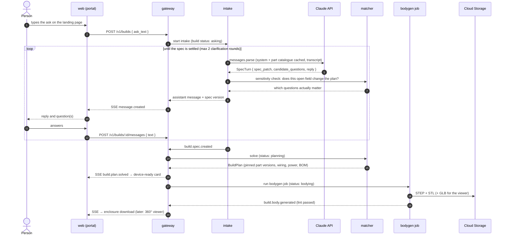

# Albus Forge — Ask to Enclosure

**Status:** Proposed design for the next build phase (after check-in 1, tag `CHECKIN1`). It breaks one user-facing feature into components, and ties each one to the architecture's pipeline stages, milestones and deliverables.

**The feature.** On the landing page a person types what they want ("keep my greenhouse soil moist"). The request goes to Claude, and the product iterates with the person until the requirements are exactly understood. The device's parts are then narrowed down to a concrete, buildable plan, and a 3D-printable enclosure is generated as STL. In a later iteration, the person can rotate a full 360° 3D view of the enclosure in the browser.

It breaks into three components plus a follow-on:

| # | Component | Pipeline stage (ARCHITECTURE.md §2) | Milestone (§16) | Where Claude is used |
| --- | --- | --- | --- | --- |
| 1 | **Requirements conversation with Claude** | Understand, `intake` | **M2** | Understands the request, asks clarifying questions, produces a structured spec |
| 2 | **Parts determination** | Map parts, `matcher` | **M3** | Explains trade-offs and the chosen parts. **Never selects parts** |
| 3 | **Enclosure STL generation** | Generate body, `bodygen` | **M5** | Not used. Geometry is deterministic and lint-gated |
| 4 | **360° enclosure viewer** *(next iteration)* | Portal | **M5.5** (new) | Not used |

## 1. The invariant this design keeps

> **Claude understands and explains; deterministic code decides.**

The architecture's core rule, that every service reads the Part Definition from the registry (§1.1), carries straight into this feature:

- **Claude never emits free-form design** (§7.1). Each turn produces a schema-validated spec update, not prose that code has to interpret.
- **Claude never chooses a part.** Part selection is the matcher's constraint solver over the registry. Nothing a model returns can produce an infeasible build (§7.2).
- **Claude never produces geometry.** The enclosure comes from the parts' mechanical blocks through CadQuery, and has to pass the printability lint (§7.4).

That split is what makes each stage testable (golden ask → spec, spec → plan, plan → dimensions), cheap to run, and safe against prompt injection. The model has nothing it could inject into except a bounded schema.

## 2. The user flow

The routes already exist in the contract (ARCHITECTURE.md §6, PORTAL.md §3, `packages/schema/src/routes.ts`): `POST /v1/builds`, `GET/POST /v1/builds/:id/messages`, `GET /v1/builds/:id/events`, `PATCH /v1/builds/:id/spec`, `POST /v1/builds/:id/plan` and `GET /v1/builds/:id/body`. The portal's `/build/:buildId` page is a stub waiting for M2.

## 3. Component 1: requirements conversation with Claude (intake, M2)

### Responsibilities

1. **Scope filter first** (§7.1). `policy.ts` refuses weapons, mains voltage, medical-monitoring claims and covert tracking before any extraction runs, returning `OUT_OF_SCOPE` with a category. A `REDIRECT` outcome, for when an off-the-shelf product already solves the need, is designed (§11.2) but depends on the `alternatives` registry field.
2. **Extract a structured spec** into the fixed template: `sense`, `act`, `environment`, `connect`, `power` and `experience` (§7.1).
3. **Ask only questions that matter.** Claude proposes candidate questions, each tied to the spec field it resolves. Code keeps only those that pass the **clarification test**: solving with each candidate value produces a different plan. There are at most two rounds; after that, defaults apply and are shown to the person as stated assumptions.
4. **Hand off to the matcher** when the spec settles, emitting `build.spec.created`.

### How Claude is called

One structured call per turn, in `packages/llm` (the TypeScript `@anthropic-ai/sdk`):

- **`client.messages.parse` with `output_config.format: zodOutputFormat(SpecTurn)`.** `SpecTurn` is a Zod schema in `packages/schema` holding `{ spec_patch, candidate_questions[], assumptions[], reply }`. The response is validated against the schema, so intake never parses prose. If `parsed_output` is null, there's one repair retry, then a safe fallback reply.
- **Model `claude-opus-5`** with adaptive thinking (on by default). Chat turns are latency-sensitive, so `output_config.effort` gets tuned per route against the golden set, starting at `medium`. The model id comes from `LLM_MODEL`, never hard-coded (§12.4).
- **Prompt caching.** The stable prefix is the system prompt plus a **part catalogue generated from the registry**: capabilities, units, environment flags and power options for the MVP parts. It sits before a `cache_control` breakpoint, with the transcript after it. `usage.cache_read_input_tokens` is logged; a zero means something volatile has leaked into the prefix.
- **Refusal fallbacks enabled** (`server-side-fallback-2026-07-01`, `fallbacks: "default"`). Code always checks `stop_reason` before reading content, and a `refusal` becomes a polite out-of-scope reply.
- **Replies reach the browser over the existing SSE channel** as `message.created` once the turn completes, with a typing indicator meanwhile. Token-level streaming of the reply can come later; it isn't needed to meet the contract.
- **Prompt-injection posture.** The person's text only ever appears in user turns. The output is a bounded schema whose spec values are validated against registry vocabularies (capabilities, flags, transports), and nothing the model returns is executed.

### Data and metering

- `build_messages` holds the transcript (PORTAL.md §3). `specs(build_id, version, data, confidence, open_questions)` records every spec version (§5).
- `llm_calls` records every call with tokens, cost, stage and `build_id`. It's attributed to the `anon_owner_hash` until sign-up, then re-attributed to the tenant (ADR 0009).
- There's a **per-build token ceiling** in `packages/llm`. Per-IP and per-anonymous-owner rate limits sit on `POST /v1/builds` and `POST …/messages`, on top of Cloud Armor.

### Before the matcher exists

M2 lands before M3's solver, so the clarification test needs an interim rule. Ask only about fields on a registry-derived **solver-relevant list** (sensed quantity, actuation, power source, transport, target battery life, environment flags), still capped at two rounds. When M3 lands, the real sensitivity check replaces the list, with the same interface and the same tests.

### Tests

- **Golden fixtures:** ask → expected spec, and ask → expected questions (§3, §12.6).
- **Recorded LLM fixtures,** so CI never calls the API or spends money (§12.6).
- **Unit tests** for the scope filter, spec-patch merge, question filtering and the two-round cap.
- **A small live eval set,** run on demand, to tune model effort and prompt changes.

## 4. Component 2: parts determination (matcher, M3)

### Responsibilities

- **Solve deterministically, with no LLM** (§7.2), under five hard constraints:
  - capability coverage
  - brain compatibility: `requires`, unique I²C addresses, `conflicts`
  - electrical fit: voltage windows and connectors
  - power: battery life against `interval_s`
  - the driver/runtime/brain compatibility matrix
- **Rank only feasible assignments** (`rank.ts`).
- **When nothing is feasible,** return a **minimal conflict set.** `explain.ts` turns it into a trade-off question ("battery life of 90 days needs a larger pack or a longer interval"), and the build returns to `specifying`.
- **Output a `BuildPlan`:** pinned `{part_id, version}` pairs, the wiring graph, power budget, BOM and solver log (`plans`, §5). That plan drives the device-ready card: part chips and estimated price, taken from the plan and never from UI strings (PORTAL.md §6).

### Where Claude helps, without deciding

- **Phrasing:** turning the conflict set and the ranked alternatives into plain-language trade-offs. The numbers and part names come from the solver output, which is passed to Claude as data.
- **Narrowing the design with the person:** they can ask "why this sensor?" or say "use a USB supply instead of a battery". Claude maps that to a spec edit (`PATCH /v1/builds/:id/spec`), and the matcher re-solves. Solving is idempotent per spec version, so each round is a new spec version and a new plan, never a model-edited plan.

### Prerequisites and tests

- **Registry:** twelve MVP parts with complete Part Definitions and footprint files, plus the validator and loader (M1, §4.1).
- **Tests:** `solver.ts` is pure, and carries the project's highest-value unit tests (§7.2), including property tests that no returned plan violates any constraint. Golden spec → plan fixtures cover the three golden builds: fridge monitor, presence alert and plant waterer.

## 5. Component 3: enclosure STL generation (bodygen, M5)

### Responsibilities

A Python 3.12 + CadQuery **Cloud Run Job** (2 vCPU / 4 GiB) turns a `BuildPlan` into printable geometry (§7.4):

1. **Layout.** Pack the parts using each pinned part's `mechanical` block: `bounding_mm`, `mount`, `exposure` and `footprint.step`.
2. **Shell.** Build the base and lid, with wall thickness and clearances taken from a **versioned tolerance table**, per printer profile.
3. **Features from environment flags.** Cable glands for probes, vent grids, condensation drains, a tool-free battery door.
4. **Printability lint, as a gate:** minimum wall 1.6 mm, overhang ≤ 55° or supported, part clearance. A failure is a failed job, never a delivered file.
5. **Export.** STEP, plus one STL per printable body (base, lid). The QR code for the build serial is embossed on the inner lid.

Outputs go to a GCS bucket and the `bodies` table (`step_ref`, `stl_refs`, `lint_report`, `serial`). `GET /v1/builds/:id/body` returns short-lived signed URLs.

### Ordering

The pipeline diagram orders codegen before bodygen (§2), but the enclosure depends **only on the plan's mechanical blocks**. This design proposes **starting bodygen as soon as the plan is solved**, running in parallel with codegen. The person then sees the enclosure without waiting for the firmware compile gate.

### Tests and the fit risk

- **Plan fixtures → dimension assertions** (§3).
- **Lint unit tests,** plus mesh checks on every exported STL: watertight/manifold, and a bounding box within printer limits.
- **The riskiest assumption is first-print fit ≥ 90%** (§15). Run the **fit spike** early, in parallel: footprints for a handful of parts, a parametric box, and a real printer.

## 6. Next iteration: 360° enclosure viewer (M5.5)

- **In the portal:** a client component in `apps/web` using three.js (`OrbitControls` for full rotate, zoom and pan). It loads the body from `GET /v1/builds/:id/body`.
- **View controls:** base, lid and exploded views, plus optional translucent "ghosts" of the parts from the plan's layout, so the person can see what fits where.
- **Format.** STL stays the print artifact. bodygen should also export a compact **GLB** for the viewer, which gives smaller downloads and room for named sub-meshes. This is a small addition to component 3's export step, and worth making when M5 is built rather than retrofitted.
- **Delivery.** Signed GCS URLs are cross-origin to `albusforge.ai`, so either the bodies bucket gets a CORS rule allowing GET from the portal origins, or the gateway proxies the file. The CORS rule is simpler and keeps large files off Cloud Run.
- **Fallback.** bodygen renders a static PNG preview for devices without WebGL, and for listing cards later.
- **Tests:** a component test loads a fixture GLB and asserts the orbit controls mount, and a visual smoke check runs in the browser tests.

## 7. Deliverables by milestone

| Milestone | Services and code | Portal | Infrastructure (Terraform) |
| --- | --- | --- | --- |
| **M1: Spine** (prerequisite) | `packages/db` and migrations; registry with 12 parts, validator and loader; gateway skeleton; `tenants`, `build_messages`, `specs`, `plans`, `bodies` tables | — | Cloud SQL (private IP, PITR); migration and registry-load Cloud Run Jobs |
| **M2: Conversation** | `apps/intake`; `packages/llm` (Anthropic SDK, structured outputs, caching, fallbacks, token ceiling, `llm_calls`); `SpecTurn` schema; scope filter; golden and recorded fixtures | Live `/build/:buildId` chat: send, SSE replies, typing state, assumptions, sign-up gate | Anthropic API key in Secret Manager with accessor on intake's SA; intake Cloud Run service (internal ingress) and gateway invoker; LLM-spend log-based metric and alert **before the first real prompt** |
| **M3: Parts** | `apps/matcher`: solver, rank, explain; real clarification sensitivity check replaces the M2 list | Device-ready card from the plan; "why this part" and swap flows via spec edits | Matcher Cloud Run service (internal ingress) and invoker binding |
| **M5: Enclosure** | `workers/bodygen`: layout, shell, flags, lint, STEP/STL export, **GLB and PNG previews** | Download STLs; lint and assumptions summary | CadQuery image (prebuilt base); bodygen Cloud Run Job and trigger permission; bodies GCS bucket, lifecycle and signed-URL signing permission |
| **M5.5: Viewer** *(new)* | — | 360° viewer (three.js), exploded view, part ghosts, PNG fallback | CORS rule on the bodies bucket for the portal origins |

Codegen (M4) and delivery (M6) are unchanged by this design. The firmware-target fork (§18.1) doesn't block these components.

## 8. Open decisions

| Decision | Recommendation | Why it's open |
| --- | --- | --- |
| **Model and effort per route** | `claude-opus-5`; tune `effort` per route on the golden set, starting at `medium` for chat turns | A cost-and-latency trade-off; measure before changing models |
| **Anthropic API or Vertex** (§18.4) | Anthropic API directly (key in Secret Manager) | `packages/llm` keeps it an env switch, and Vertex lags on some features |
| **Clarification before the solver exists** | The registry-derived solver-relevant list in M2, replaced by the sensitivity test in M3 | M2 lands before M3 |
| **Bodygen ordering** | Run as soon as the plan is solved, in parallel with codegen | §2 shows it after codegen, but it only needs the plan |
| **Viewer format** | STL for printing, plus GLB for viewing | Adds one export to bodygen |
| **Fit loop timing** (§18.3) | Fit spike now, in parallel; the feedback data model when M5 lands | The deck calls it the moat; the spec marks it `[LATER]` |

## 9. Risks

- **LLM cost and abuse:** anonymous chat is an open door. The per-build token ceiling, rate limits, Cloud Armor, metering against the anonymous owner, and spend alerts all go live with M2, not after.
- **Prompt injection:** the model's only output is a bounded schema, and spec values are validated against registry vocabularies. The solver and bodygen never see model free-text.
- **Clarification drift:** without the sensitivity test the model over-asks. The two-round cap and the solver-relevant list bound it until M3.
- **CadQuery image size and cold starts:** use a prebuilt base image and layer only project code (§17.1).
- **First-print fit:** the dominant product risk (§15). The fit spike answers it before M5 is built out.
