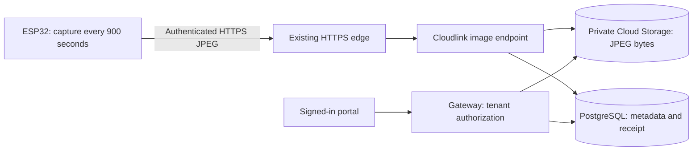

# Camera snapshots every 15 minutes

Assessment: 2026-09-14. This is a proposed implementation, not a deployed image
pipeline. The initial inventory inspected `main` at `8143b9e`, before the
bring-up recipe and these plans were added to version control. The review branch
is `docs/sensor-observation-plan`, based on `d8b2faa`.

The implementation uses shared device capabilities and typed observations for
numeric sensors and images; see [SENSOR-OBSERVATION-ARCHITECTURE.md](SENSOR-OBSERVATION-ARCHITECTURE.md).

For concrete API contracts, implementation tickets, failure handling and release
checks, see [CAMERA-CLOUD-IMPLEMENTATION.md](CAMERA-CLOUD-IMPLEMENTATION.md).

## Verified baseline

The physical Freenove board has an ESP32-S3, 16 MiB flash, 8 MiB PSRAM, GC0308
camera, and a FAT32 card mounted as 960 MiB. The working ESPHome configuration
uses RGB565 capture, software JPEG conversion, and `agc_value: 10`; zero gain
produced uniformly dark frames. HTTP snapshot retrieval, image decoding, Wi-Fi
and OTA have passed. A sample 320x240 JPEG was 14,088 bytes. The SD check has
only mounted/read capacity: durable file writes and recovery are untested.

Live GCP inventory, read-only:

| Resource | Staging | Production |
| --- | --- | --- |
| Cloudlink ready revision | `cloudlink-00002-x2v` | `cloudlink-00002-cxl` |
| Other Cloud Run services | gateway, web, intake, ask | gateway, web, intake, ask |
| Cloud SQL PostgreSQL 16 | `albusforge-staging-pg`, RUNNABLE | `albusforge-prod-pg`, RUNNABLE |
| Storage buckets in runtime project | none listed | none listed |

Terraform already defines HTTPS edge routing `/ingest/*` to Cloudlink, its
Cloud Armor policy, private database networking and Secret Manager credentials.
The live production Cloudlink is ready, has 100% traffic on its ready revision,
LB-only ingress and one minimum instance. CI builds/deploys services and promotes
immutable images. Some top-level README status descriptions are stale; source,
rollout records and live inventory provide stronger evidence.

Cloudlink's existing `POST /ingest/v1` is strict JSON numeric telemetry with a
128 KiB limit, hashed device-token authentication, revocation and transactional
deduplication. It cannot receive camera files. Gateway/portal expose numeric
telemetry, not image retrieval. There is no existing image bucket/table/route.

## Proposed path

The device schedules capture using a monotonic 900-second interval. Synchronize
UTC for capture timestamps, add initial fleet jitter, and keep capture cadence
separate from retry cadence. This is 4 images/hour, 96/day, 2,880/30 days per
device. At the measured 14,088 bytes it is about 1.35 MB/day or 40.6 MB/30 days,
before metadata, operations and network overhead. Image size depends on scene
and quality; these are volume estimates, not a cloud bill.

## Work to implement

1. **Versioned hardware profile and integration.** Preserve the tested ESPHome
   YAML, pin map, driver versions and acceptance evidence in a focused bring-up
   PR. Keep secrets/backups/images out of Git and generate new secrets per
   device. Add a reviewed Freenove N16R8 + GC0308 camera capability/profile in
   the registry/build system. Application services remain part-agnostic.

   Unmerged `feat/firmware-pipeline` implements a native ESP-IDF N8R8 + BH1750
   candidate, not this board. Its GPIO8/9 I2C wiring conflicts with this camera.
   Integrate camera support into that runtime/profile path, or explicitly use
   this ESPHome recipe for a limited pilot with the same cloud contract. Do not
   silently overwrite its firmware/config partition layout with ESPHome's.

2. **Provisioning.** Reuse tenant-bound device UUIDs, hashed bearer credentials,
   revocation and the in-flight `feat/device-provisioning` configuration handoff.
   That branch's production profile list is empty and currently fails closed;
   it needs approved camera evidence. Add an image capability, 900-second
   interval and quotas. Existing channel validation requires numeric channels;
   support camera-only profiles explicitly rather than inventing sensor readings.
   Local simulator provisioning is not production enrollment.

3. **Image ingest contract.** Proposed endpoint:
   `POST /ingest/v2/devices/:deviceId/observations`, with the existing device bearer
   credential, `Content-Type: image/jpeg`, immutable capture UUID, capture UTC
   and binary JPEG body. Derive tenant from authenticated device. Set a bounded
   body limit (proposed 1 MiB), pixel/dimension limits, JPEG validation and
   per-device rate/byte quotas. Reuse bounded admission without holding a SQL
   connection throughout network upload. Disable credential/body logging.

4. **Private storage and metadata.** Add a dedicated camera bucket in each
   runtime project, regional placement, public-access prevention, uniform bucket
   access and least-privilege runtime IAM. Suggested object name:
   `tenant/<tenantId>/device/<deviceId>/<captureId>.jpg`. Keep JPEG bytes in GCS;
   add PostgreSQL image metadata: device, capture ID/time, received time, object
   key/generation, SHA-256, length, dimensions and finalization state. Index
   device/capture time and enforce unique device/capture ID. Separate image
   counts/bytes from numeric-reading usage; update device presence for fresh
   image acceptance and teach setup confirmation about image receipts.

5. **Durable acceptance and retries.** GCS and PostgreSQL are not one atomic
   transaction. Use create-only generation preconditions, deterministic keys
   and a receipt/finalization protocol. Same capture ID and identical content
   returns the prior success; changed content returns conflict. Acknowledge only
   after object storage and metadata finalization succeed. Recheck authorization
   at finalization, and reconcile orphaned objects/pending receipts after partial
   failures. Retain enough receipt/tombstone state to prevent retries from
   resurrecting deleted images. Apply retry/backfill age bounds consistently.

6. **Firmware uploader and offline behavior.** Capture a fresh frame every 900s,
   make an owned JPEG buffer/file, then send outside the camera callback through
   certificate-verified HTTPS. Never retain a borrowed frame pointer after its
   lifetime. Persist the capture ID, timestamp and exact bytes for retries; do
   not recapture under the same ID. Retry timeouts/429/5xx with bounded backoff;
   stop or surface permanent authentication/validation failures. A bounded SD
   spool can preserve the requested capture cadence through outages. Implement
   atomic file writes, restart recovery, a full-card/drop policy and a queue
   byte/age cap; mount success alone does not prove these work. Delete pending
   files only after durable acknowledgment. Expose last-upload status/queue size.

7. **Portal reads and operations.** Add tenant-authorized latest/history APIs
   and an authenticated image-content route in gateway. Use a latest-photo card,
   capture/received timestamps and paginated history in the device view. Proxy
   private image reads initially; avoid permanent public object URLs. Add
   accepted/rejected/duplicate counts, upload latency, stored bytes, stale-image
   detection and reconciliation failure monitoring. Proposed retention is 30
   days, subject to product choice; lifecycle expiry, metadata and receipt
   retention must agree. Existing telemetry jobs do not maintain image metadata.

## Delivery order and acceptance

- PR 1: tested board recipe/profile evidence and pinned reproducible setup.
- PR 2: image schema, Cloudlink storage adapter/route, private bucket/IAM,
  reconciliation and integration tests; coordinate with provisioning contracts.
- PR 3: 900-second uploader, persistent retry/spool and physical acceptance.
- PR 4: tenant-scoped latest/history viewer and observability; this can proceed
  against the agreed API while firmware is implemented.

Staging acceptance: at least five successive captures spanning at least 60 minutes; verify
each JPEG object and SQL record, timestamps/cadence and portal rendering. Exercise
lost acknowledgments, concurrent retries, board restart, Wi-Fi outage, full or
missing SD card, storage/SQL partial failures, oversized/malformed images,
revoked credentials and cross-tenant reads. A duplicate must create one stored
image and one usage charge. Promote the tested code/infra only after acceptance.

Current `infra/env` apply coordinator is Claude session `albusforge-44`, per
`docs/ARCHITECTURE.md` section 12.3.1. Infra changes can be prepared/reviewed in a
dedicated branch; apply must follow its single-owner rollout and CI exclusion
procedure. The assessment and review preparation made no cloud mutations.

## References

- Existing implementation: `apps/cloudlink/src/routes.ts`,
  `packages/schema/src/telemetry.ts`, `infra/env/sensor.tf`, `infra/env/main.tf`.
- In-flight contracts: `docs/FIRMWARE-PIPELINE.md` on `feat/firmware-pipeline`,
  `docs/DEVICE-PROVISIONING.md` on `feat/device-provisioning`.
- [GCS create-only and generation preconditions](https://docs.cloud.google.com/storage/docs/request-preconditions)
- [ESPHome HTTP requests](https://esphome.io/components/http_request/)
