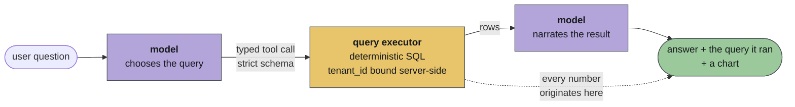
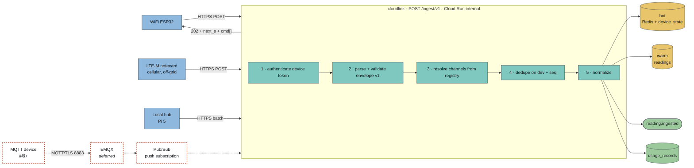
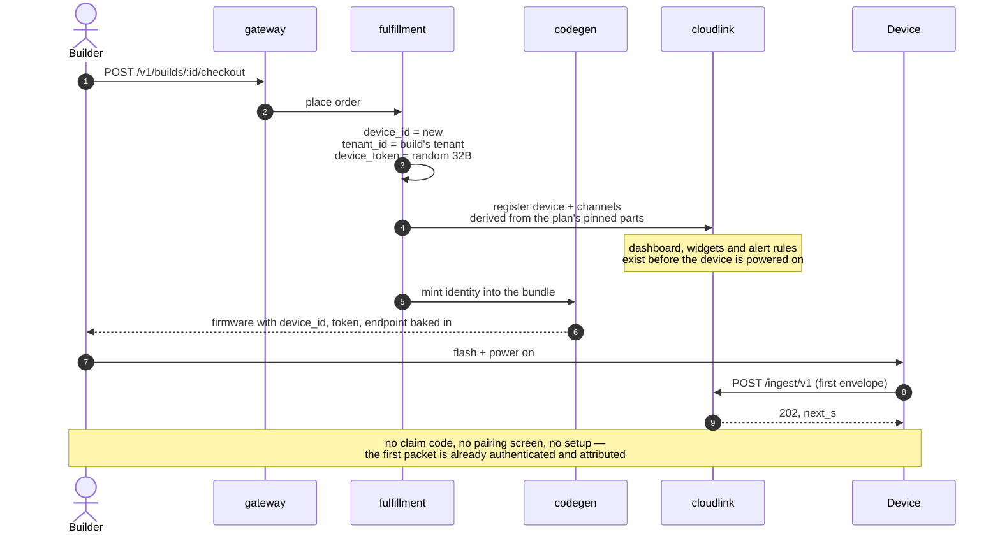
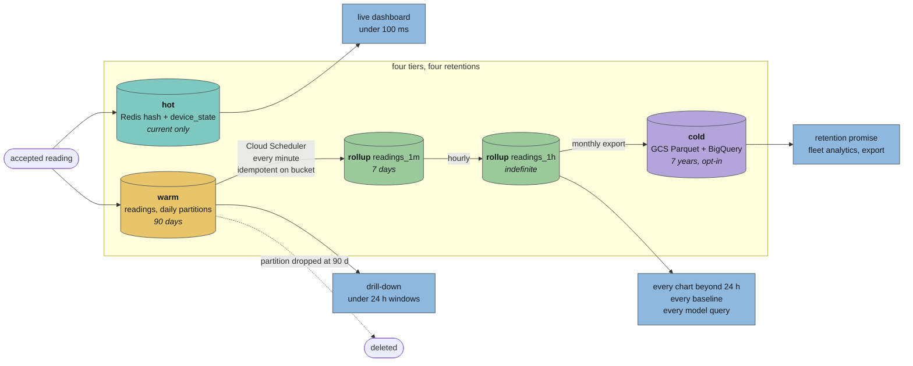
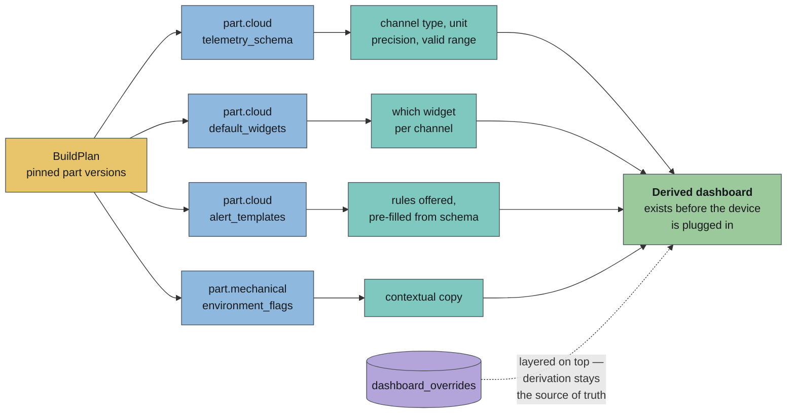
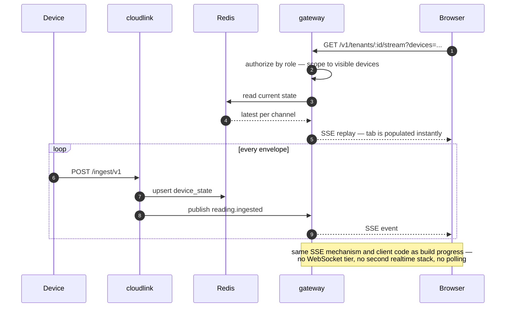
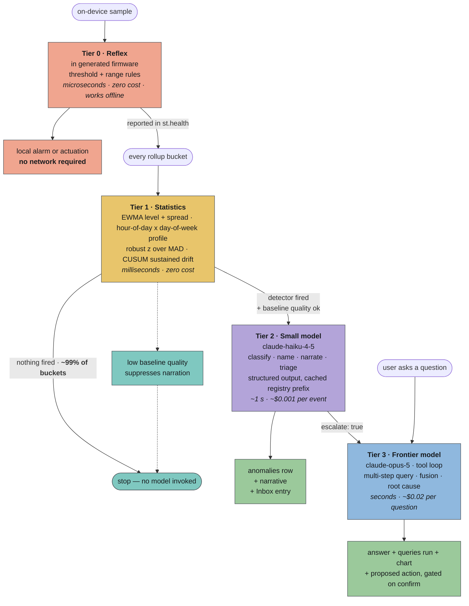
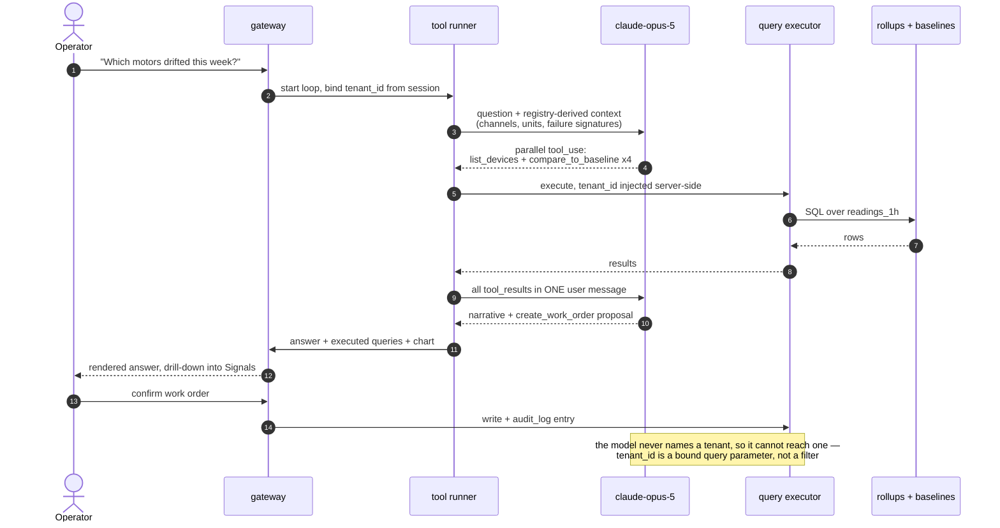
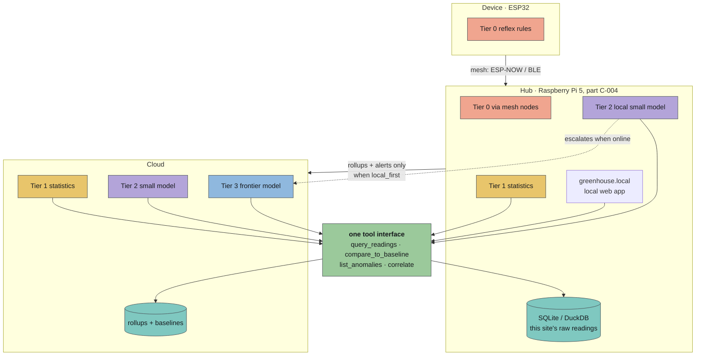
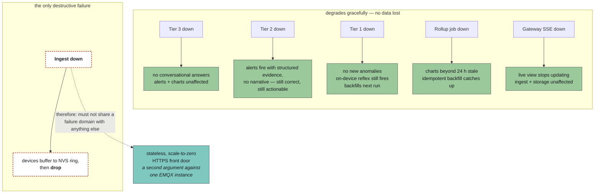

# Albus Forge — The Cloud Platform

> **Implementation boundary, 2026-09-13:** M6a is merged in PR #32: standalone `apps/cloudlink`, shared wire contract, transactional PostgreSQL storage and local simulator. Gateway contains no ingestion code. Its separate Cloud Run/NEG/Armor infrastructure is merged and staging is provisioned, following ADR 0003; resource inventory and rollout gates are tracked in [SENSOR-CLOUD-ROLLOUT.md](SENSOR-CLOUD-ROLLOUT.md). [TELEMETRY-INGEST.md](TELEMETRY-INGEST.md) records runtime configuration, autoscaling/connection budgets, implemented behavior and remaining work.

> M6b partitioned storage, rollups and retention are merged in PR #40. The M6c [telemetry read API](TELEMETRY-READ-API.md) is merged in PR #44, and gateway sign-in/session issuance in PR #45. The telemetry monitor and bounded sensor Ask integration are merged. All six staging release workflows at `03f40c1` succeeded, including sensor runtimes/jobs and web. Deployed simulator ingestion, model-free Ask/accounting, rollup, bounded HTTP load and polling-dashboard/chat browser checks passed; the durable quota audit/cleanup and one attributed real-provider Haiku call passed. Staging model/schedule activation is applied, with automatic execution observation and pipeline cleanup pending. Production infrastructure apply is in progress with model/schedules disabled; durable event delivery and backend telemetry SSE remain pending.

**Status:** target architecture with implementation boundaries above; later-stage diagrams are not deployment evidence. Companion to [`ARCHITECTURE.md`](ARCHITECTURE.md); expands §7.6 (ingest) and §11.3 (intelligence), which the source spec covers in two sentences.

> The registry and the generator get a device built. **This document is the part that makes it worth keeping.** A gadget that works is a weekend; a gadget whose data becomes answers is a subscription.

---

## 1. Why this document exists

The backend spec describes the cloud tier in full as: *dashboard config is the union of the parts' `default_widgets`, and alerts are `out_of_range {min,max}` to email.* The business model puts **~90% of projected revenue** on per-sensor subscription — data ingested, stored, and LLM compute applied.

That is the largest mismatch between ambition and specification anywhere in the project, and it is the *differentiated* half. Generating firmware and enclosures is increasingly commodity. **Getting a new sensor's data into a typed, queryable, model-legible store within minutes of unboxing — with no pipeline work by the user — is not.**

This document specifies that path end to end: how a packet leaves the device, how it is stored, how it reaches the screen, and how a model turns it into an answer.

---

## 2. Two invariants

Everything below follows from these. They are the cloud-tier equivalents of the Part Definition rule in `ARCHITECTURE.md` §1.1.

### 2.1 The pipeline is derived from the registry, never authored

A device's channels, units, valid ranges, dashboard widgets, alert templates and self-test codes are **already known before the first packet arrives**, because the BuildPlan pinned exact part versions and every part's `cloud` block declares them.

> **No user ever configures a pipeline, maps a field, or picks a chart.** If a configuration step exists anywhere in the cloud onboarding path, a registry field is missing.

This is the whole "ready before packet one" claim, and it is cheap to honour — provisioning writes the channel rows at checkout, from the plan.

### 2.2 Models propose and narrate; they never compute

Every quantitative claim shown to a user — a mean, a delta, a percentage, a count, a correlation — is produced by **executing a typed query against the store.** The model's job is to choose the query and to phrase the result.



The advertised answers are quantitative — *"Motor 7's RMS is up 34% vs baseline, pattern matches bearing wear."* A model handed a token-dumped time series will produce a number of that shape whether or not it is true. **34% must come from SQL.**

This is the same architecture as the matcher (`ARCHITECTURE.md` §7.2): a pure deterministic core, with the model confined to the one place judgment is actually required. It also makes the intelligence layer testable — golden question → expected query → expected rows — in exactly the way a prompt-and-pray design is not.

---

## 3. Transport: MQTT/JSON vs HTTPS

This is open decision §18.1 in the architecture. It deserves a real answer rather than a fork, because it gates the heaviest milestone (M6) and a single point of failure.

### 3.1 The honest comparison

| | MQTT/TLS over 8883 | HTTPS POST |
| --- | --- | --- |
| **Per-message cost on the wire** | ~2-byte header on a held connection | full TLS handshake unless the session is reused — 3–6 KB and 1–4 s on an ESP32 |
| **Battery** | excellent for frequent messages; poor if the radio must stay up | excellent for infrequent wake-post-sleep; poor if posting every few seconds |
| **Infrastructure** | a broker that is always on — EMQX on a GCE MIG, ~$14/mo, **and a SPOF** | none. Cloud Run scales to zero |
| **Downlink (cloud → device)** | native, instant — subscribe to a command topic | **not available** without polling |
| **Offline detection** | native — Last Will and Testament fires on disconnect | needs a heartbeat channel and a server-side staleness sweep |
| **Delivery guarantees** | QoS 1/2, broker-side queueing | whatever you build: retry, `seq`, idempotency key |
| **Cellular (LTE-M)** | notecard and carrier gateways speak HTTPS natively; MQTT needs a bridge | **native** |
| **Local hub** | native — Mosquitto on the Pi, ESP-NOW/BLE bridged in | works, but a hub polling upstream is awkward |
| **Ops burden at MVP** | broker clustering, auth hook, rule-engine bridge, Pub/Sub plumbing | one authenticated route |

### 3.2 The decision

> **MVP: HTTPS POST as the primary uplink. MQTT as a second front door added at M6+, when downlink is real.**
>
> **The transport is an adapter. The envelope is the contract.**

The reasoning:

- **The three golden builds don't need MQTT.** Fridge monitor, presence alert and plant waterer all sample on the order of seconds-to-minutes and act *locally* — the waterer's pump decision is made on-device against a threshold, not round-tripped through the cloud. Nothing in MVP requires cloud→device latency.
- **MQTT's real advantage is downlink, and downlink isn't in MVP.** Config push, threshold updates, OTA triggers and remote actuation are all M6+ or later. Buying a broker, a SPOF and the heaviest infra milestone in the plan to serve a capability that ships two milestones later is a poor trade.
- **Cellular forces a second front door anyway.** Three of the eight appendix builds use an LTE-M notecard; one is solar + cellular off-grid. Those devices never join WiFi and never reach an internal broker. If HTTPS ingest must exist for them, building it *first* and adding MQTT for the fleet case is strictly less work than the reverse.
- **It deletes the single largest MVP infra risk.** No EMQX MIG, no rule-engine bridge, no broker auth hook, no single e2-small carrying all telemetry. M6 stops being "roughly double the infra time of any other milestone."
- **Battery math favours HTTPS at MVP duty cycles.** A device waking every 5 minutes to post one batched envelope pays one handshake per wake. Session resumption and a batched payload make this cheaper than holding a radio up for a persistent MQTT session.

**What we give up, stated plainly:** instant downlink, LWT-based offline detection, and broker-side queueing. Each has a designed replacement below (§3.4, §4.3). The one genuinely lost capability is sub-second remote actuation — **do not promise it before MQTT lands.**

### 3.3 The envelope — one wire format, both transports

Short keys because LTE-M bills by the byte and battery devices pay for radio-on time.

```jsonc
{
  "v":   1,                    // envelope version
  "dev": "dev_01J8XK3M9QW",    // device id, minted at checkout
  "seq": 4417,                 // monotonic per device; survives reboot in NVS
  "ts":  1757649600,           // device clock at send, epoch seconds
  "r": [                       // readings, batched across a sleep window
    { "c": "temperature_c", "t": 1757649420, "v": 4.2 },
    { "c": "temperature_c", "t": 1757649600, "v": 4.4 },
    { "c": "humidity_pct",  "t": 1757649600, "v": 61.0 }
  ],
  "st": {                      // device status — always present
    "batt_mv": 3810,
    "rssi": -62,
    "up_s": 84213,
    "health": ["OK"]           // self-test health codes, ARCHITECTURE.md §10
  }
}
```

Rules:

- **`c` must be a channel declared by the plan.** Unknown channel → the reading is rejected and counted, never silently stored. An unknown channel means the device firmware and the registry have diverged, which is a real alarm.
- **Per-reading `t`**, because a battery device batches several samples taken across a sleep window into one send. `ts` is the send clock; `t` is the sample clock. Devices with no RTC send `t` as a negative offset from `ts`, resolved at ingest.
- **`(dev, seq)` is the idempotency key.** Pub/Sub push is at-least-once and HTTPS retries happen; a unique index makes duplicate delivery a no-op rather than a double-counted reading.
- **`st` is not optional.** Battery, signal and health-code telemetry are what the support assistant and the patch-pledge fleet tooling read. Making them a first-class part of every envelope — rather than a separate channel someone forgets to enable — is what makes §10's self-test promise real.
- **`v` is 1 and it is checked.** Envelope changes are versioned, never inferred.

Identical JSON on both transports. MQTT publishes it to `hsx/t/{device_id}`; HTTPS POSTs it to `/ingest/v1`. The normalizer downstream cannot tell which arrived.

### 3.4 Downlink without a broker: piggyback

The ingest response body carries pending work:

```jsonc
// 202 Accepted
{
  "ok": 3,                                   // readings accepted
  "next_s": 300,                             // server-directed sleep interval
  "cmd": [                                   // pending commands, at-most-N per response
    { "id": "c_8821", "op": "set_threshold", "ch": "temperature_c", "max": 5.0 },
    { "id": "c_8822", "op": "ota_check",     "url": "…" }
  ]
}
```

Command acknowledgement rides the next envelope's `st.ack: ["c_8821"]`. Commands are idempotent and expire.

**Latency equals the post interval** — minutes, not milliseconds. That is honest for config, thresholds and OTA triggers, and inadequate for actuation. `next_s` also gives the server a cheap backpressure lever: under load or over a tenant's free-tier cap, tell devices to slow down rather than dropping their data.

---

## 4. The ingest path

### 4.1 Three front doors, one normalizer



> **Every path converges on one `normalize()` producing one internal `Reading` event.** Transport-specific code lives only in the front-door handler — the same containment rule `packages/db` applies to timeseries and `packages/llm` applies to providers.

Every path converges on one `normalize()` function producing one internal `Reading` event. **Transport-specific code lives only in the front-door handler** — the same containment rule `packages/db` applies to timeseries access and `packages/llm` applies to providers.

### 4.2 Authentication — provisioned at checkout, not claimed after

This resolves the claim-vs-provision fork in `ARCHITECTURE.md` §8 in favour of the deck.

At checkout, `fulfillment` mints a device identity and hands it to `codegen`, which bakes it into the firmware bundle:



The first packet is already authenticated and already attributed to a tenant. **No claim code, no pairing screen, no setup.** Bearer token in an `Authorization` header; rotation is a downlink command; mTLS remains `[LATER]` and is a per-device cert swap, not an architecture change.

The existing `POST /v1/devices/claim` route stays for self-printed and self-flashed builds, where nobody bought anything and there is no order. It takes `tenant_id` from the session, never from the request body, and requires it to match the build's tenant ([ADR 0009](adr/0009-tenant-created-at-sign-up.md)).

### 4.3 Offline detection without LWT

A `device_state` row carries `last_seen_at` and the device's own `next_s`. A Cloud Scheduler sweep every minute marks any device silent for `3 × next_s` as `offline` and emits `device.offline`. Coarser than MQTT's LWT by a few minutes, and it catches a class LWT misses: a device that is powered and connected but has stopped sending.

### 4.4 Backpressure and abuse

Cloud Armor rate limits per device token at the edge. Beyond a tenant's plan rate, ingest responds `202` with an increased `next_s` rather than `429` — **a device told to slow down keeps its data; a device given an error drops it.** Envelopes over the size cap, or with more than N readings, are rejected with a counted error rather than truncated.

---

## 5. Storage: four tiers

One design point dominates: an advertised tenant runs 142 sensors at **2.1M readings/day ≈ 63M rows/month**, already past the ~50M threshold where the plan says to revisit partitioned Postgres. **Rollups are therefore not an optimization; they are what keeps the chosen database viable.**



> **Ingest writes hot and warm only.** Rollups are produced by a scheduled job, keeping ingest a single cheap insert that can absorb a burst. At the advertised 63M rows/month, rollups are not an optimization — they are what keeps partitioned Postgres viable.

| Tier | Store | Retention | Serves |
| --- | --- | --- | --- |
| **Hot** | Redis hash per device + `device_state` row | current only | live dashboard, "is it on?", reflex rules |
| **Warm** | `cloud.readings`, daily partitions | **90 days** | drill-down, incident forensics, baseline fitting |
| **Rollup** | `readings_1m` (7 d), `readings_1h` (indefinite) | indefinite | every chart beyond 24 h, every baseline, every model query |
| **Cold** | GCS Parquet, partitioned by tenant/month; BigQuery external table | **7 years, opt-in** | the retention promise, fleet analytics, export |

### 5.1 This reconciles the three retention answers

The architecture notes three contradictory claims (90 days in the plan, 7 years on the platform slide, minimal-retention local-first in the risk register). They are not in conflict once retention is per-tier:

- **Raw readings: 90 days.** Full fidelity, then dropped by partition. Cheap, and drops the partition rather than deleting rows.
- **Hourly rollups: indefinite.** This is what "7-year retention" actually means to a customer asking about last winter — and it is ~0.3% of the raw volume.
- **Cold archive: 7 years, opt-in per tenant.** Off by default.
- **Local-first: a tenant flag.** Hub-resident tenants keep raw data on the hub and ship only rollups and alerts upward. §8.

Say this on the slide. "7-year retention" and "minimal retention by default" are both true statements about different tiers, and stating only one of them is what made them look like a contradiction.

### 5.2 Schema

```sql
-- hot: one row per device, upserted on every ingest (Redis is the read path,
-- Postgres the durable copy)
device_state(
  device_id, tenant_id, last_seen_at, last_seq, status,        -- online|offline|never_seen
  next_s, batt_mv, rssi, health text[], latest jsonb           -- {channel: {v, t}}
)

-- warm: raw, partitioned by day on ts, dropped at 90 days
readings(device_id, channel, ts, value double precision, PRIMARY KEY (device_id, channel, ts))
  PARTITION BY RANGE (ts)
readings_dedupe(device_id, seq, received_at, PRIMARY KEY (device_id, seq))  -- 48 h TTL

-- rollups: written by a scheduled job, not by ingest
readings_1m(device_id, channel, bucket, n, sum, min, max, last, stddev)
readings_1h(device_id, channel, bucket, n, sum, min, max, last, stddev, p05, p50, p95)

-- derived intelligence
baselines(device_id, channel, method, params jsonb, fitted_at, warmup_complete,
          n_samples, quality double precision)
anomalies(id, tenant_id, device_id, channel, detected_at, detector, severity,
          evidence jsonb, narrative text, state)   -- open|acknowledged|resolved|dismissed
insights(id, tenant_id, scope jsonb, created_at, kind, body text, evidence jsonb, tier)

-- tenancy (ARCHITECTURE.md §8)
tenants(id, name, slug, plan, retention_days, local_first bool, created_at)
tenant_members(tenant_id, user_id, role, added_at)   -- admin|operator|viewer
audit_log(id, tenant_id, actor, action, target, at, detail jsonb)

-- metering (§9)
usage_records(tenant_id, device_id, period, readings_in, bytes_stored,
              llm_calls_tier2, llm_calls_tier3, tokens_in, tokens_out, ota_bytes,
              anon_owner_hash)   -- tenant_id null only for unclaimed anonymous builds (ADR 0009)
```

Rollups are computed by a job on Cloud Scheduler (`readings_1m` every minute over the last two minutes; `readings_1h` hourly), **idempotent on bucket**, so a missed run backfills on the next pass. Ingest never writes a rollup — keeping ingest a single cheap insert is what lets it absorb a burst.

---

## 6. From reading to screen

### 6.1 The dashboard is derived, not configured

At provisioning time, the plan's parts yield the whole UI:

```
part.cloud.telemetry_schema  →  channel type, unit, display precision, valid range
part.cloud.default_widgets   →  which widget, per channel
part.cloud.alert_templates   →  which rules are offered, pre-filled from the schema
part.mechanical.environment_flags → contextual copy ("probe reads inside the fridge")
```

A fridge build lands on a dashboard with a temperature line chart, a humidity line chart, a battery gauge, a health strip and an `out_of_range` alert pre-filled to 0–5 °C **before the device is plugged in**. The user's first action is not setup; it is watching a number arrive.



The user may then override — rename a channel, change a widget, adjust a threshold. Overrides live in a `dashboard_overrides` row layered on the derived config, so **the derivation stays the source of truth** and a part swap re-derives cleanly instead of stranding a hand-built dashboard.

### 6.2 The live path reuses SSE

The gateway already streams build progress over SSE (`ARCHITECTURE.md` §5.1). Device telemetry uses the same mechanism and the same client code:



No WebSocket tier, no second realtime stack, no client-side polling. A browser tab holds one SSE connection scoped to the devices the session's role is allowed to see. On connect the gateway replays current state from Redis, so a fresh tab is populated instantly rather than waiting for the next packet.

Historical ranges are plain queries against `readings_1m` / `readings_1h`, chosen by requested window — never against raw `readings` unless the window is under 24 hours.

### 6.3 The screens

| Surface | Content |
| --- | --- |
| **Device** | derived widgets, live values, health strip, battery/signal, alert rules, self-test history |
| **Fleet** | one row per device — status, last seen, active anomalies, deviation from its own baseline; grouped by site or tag |
| **Signals** | cross-device chart composition over rollups; the drill-down target for every anomaly and every model answer |
| **Ask** | the conversational surface (§7.4) — quantitative answers with the executed query and a chart attached |
| **Inbox** | anomalies and alerts, acknowledgeable; acknowledgement is a labelled training signal (§7.6) |
| **Usage** | readings, storage, model calls and cost against plan caps — **visible before it is billed** (§9) |

Fleet, Signals, Ask, Inbox and Usage are all tenant-scoped and all absent from the current API surface (`ARCHITECTURE.md` §6.2). Each is a route, and each depends on §8's tenancy work landing first.

### 6.4 Per-tenant hosting

`acme-plant.albusforge.ai` is a wildcard certificate and host-header routing to the same gateway — **not** a per-tenant deployment. The subdomain resolves to a `tenant_id` at the edge, and every downstream query is scoped by it server-side. Custom domains are a CNAME plus a managed cert, later.

---

## 7. The intelligence layer

### 7.1 Three tiers, by where judgment is needed

| Tier | Runs | Latency | Cost | Does |
| --- | --- | --- | --- | --- |
| **0 — Reflex** | on-device, in generated firmware | µs | zero | threshold and range rules from `alert_templates`. **Works with no network.** |
| **1 — Statistics** | cloud (or hub), every rollup bucket | ms | zero | baseline fitting, drift and anomaly *detection*, gap and staleness checks |
| **2 — Small model** | cloud (or hub), **only when tier 1 fires** | ~1 s | ~$0.001/event | classify, name and narrate a detection; triage severity; draft the alert |
| **3 — Frontier model** | cloud, on demand or escalation | seconds | ~$0.02/question | multi-step querying, cross-sensor fusion, root-cause reasoning, proposed actions |



> **Tier 1 gates tier 2. Tier 2 gates tier 3.** Statistics run constantly and cost nothing; models run on events and questions.

This is the load-bearing decision of the whole section. The naive design — "run a small model over every window of every sensor" — costs roughly **$1/device/month in tokens alone** at hourly windows, which destroys the margin on a per-sensor subscription before a single feature is built. Gating on a detector takes the same device to a handful of model calls per *week*, or **well under $0.05/device/month**, and loses nothing: a model asked to stare at a normal temperature series 24 times a day produces 24 paraphrases of "normal."

It is also the more honest engineering claim. **Anomaly detection is statistics, not language.** EWMA mean and variance, an hour-of-day and day-of-week seasonal profile, robust z-scores over median absolute deviation, and a sustained-deviation counter will find the drift. What they cannot do is say *which* drift this is, whether it matters, or what to do — and that is exactly what a language model is good at.

### 7.2 Tier 1 in detail

Per `(device, channel)`, fitted on `readings_1h` once `warmup_complete` (7 days or 200 buckets, whichever first):

- **Level and spread** — EWMA mean and variance, half-life one day.
- **Seasonality** — hour-of-day × day-of-week profile; a fridge on a compressor cycle and an office with a thermostat schedule are both strongly periodic, and ignoring that produces alerts every morning.
- **Deviation** — robust z over MAD against the seasonal expectation; MAD rather than stddev so one spike doesn't widen the band and hide the next week.
- **Drift** — sustained one-sided deviation over N consecutive buckets. This is the "flagged 11 days before failure" claim, and it is a CUSUM, not an LLM.
- **Silence and gaps** — expected vs received bucket counts.

`baselines.quality` records fit confidence; a low-quality baseline **suppresses tier 2** rather than generating narrated noise from a bad model. Every detector emits an `anomalies` row with structured `evidence` — the query, the numbers, the expected band. **The evidence exists before any model is invoked**, which means an alert is still correct and actionable if every model in the stack is down.

### 7.3 Tier 2: the always-on narrator

Invoked per anomaly, not per window. Input is the structured evidence plus registry context; output is structured:

```jsonc
{
  "severity": "warning",                 // info | warning | critical
  "title": "Compressor cycling longer than usual",
  "narrative": "Temperature recovery after each cycle has taken 34% longer over
                the past 6 days. The pattern is consistent with reduced cooling
                capacity — a failing door seal or low refrigerant.",
  "confidence": 0.72,
  "suggested_checks": ["door seal", "condenser coil dust"],
  "escalate": false
}
```

Implementation notes that matter:

- **Claude Haiku 4.5** (`claude-haiku-4-5`) is the tier-2 model — $1/$5 per MTok makes the per-event cost genuinely negligible, and the task is classify-and-phrase over a small structured payload, not reasoning.
- **Structured outputs**, not prose parsing: `output_config: {format: {...}}` with a JSON schema, so the alert pipeline never string-matches a model response.
- **Prompt caching carries the registry context.** The stable prefix per tenant — channel schemas, part capabilities, units, alert templates, site vocabulary — is ~1–3K tokens and identical across every call for that tenant. Put it before the `cache_control` breakpoint and the volatile evidence after it. Cache reads are a fraction of input price, and this is the difference between a viable and a silly cost per sensor. Verify with `usage.cache_read_input_tokens`; if it is zero, something volatile (a timestamp, an unsorted JSON key order) has leaked into the prefix.
- **Nightly digests go through the Batch API** at 50% cost. A summary written at 03:00 is not latency-sensitive.

### 7.4 Tier 3: the conversational surface

**Bounded single-sensor slice, authorized 2026-09-13:** the first sensor chatbot uses a configurable small hosted model to interpret questions for an explicitly selected channel/time window. Gateway binds the session's actor, tenant and device; the internal Ask service rechecks scope and uses deterministic bounded queries and evidence-based numerical answers. Per-call limits are paired with durable actor/tenant/environment request budgets and sensor-attributed metering. The selected scope and whether previous messages are used must be visible in the UI. See [SENSOR-CLOUD-ROLLOUT.md](SENSOR-CLOUD-ROLLOUT.md) for delivery and deployment evidence.

The larger cross-sensor tool loop below remains the target architecture. Its frontier-model selection is for that later reasoning workload; it does not require the initial single-sensor chatbot to use the intake model. Baselines, anomaly tools, work orders and persistent conversations are not claimed by the first slice.

A tool-use loop where every tool is a **deterministic, tenant-scoped query**:

```jsonc
// strict: true on every tool — additionalProperties: false, required listed.
// Guarantees the input validates exactly, so the executor never defends against
// a malformed query.
[
  { "name": "list_devices",       "input": { "site?", "tag?", "status?" } },
  { "name": "query_readings",     "input": { "device_ids[]", "channels[]",
                                             "from", "to",
                                             "agg": "avg|min|max|p95|last",
                                             "bucket": "1m|1h|1d" } },
  { "name": "compare_to_baseline","input": { "device_id", "channel", "window" } },
  { "name": "list_anomalies",     "input": { "from", "to", "severity?", "device_ids?" } },
  { "name": "correlate",          "input": { "series_a", "series_b", "window", "lag_max" } },
  { "name": "device_context",     "input": { "device_id" } },   // parts, plan, build story
  { "name": "create_work_order",  "input": { "device_id", "summary", "window" } }  // WRITE
]
```



Loop mechanics:

- **`tenant_id` is injected server-side into every tool call and is never a model-supplied parameter.** The model cannot name a tenant, so it cannot reach one. This is the security boundary of the entire feature, and it must not be a filter applied after the query — it is a bound parameter of the query.
- The **SDK tool runner** (`client.beta.messages.toolRunner` with `betaZodTool`) drives the loop; its per-turn hooks are where the approval gate, the audit-log write and the token accounting live.
- **Parallel tool calls are expected** — "compare these four motors" is four `compare_to_baseline` calls in one assistant turn. Return **all** results in a single user message; splitting them trains the model out of parallelism.
- **Write tools are gated.** `create_work_order` returns a *proposal* that a user with the right role confirms in the UI. Nothing reaches an external system on a model's say-so, and every confirmation writes to `audit_log`. The deck's "schedule it for Friday's window" is a proposed action with a confirm button, and should be demoed that way.
- **Adaptive thinking** (`thinking: {type: "adaptive"}`) with `output_config: {effort: "medium"}` for interactive questions; `high` for the nightly fusion pass where correctness beats latency.
- **`claude-opus-5`** is the tier-3 model. Cross-sensor root-cause reasoning over a multi-step tool loop is precisely the work that justifies the frontier tier; nothing cheaper does it reliably.
- Every answer ships **with the queries it ran**, rendered as a chart the user can open in Signals. The model's narrative is auditable against the rows that produced it — which is the only defensible way to put a generated number in front of someone managing a facility.

### 7.5 Context assembly — registry again

The system prompt for both model tiers is **generated from the registry and the tenant's plan**, never hand-written per customer:

```
tenant  → sites, device groups, naming vocabulary, plan tier
plan    → for each device: parts, channels, units, valid ranges, capabilities
registry→ per channel: telemetry schema, what the sensor physically measures,
          known failure signatures, self-test health-code meanings
```

A model told *"channel `vibration_rms` is an ADXL355 accelerometer on a motor mount, units g, typical 0.02–0.15, health code `E12` means the self-test axis check failed"* answers a bearing-wear question well. The same model told *"here is a column called value"* guesses. **The registry is what makes the answers good** — the same asset that makes the solver deterministic and the enclosure fit.

This is also why §1.1's "no user configures a pipeline" is not merely a UX nicety. Every configuration step a user skips is a piece of context the platform knows with certainty instead of inferring.

### 7.6 The feedback loop

Acknowledgements are labels. When a user resolves an anomaly as *real*, *expected* or *noise*, that verdict writes back to `anomalies.state` and adjusts the detector: repeated *noise* verdicts on a `(device, channel, detector)` widen the band or suppress the pattern; *real* verdicts tighten it.

This is the intelligence-layer analogue of the fit loop in bodygen (`ARCHITECTURE.md` §7.4) — **the product gets better per tenant with use, and the improvement is not transferable by a competitor who lacks the data.** Instrument it from the first alert, for the same reason the fit loop should be instrumented from the first print.

---

## 8. Three execution sites, one interface

Tiers 0–2 are defined by *what they do*, not *where they run*. That is what makes local-first a real architecture rather than a slogan:

| Site | Tier 0 | Tier 1 | Tier 2 | Tier 3 |
| --- | --- | --- | --- | --- |
| **Device** (ESP32) | ✓ | — | — | — |
| **Hub** (Pi 5, `C-004`) | ✓ via nodes | ✓ | ✓ local small model | escalates when online |
| **Cloud** | — | ✓ | ✓ | ✓ |



> Cutting the link between the hub and the cloud in this diagram is the demo. Everything inside **Hub** keeps working.

The hub runs the **same tool interface** (§7.4) against a local SQLite/DuckDB store holding that site's readings. A question asked at `greenhouse.local` executes the same `query_readings` contract; only the executor's backing store and the model endpoint differ. A local-first tenant ships rollups and alerts upward and keeps raw readings on site.

> **This is the strongest differentiator in the product and the least specified thing in either source document.** It answers the compliance exposure, the data-trust risk and the offline industrial case simultaneously. It is also a second compile target, a second generator and a mesh transport — see `ARCHITECTURE.md` §11.4. Designing the tool interface as a *contract with three implementations* from the start is what keeps the hub a port rather than a rewrite; retrofitting it after the cloud path hard-codes Postgres is expensive.

**Cutting the uplink mid-demo and watching the answers keep coming is the single best demo this platform has.** It requires the interface split to exist on day one, not the hub itself.

---

## 9. Metering

Per-sensor subscription is ~90% of projected revenue, and **nothing in the spec counts anything.** Every path in this document increments a `usage_records` row:

| Metered | Written by |
| --- | --- |
| `readings_in` | ingest, per accepted reading |
| `bytes_stored` | nightly sweep over partition sizes per tenant |
| `llm_calls_tier2` / `llm_calls_tier3`, `tokens_in`, `tokens_out` | the `packages/llm` wrapper, tagged with `tenant_id` and tier. For an anonymous build `tenant_id` is null and `anon_owner_hash` is set; the sign-up claim re-attributes the rows ([ADR 0009](adr/0009-tenant-created-at-sign-up.md)) |
| `ota_bytes` | the OTA path, when it lands |

Three requirements that are cheap now and painful later:

1. **Metering is a hard requirement for MVP; billing is not.** Usage that was never counted is revenue that cannot be recovered retroactively. Stripe can wait; `usage_records` cannot.
2. **The tenant sees usage before they are billed for it** — the Usage screen in §6.3 ships with the first metered call. The stated anti-pattern is a free trial followed by a surprise enterprise quote; the antidote is a visible counter from day one.
3. **No cliffs.** Over a plan cap, raise `next_s` and degrade tier 3 to tier 2 — never drop data, never hard-stop ingest. A platform that discards a customer's readings to enforce a billing rule has broken the one promise that matters.

`packages/llm` currently logs cost to `llm_calls` for internal spend attribution. Extending it with `tenant_id`, `device_id` and `tier` turns the same table into the billing substrate — one field addition, made before there is data worth back-filling.

---

## 10. Failure behaviour

The ranking that follows from §2.2 and §7.1:

| Down | Consequence |
| --- | --- |
| Tier 3 model | no conversational answers; alerts, dashboards, charts unaffected |
| Tier 2 model | alerts fire with structured evidence and no narrative — **still correct, still actionable** |
| Tier 1 job | no new anomalies; on-device reflex rules still fire; backfills on next run |
| Rollup job | charts beyond 24 h go stale; idempotent-on-bucket backfill catches up |
| Gateway SSE | live view stops updating; ingest and storage unaffected; refresh recovers |
| **Ingest** | **devices buffer to the extent their flash allows, then drop** |



Ingest is the only path where an outage destroys data. It is therefore the only component that must not share a failure domain with anything else — which is a second argument against routing all telemetry through a single EMQX instance, and for the stateless, scale-to-zero HTTPS front door.

Devices keep a small NVS ring buffer and replay on reconnect; `(dev, seq)` dedupe makes replay safe. **A device with no network must not lose the readings it already took**, and that is firmware work, specified here because it only matters for this path.

---

## 11. What this adds

### Schema
`tenants`, `tenant_members`, `audit_log` · `device_state` · `readings_1m`, `readings_1h` · `readings_dedupe` · `baselines` · `anomalies` · `insights` · `usage_records` · `dashboard_overrides` · `tenant_id` on `devices`, `orders`, `builds`

### Part Definition
`cloud.valid_range` and `cloud.precision` (display and detection need both) · `cloud.failure_signatures` (what tier 2 reads) · `selftest.health_codes` with human meanings (`ARCHITECTURE.md` §4.2)

### API
`/v1/tenants/*` · `/v1/tenants/:id/stream` (SSE) · `/v1/tenants/:id/devices` · `/v1/devices/:id/series` · `/v1/anomalies` · `/v1/ask` · `/v1/usage` · `/ingest/v1` (device-authenticated, separate from the session-authenticated `/v1` surface)

### Milestones

The transport decision moves work *out* of M6, and the intelligence layer adds a milestone that did not exist:

| | Change |
| --- | --- |
| **M1** | add `tenants` and `tenant_id` **now** — retrofitting it across seven services later is the expensive version of this decision |
| **M4** | codegen emits the device identity and the HTTPS ingest client; no MQTT stack |
| **M6** | **substantially lighter** — no EMQX MIG, no rule-engine bridge, no Pub/Sub push plumbing. One authenticated route, the rollup jobs, the derived dashboard, SSE fan-out, and metering |
| **M6.5 — Intelligence** *(new)* | baselines and detectors (tier 1), tier-2 narration, the Ask surface and tool loop (tier 3), the anomaly inbox. **This is the milestone the business model actually rests on, and it has no place in the current plan.** |
| **M8+** | MQTT front door and downlink; hub tier; cold archive; mTLS |

---

## 12. Open decisions

| Decision | Recommendation | Why it is open |
| --- | --- | --- |
| **Transport** | HTTPS now, MQTT at M8 | reversible by design — the envelope is the contract — but it sets M6's size. If remote actuation is a launch demo, this flips |
| **Tier-2 gating** | statistics gate the model | the alternative (model on every window) is ~20× the cost. Revisit only if detection quality proves inadequate on real data |
| **Raw retention** | 90 days raw, rollups indefinite | needs to be stated on the slide, since it is the resolution of a visible contradiction |
| **Tenant root** | tenant created at sign-up; orders and devices take it from the build ([ADR 0009](adr/0009-tenant-created-at-sign-up.md)). Superseded: tenant from `h(order)`, which can't hold builds that have no order | **Decided** in ADR 0009; lands in M1 |
| **Hub timing** | design the tool interface as a port in M6.5, build the hub after | building the hub early halves MVP; ignoring the seam makes it a rewrite |
| **Vertex vs direct API** | direct Anthropic API | Vertex keeps traffic in-project and spend on the GCP bill, and is worth switching to if procurement requires it — but it lags on feature availability, so verify per-feature support before committing. `packages/llm` makes it an env var either way |
| **Fusion connectors** | out of scope until a customer names one | weather/schedule/ERP fusion is pitched but unscoped; the tool interface accommodates it as additional tools, so no architecture is blocked |
