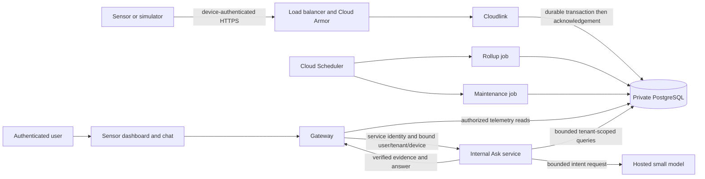

# Sensor data and conversational Ask rollout

This is the implementation and rollout ledger for the user-authorized single-sensor chatbot work on 2026-09-13. A user selects one of their sensors, selects its channel and time window, and asks questions about its stored measurements. The first slice uses a small hosted language model for bounded intent interpretation and deterministic queries/rendering for numerical evidence.

## Final runtime acceptance record — 2026-09-14, 01:07 UTC

Production active Terraform configuration converged with exit 0 and no changes. Fixture cleanup execution `registry-load-rhm2d` succeeded; the independent cleanup verification confirmed both fixture sessions and the device credential return 401. Root deleted the private production fixture manifest and retained only a sanitized closeout record. Staging fixture credential cleanup and active no-change convergence were recorded earlier. Both committed environment variable files match the applied model/schedule activation, retaining SQL alert ceilings 37/320.

Independent final inventory at 01:04:37 UTC verified all five services and four jobs in each environment against the staging-certified immutable images for source `03f40c1a2cfc3304fe7637e88d37e5c4347f7a9e`. Configured images and resolved ready-revision digests match, and each listed service revision receives 100% traffic:

| Service | Production ready revision | Staging ready revision |
| --- | --- | --- |
| web | `web-00011-tcr` | `web-00035-s68` |
| gateway | `gateway-00006-24j` | `gateway-00021-vlv` |
| intake | `intake-00002-cj7` | `intake-00009-klg` |
| cloudlink | `cloudlink-00002-cxl` | `cloudlink-00002-x2v` |
| Ask | `ask-00003-pd2` | `ask-00003-nk9` |

The four jobs are `db-migrate`, `registry-load`, `telemetry-rollup` and `telemetry-maintain`; their configured immutable images match the exact digests in the 00:04 deployment snapshot below. Ask revisions changed during model activation while preserving the same application image.

Production automatic processing acceptance observed two completed minute rollups:

| Execution | Created UTC | Completed UTC | Result |
| --- | --- | --- | --- |
| `telemetry-rollup-zr2tc` | 01:01:00.875770 | 01:02:30.523868 | Succeeded, one task |
| `telemetry-rollup-6tqzg` | 01:02:11.389108 | 01:04:25.704000 | Succeeded, one task |

Scheduler logs correlate the 01:01/01:02 dispatches with HTTP 200 API acceptance; separate Cloud Run terminal state establishes completed work. Both executions used `telemetry-rollup-run@albusforge-prod.iam.gserviceaccount.com` and certified telemetry image `a39b4c21997137acefb31e34a7f92dd78f98977414bf2bb018f07d56d68c0d88`. Correlated health snapshots had zero dirty hours, oldest dirty seconds and default rows. Positive post-activation heartbeat metrics were visible. A 01:03 SQL sample showed two backends and CPU 5.409%; sampling can miss peaks, and the approximately 90/134-second overlapping executions do not establish maximum throughput.

Both production schedules and all 13 sensor policies were enabled at 01:01:45 UTC. Automatic daily maintenance at 00:05 UTC was not observed in this bounded window; the successful deployment seed remains separate evidence. Later minute dispatches were still pending at the observation cutoff, so future execution success is not claimed.

**Residual operator closeout:** the two inconsistent zero-job GitHub records `34793442644`/`34793442663` remain unresolved despite successful serialized replacements. Root started a watcher restricted to these superseded IDs (30-second interval, bounded to 24 hours), which requests cancellation if jobs appear; it cannot dispatch a new deployment. This is mitigation, not proof those records are cleared. Workflow restoration is planned after this documentation PR merges and remains a future operator step, with its actual result to be recorded privately. Do not treat this runtime acceptance as proof that every workflow history is drained for a later Terraform window.

The bounded rollout now has recorded simulator ingestion/read/processing, browser, quota, two attributed provider calls, synthetic notification incident/recovery receipt, fixture credential cleanup and active configuration convergence. Physical-device validation, backend telemetry SSE, sustained load certification and automatic daily maintenance observation remain separate work. Earlier timestamps and pending-state statements below are preserved as historical snapshots, superseded only by the specific later evidence above.

## Earlier production activation update — 2026-09-14, 01:02 UTC

All six production runtime promotions succeeded at source `03f40c1a2cfc3304fe7637e88d37e5c4347f7a9e`:

| Release | Successful workflow |
| --- | --- |
| Gateway/schema | [34793233220](https://github.com/guitarpastdusk/albusforge/actions/runs/34793233220) |
| Cloudlink | [34793442684](https://github.com/guitarpastdusk/albusforge/actions/runs/34793442684) |
| Ask | [34793442633](https://github.com/guitarpastdusk/albusforge/actions/runs/34793442633) |
| Intake | [34793866253](https://github.com/guitarpastdusk/albusforge/actions/runs/34793866253) |
| Telemetry jobs | [34793865162](https://github.com/guitarpastdusk/albusforge/actions/runs/34793865162) |
| Web | [34794045944](https://github.com/guitarpastdusk/albusforge/actions/runs/34794045944) |

The replacement intake/telemetry runs and web release were independently checked for successful completion at that SHA. Root applied production model activation and schedule activation; both schedules and five dependent alerts were enabled. The committed production input matches the applied private configuration: model enabled, `claude-haiku-4-5`, schedules enabled and SQL alert threshold 320. Final active-state convergence and automatic schedule acceptance are still pending.

Production provider request `c158d87a-454e-4848-868e-66acf7a03182` passed SQL/log verification through `registry-load-g6z2m`: `claude-haiku-4-5-20251001`, 341 input tokens, 9 output tokens, $0.000386 recorded cost. Together with the earlier staging request, these are two verified acceptance calls totaling $0.000772, not total account spend. Production browser acceptance covered nine views with zero page errors and zero additional questions. Fixture-cleanup job execution is still in progress and must be verified before closeout.

**Unresolved GitHub run records:** initial telemetry run `34793442644` and intake run `34793442663` show queued with zero jobs. Root's cancel and force-cancel attempts returned 409 indicating they were not queued for cancellation; replacement releases were dispatched serially and succeeded. These inconsistent orphan run records have not been cleared. They are an operational limitation requiring follow-up, not evidence that all workflow queues are drained. Future infrastructure windows must still inspect complete histories and resolve or explicitly account for these records alongside actual job execution state.

Keep this PR draft until automatic schedule observation, fixture cleanup and final convergence are recorded and independently reviewed. Physical devices and backend telemetry SSE remain outside this acceptance; no new hardware claim follows from simulator/provider/browser success.

## Earlier production progress and notification update — 2026-09-14, 00:48 UTC

The user-authorized synthetic notification test in staging passed both OPEN and CLOSED/recovery observation. The user explicitly confirmed receipt of both emails at 00:47:01 UTC. Temporary alert-policy and metric cleanup was completed and both resources verified absent with 404; metric cleanup recovered at 00:44:34 UTC. The private evidence record `monitoring-probe-6da5fddd0d4841edbc47db33b5a48ff0.json` records the observation, cleanup recovery and recipient confirmation without publishing the notification address. This validates that synthetic incident/recovery delivery path, not every production alert condition.

Production infrastructure now has a no-change convergence plan. The following promotions completed successfully at source `03f40c1a2cfc3304fe7637e88d37e5c4347f7a9e`, independently checked against GitHub:

| Production release | Successful workflow |
| --- | --- |
| Gateway/schema | [34793233220](https://github.com/guitarpastdusk/albusforge/actions/runs/34793233220) |
| Cloudlink | [34793442684](https://github.com/guitarpastdusk/albusforge/actions/runs/34793442684) |
| Ask | [34793442633](https://github.com/guitarpastdusk/albusforge/actions/runs/34793442633) |

At root's handoff, telemetry [34793442644](https://github.com/guitarpastdusk/albusforge/actions/runs/34793442644) and intake [34793442663](https://github.com/guitarpastdusk/albusforge/actions/runs/34793442663) were queued. Root reports production synthetic fixture provisioning and ingestion passed. Production reads, provider/model activation, schedules and remaining release/cleanup evidence are still pending; this update does not close production acceptance. The production variable file remains at its disabled model/schedule settings until an applied activation is recorded.

## Earlier staging closeout update — 2026-09-14, 00:36 UTC

Staging active configuration produced a no-change Terraform plan after activation. Root confirmed pipeline fixture credentials revoked/deleted; the earlier quota credentials were separately removed and cleanup verified. The provider SQL/log audit remains the single request `520e1c51-286e-45b1-9173-95208454e904`, recorded cost $0.000386; no additional provider call is implied by this update.

Independent read-only schedule observation from 00:27–00:31 UTC confirmed three automatically dispatched rollups completed:

| Execution | Created UTC | Completed UTC | Result |
| --- | --- | --- | --- |
| `telemetry-rollup-l5d9n` | 00:27:00.945859 | 00:28:22.114425 | Succeeded, one task |
| `telemetry-rollup-ctq2m` | 00:28:04.048863 | 00:30:38.164025 | Succeeded, one task |
| `telemetry-rollup-rp9sc` | 00:29:04.885284 | 00:30:40.300378 | Succeeded, one task |

Scheduler attempt logs recorded HTTP 200, while separate Cloud Run terminal conditions established completion. Correlated health logs reported `dirty_hours=0`, `oldest_dirty_seconds=0`, `default_rows=0` for each execution, using the app-role rollup service account and telemetry image `a39b4c21997137acefb31e34a7f92dd78f98977414bf2bb018f07d56d68c0d88`. Positive heartbeat points were observed after activation. Execution elapsed times of approximately 81–154 seconds demonstrate overlap; this bounded check is not a throughput certification. A SQL sample at 00:30 UTC showed two backends and CPU 12.20%; sampled metrics can miss short peaks.

Both staging schedules and all 13 sensor alert policies were enabled in the 00:29:33 UTC inventory. The daily maintenance schedule is 00:05 UTC; its prior successful manual run and heartbeat do not establish an automatic daily execution in this observation window. Later minute work was still starting at the cutoff.

Root completed production's initial apply (54 creates, two updates) and a follow-up normalization of two scheduler resources. Production convergence verification and runtime promotions remain pending; infrastructure provisioning is not production acceptance. The user explicitly authorized a notification test and root started it; incident delivery, recovery and recipient receipt have no completed outcome recorded here. Keep this rollout PR draft until production closeout and the remaining evidence are recorded. No physical-device or backend telemetry SSE acceptance is claimed.

## Earlier activation update — 2026-09-14, 00:28 UTC

Root applied staging model activation and schedule activation successfully. The current staging variable file now records `ask_model_enabled=true`, `ask_model=claude-haiku-4-5`, `telemetry_schedules_enabled=true` and SQL connection alert threshold 37, matching the applied private activation input. Both schedules and five schedule-dependent alerts are enabled. Actual automatic execution observation remains pending; enabled configuration alone does not prove scheduled processing.

The provider acceptance request `520e1c51-286e-45b1-9173-95208454e904` was verified against SQL and logs through audit execution `registry-load-mbjh2`: model `claude-haiku-4-5-20251001`, 341 input tokens, 9 output tokens, recorded cost $0.000386, outcome `model`, known usage. This establishes one real-provider call with attributed usage; it is not a sustained quality or load evaluation.

The full durable-quota SQL audit and cleanup passed through `registry-load-zg4s7`; subsequent cleanup verification passed and quota-test credentials were removed. Pipeline fixture cleanup remains in flight and is tracked separately.

Production's fresh plan was reviewed after its exclusion window: 54 creates, two updates, no deletions. Root's production apply is in progress; completion and production service/acceptance evidence are not claimed. Production's committed rollout inputs remain model disabled, schedules paused and SQL alert threshold 320. Physical hardware validation and backend telemetry SSE remain outside the accepted scope.

## Earlier acceptance update — 2026-09-14, 00:14 UTC

Root-operated staging checks now extend the deployment snapshot below:

- The bounded HTTP load check sent 30 requests at concurrency 10: 20 returned 202 and 10 deliberately invalid-token requests returned 401. This is a small acceptance exercise, not sustained capacity or hardware evidence.
- Post-ingest processing execution `telemetry-rollup-vrwkv` succeeded at 00:04:54 UTC. Verification found two raw readings, latest value 20, minute-rollup count 2, and the expected 401/404 authorization outcomes.
- Model-disabled Ask request `dde56f84-9566-478c-8f7d-37fb1343602f` returned mean 15. Its SQL audit confirmed `evidence_only`, no model attempt, known usage and zero cost.
- Deployed browser acceptance completed at 00:13:46 UTC with 12 screenshots across 1440px, 390px and 320px widths, no document overflow or page errors, and exactly one additional model-disabled question. This supports the deployed polling dashboard and chat. The SSE endpoint remains unavailable with 501; this is not backend telemetry-stream acceptance.
- The durable actor-quota probe correlated request `cb4a719d-0e3f-423f-abd9-9e880f536de3` with an actor-scoped rejection log. The corresponding SQL quota audit and cleanup are still running, so full quota acceptance is not yet claimed.

Model activation has not been applied. Schedules remain paused, production unchanged, physical-device and provider acceptance unproven. Fixture cleanup and the complete quota audit require their own successful execution evidence before closeout.

## Deployment snapshot — 2026-09-14, 00:04 UTC

All six staging deployment workflows succeeded at source `03f40c1a2cfc3304fe7637e88d37e5c4347f7a9e`: gateway/schema, intake, telemetry jobs, cloudlink, Ask and web. The four newly completed sensor/web runs were independently checked against GitHub for successful conclusion and the exact source SHA. The root-operated release ledger records these five service revisions and four job images in `albusforge-staging`, `us-central1`:

| Service | Revision | Immutable image digest | Successful release |
| --- | --- | --- | --- |
| gateway | `gateway-00021-vlv` | `cc2da8a745e5b30bf501e9c1e721e3b7dca38ed06f5b3c6d9373dcfcf093c9e0` | [Run 34789222331](https://github.com/guitarpastdusk/albusforge/actions/runs/34789222331) |
| intake | `intake-00009-klg` | `cd7e9b008ad4262bc36fd6757628af510d235812d0e6b949014a5a72a4ef6cbc` | [Run 34789264756](https://github.com/guitarpastdusk/albusforge/actions/runs/34789264756) |
| cloudlink | `cloudlink-00002-x2v` | `63d59e652d50c7bcfb5db77e06022a624a7d52f00649a0bc2de81bebe15df92d` | [Run 34791185077](https://github.com/guitarpastdusk/albusforge/actions/runs/34791185077) |
| ask | `ask-00002-msm` | `dbaef2150f6f518b5d9faa2e889e8eca8a8d6c4e23d5a062df5c29430afb70be` | [Run 34791186642](https://github.com/guitarpastdusk/albusforge/actions/runs/34791186642) |
| web | `web-00035-s68` | `8e1e2ee8030514d77bf6497dcc8a85b41ddbe1bb3aaa2752e3d500b704558c23` | [Run 34791188063](https://github.com/guitarpastdusk/albusforge/actions/runs/34791188063) |

| Job | Immutable image digest | Release |
| --- | --- | --- |
| db-migrate | `baeccb5bb370d958a64593a5760cb8c52a1c5b9968e22ab72236cf5dc8b08a97` | [Run 34789222331](https://github.com/guitarpastdusk/albusforge/actions/runs/34789222331) |
| registry-load | `baeccb5bb370d958a64593a5760cb8c52a1c5b9968e22ab72236cf5dc8b08a97` | [Run 34789222331](https://github.com/guitarpastdusk/albusforge/actions/runs/34789222331) |
| telemetry-rollup | `a39b4c21997137acefb31e34a7f92dd78f98977414bf2bb018f07d56d68c0d88` | [Run 34791182940](https://github.com/guitarpastdusk/albusforge/actions/runs/34791182940) |
| telemetry-maintain | `a39b4c21997137acefb31e34a7f92dd78f98977414bf2bb018f07d56d68c0d88` | [Run 34791182940](https://github.com/guitarpastdusk/albusforge/actions/runs/34791182940) |

These are software deployment observations, not completion of the acceptance gates. Root reports successful hash-only fixture provisioning through existing job execution `registry-load-h9kmd`; credentials remain private. Live HTTP checks passed accepted ingestion, duplicate handling, delayed/backfilled samples and wrong-token rejection. A scoped Ask HTTP request returned two readings with mean 15 with the model disabled. These results exercise deployed services with simulator data; they do not establish physical sensor operation or a provider response.

At this snapshot, the Ask accounting audit, post-ingest rollup checks, bounded load and quota checks are still underway. Deployed browser acceptance, provider acceptance and production acceptance have no completed evidence here. Model calls remain disabled and schedules paused; no activation flag changes accompany these results. Production remains unchanged and its earlier plan remains non-applyable preflight evidence. Subsequent updates append completed checks and exact execution identifiers without replacing this historical boundary.

## Earlier rollout snapshot — 2026-09-13, 23:23 UTC

The earlier inventory, PR ownership states and local tests below remain historical evidence at their stated timestamps/commits. They are not overwritten by this execution record. Current architecture and deployment are distinct: implementation is merged; deployment and acceptance proceed in stages.

| Evidence | Observed result | Remaining boundary |
| --- | --- | --- |
| Capacity controls [#60](https://github.com/guitarpastdusk/albusforge/pull/60) | Merged as `d8c81b2`; staging caps fit the measured 50-connection server | Idle capacity is not a load test |
| Observability [#61](https://github.com/guitarpastdusk/albusforge/pull/61) | Merged as `6ebe7fa`; exact breach counters avoid distribution-bucket threshold bias | Runtime signals and notification delivery still need acceptance |
| Acceptance tooling [#59](https://github.com/guitarpastdusk/albusforge/pull/59) | Merged as `6003b6a` | Committed probes do not establish that cloud acceptance passed |
| Maintenance alert correction [#66](https://github.com/guitarpastdusk/albusforge/pull/66) | Merged as `ce675bf`; supported 25-hour history | Historical plans before this correction are not current desired state |
| Staging infrastructure | Root reports provisioned and converged; model disabled, schedules paused | Bootstrap resources alone do not establish working sensor ingestion or Ask |
| Staging intake, source `03f40c1` | [Run 34789264756](https://github.com/guitarpastdusk/albusforge/actions/runs/34789264756) succeeded; revision `intake-00009-klg`, digest `cd7e9b008ad4262bc36fd6757628af510d235812d0e6b949014a5a72a4ef6cbc` | Intake deployment is separate from the sensor Ask runtime |
| Staging gateway/schema, source `03f40c1` | [Run 34789222331](https://github.com/guitarpastdusk/albusforge/actions/runs/34789222331) succeeded at 23:23:20 UTC, including owner migration, registry load, gateway deploy and immutable staging marker steps | Exact serving digest inventory and integrated acceptance are recorded separately when collected |
| Sensor runtime/job images | Deployment evidence not yet recorded in this snapshot | Cloudlink, Ask and processing runtime promotion/acceptance remain pending |
| Production | Read-only preflight at `03f40c1`, 23:18:41 UTC: 54 creates, 2 updates, no deletes/replacements; only gateway Ask URL and edge route update, existing images unchanged | No production mutation. Preflight is explicitly not applyable; fresh plan follows the complete production drain |

The production preflight confirmed SQL alert threshold 320, model disabled and schedules paused. New sensor resources use the module bootstrap placeholders until release workflows promote immutable images. Its private plan hash is `9b681a90758d3ca0bc3d41bda3afde41d2ca751d327e2b681a44fc5549f01221`; the hash identifies inspection evidence, not an apply artifact. Refreshed registry-load drift was execution count/latest execution metadata only, with no desired job configuration update.

Named nonsecret initial configuration is committed as [`rollout-staging.tfvars.json`](../infra/env/rollout-staging.tfvars.json) and [`rollout-prod.tfvars.json`](../infra/env/rollout-prod.tfvars.json). The [environment runbook](../infra/env/README.md#sensor-rollout-configuration) requires the explicit private base plus matching environment file and the reviewed workflow/job exclusion window. Staging reservations remain 40/50 connections including observer/reserved slots; production's one-retry/600-second rollup bound is approximately 266/400. Those are capacity reservations, not demonstrated throughput.

No physical sensor, real-provider chatbot, complete deployed portal journey or production acceptance is claimed by this snapshot. Later rollout updates append exact evidence here and change activation flags only after the corresponding acceptance gates pass.

## Existing implementation and observed cloud state

Merged foundations: standalone ingest (#32), partitioned storage and rollup/retention code (#40), live portal UI (#42), authenticated telemetry read APIs (#44), gateway sign-in/session issuance (#45), and intake/model infrastructure (#37). A merged PR proves repository state, not that its services or jobs have been deployed.

Read-only Cloud Run and Cloud Scheduler inventory on 2026-09-13 at approximately 20:49 UTC, `us-central1`:

| Environment | Latest ready service revisions | Jobs | Scheduler jobs |
| --- | --- | --- | --- |
| staging | `gateway-00014-rxr`, `intake-00002-bfb`, `web-00028-cl9` | `db-migrate`, `registry-load` | none |
| prod | `gateway-00004-sj8`, `intake-00001-z8n`, `web-00010-bf4` | `db-migrate`, `registry-load` | none |

No `cloudlink` or sensor Ask service, telemetry rollup job or maintenance job was listed in either environment. These revision names are inventory evidence only: they do not attest to traffic allocation, image provenance, database migrations or working physical devices. Promotion of the existing production gateway is a separate deployment decision.

## Historical implementation ownership and PR boundaries

| Workstream | Branch / isolated tree | Scope | State |
| --- | --- | --- | --- |
| Sensor cloud infrastructure | `codex/sensor-infra`, `/private/tmp/albusforge-sensor-infra` | Cloudlink, Ask runtime, scheduled database jobs, IAM/network/edge, delivery workflows and operational controls | [PR #52](https://github.com/guitarpastdusk/albusforge/pull/52), review pending |
| Sensor Ask backend | `codex/sensor-ask`, `/private/tmp/albusforge-sensor-ask` | Internal Ask contract, scoped query execution, small-model intent selection, evidence, persistent request budgets and metering | [PR #54](https://github.com/guitarpastdusk/albusforge/pull/54), review requested |
| Gateway and portal | `codex/sensor-gateway`, `/private/tmp/albusforge-sensor-gateway` | Session-authorized Ask bridge and sensor chat controls mounted on the independently developed telemetry monitor | [PR #53](https://github.com/guitarpastdusk/albusforge/pull/53), stacked on UI PR #50; Ask contract integration implemented |
| Architecture and integration ledger | `codex/sensor-architecture`, `/private/tmp/albusforge-sensor-architecture` | This ledger, central architecture boundaries, dependency/review/rollout evidence | [PR #47](https://github.com/guitarpastdusk/albusforge/pull/47), review pending |

The separate UI agent's [PR #50](https://github.com/guitarpastdusk/albusforge/pull/50) supplies the paginated telemetry fleet and bounded raw/rollup history monitor using the existing read API. The Ask integration adopts those pages; it does not add a second set of richer dashboard/fleet adapter endpoints. [PR #51](https://github.com/guitarpastdusk/albusforge/pull/51) preserves the pre-existing deployed/local spend monitoring correction as a separate infrastructure prerequisite, leaving the original shared-checkout file untouched.

Every workstream has a dedicated PR. The gateway integration stacks on UI PR #50 and also requires the Ask service/schema PR before deployment. Shared architecture changes stay in the architecture branch; service-specific runbooks stay with the service. Code review uses exact commits and does not authorize merging or deploying unrelated work.

## Target data path

The ingest acknowledgement continues to mean durable SQL acceptance. Scheduled rollups process transactionally recorded dirty hours; daily maintenance creates partitions and expires only safely aggregated data. The raw/minute/hour contracts and restricted database roles remain those in [TELEMETRY-STORAGE.md](TELEMETRY-STORAGE.md).

The Ask service receives identity bound by the authenticated gateway and independently checks membership/device scope. The model does not select a tenant, emit SQL or execute writes. Channel/window bounds, query deadlines, result limits, request quotas and token caps apply before a provider call. Request accounting must survive instance restarts and prevent a retry from creating another billable call. Numerical answers refer to the executed query, channel units, sample count and time window; missing data or unsupported questions are explicit outcomes.

The initial UI keeps its transcript within the tab and exposes the current channel/window. If earlier messages are not sent to the model, the UI must say so; it must not promise remembered conversational context. Persistent conversation storage, cross-sensor reasoning, baseline/anomaly analysis and write actions are later work.

## Terraform plan evidence

Infrastructure PR #52 alone produces the same read-only plan counts in both environments: 34 additions, five updates, no destruction. Three updates would revert deployed LLM monitoring to the stale checked-in configuration. Combining the exact pre-existing correction from PR #51 removes those reversions: **34 additions, two updates, no destruction** in both environments. The two updates are the HTTPS URL map and gateway Cloud Run service (`ASK_URL`). Private plans are retained locally; their sensitive contents are not published.

These plans prepare the action; they are not evidence of an apply. Telemetry schedules start paused and model calls start disabled until migration/image verification and staged acceptance are complete. The current production service versions differ substantially from staging; new sensor resources do not implicitly promote the existing gateway/web/intake stack.

## Integration and deployment sequence

1. Review the independent implementation PRs and the stacked schema/gateway dependency at exact heads. Verify the combined checkout builds and tests, not only each branch separately.
2. Review Terraform plans for each environment, accounting for the existing user-owned infrastructure changes. Confirm explicit service caps and a database connection reservation shared by gateway, intake, cloudlink, Ask, migrations and scheduled jobs. Retain headroom for overlapping revisions.
3. Build immutable service/job images. Apply schema migrations before the service that needs them; prepare networking, service accounts, secret references and internal invocation permissions. Never embed API keys or database passwords in source, PRs or plans shared for review.
4. Establish staging cloudlink routing and health, then deploy the rollup and maintenance job images before enabling their schedules. Confirm one-minute rollup and daily maintenance execution, restricted roles, retry behavior and observable failures.
5. Deploy the internal Ask service, then its gateway integration and portal chat. Run model-free staging checks first. A paid provider call is separate evidence and must be explicitly budgeted; fixtures are not a real-provider test.
6. Exercise a provisioned simulator through durable ingestion, latest/history reads and a sensor question. Verify authorization failures for another tenant, duplicate ingestion, delayed samples, retention boundaries, upstream timeouts and exhausted Ask budgets. Record exact image digests, migration state and executed job results.
7. Promote only the reviewed and verified staging images through existing promotion gates. Physical sensor acceptance remains separate from simulator acceptance.

## Local integration evidence

A root-owned combined checkout was assembled from infrastructure `2291d64`, monitoring `47cc606`, Ask `1b3306c`, and gateway/portal `ffef4a1` (including the UI #50 base `a1a9b7e`). The complete workspace `turbo run typecheck lint test build` passed all **36 tasks** (32 cache hits on the final corrective rerun). This includes 27 Ask, 222 gateway, 600 web and 21 database tests. These results apply to those commits, not to later changes on the independent UI branch.

An additional local test used PostgreSQL 16 and actual HTTP servers for cloudlink, gateway and Ask. It ingested two samples, confirmed a repeated packet did not add duplicate rows, ran the rollup worker, read authenticated fleet/latest endpoints, and obtained a sensor answer with verified count 2 and mean 15. Missing authentication returned 401; removed membership returned 403. The model was disabled, so this validates the deterministic fallback and service/data integration, not a provider response. The pipeline passed again on the final combined commits listed above. The temporary test and execution log are retained in `/private/tmp/albusforge-sensor-evidence/`.

The gateway branch also passed a browser check with contract-stub transport at desktop, 390px and 320px widths, including long channel identifiers and Ask evidence, without document overflow or page errors. Infrastructure validation includes Terraform validation/mocked configuration tests, actionlint, and 94 shell checks. Ask failure-path corrections also pass the three independent reviewer reproductions for socket loss, post-body disconnect and pool acquisition deadlines. Infrastructure release-gate corrections pass the three adapted reviewer probes for newer failed/running migrations and imported policy changes. Cloud read-only plans are described above; the final infrastructure delta changes shell guards and docs, with Terraform unchanged from `83eae51`. Review verdicts and current CI belong to each PR's exact head; passing local checks do not substitute for review.

After that combined run, infrastructure `bcc0222` tightened only the release guard, its tests and runbook. It rejects overlapping terminal migration histories regardless of completion order and requires a fresh matching success created after all other observed attempts finished. All **103 shell checks** pass, including the independent reviewer overlap reproduction with only its target path and expected rejection changed. Terraform and application code are unchanged; the earlier combined test and plan evidence remains attributed to its original commits. This corrective delta awaits independent review.

## Acceptance evidence to collect

| Claim | Required evidence |
| --- | --- |
| Ingestion deployed | Traffic-serving cloudlink revision/digest, LB route and authenticated simulator acknowledgement with corresponding database rows |
| Processing operational | Successful rollup and maintenance executions, actual schedules, recent watermarks/backlog metrics and no privilege escalation |
| Sensor reads integrated | Logged-in portal renders that tenant's stored channels/readings; absent metadata has honest labels and unsupported controls remain unavailable |
| Ask integrated | Gateway authorization, internal service invocation, deterministic evidence, bounded model call/fallback, durable quotas and metering |
| Real-provider chatbot | Explicitly budgeted provider call, verified response/evidence and attributed usage; never inferred from mocks |
| Production ready | Reviewed plan, shared SQL budget, migration/rollout order, load/failure checks, alerts, exact promoted image evidence |

## Remaining independent work

Durable event delivery and tenant-scoped SSE are not supplied by the scheduled SQL jobs. The merged live UI's reconnect behavior does not prove a backend telemetry stream. Baselines, anomaly detectors, model-written anomaly narratives, Signals/Inbox, persistent conversations, automated production provisioning/token rotation, and firmware/hardware acceptance remain separate items. The first stored-data chatbot does not require completing those items.

## Authorized deployment preparation, 2026-09-13

The user subsequently authorized staged deployment and production promotion after acceptance. SQL probes through existing VPC-attached registry-load executions confirmed connection limits of 50 (staging) and 400 (prod), including three superuser-reserved slots each. Staging service/pool caps are reduced before provisioning; planned combined reservations are 40/50 and 266/400 respectively, including overlapping revisions/jobs and observer/reserved slots. Current low utilization is an idle baseline, not load evidence. See SENSOR-INFRA for limits and rollout controls. Fresh plans, actual migrations/images, schedules and acceptance evidence must be recorded as execution proceeds; this preparation does not claim deployment.
