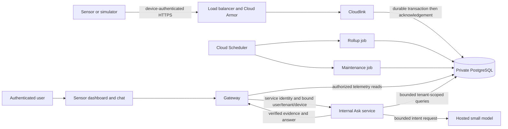

# Sensor data and conversational Ask rollout

This is the implementation and rollout ledger for the user-authorized single-sensor chatbot work on 2026-09-13. A user selects one of their sensors, selects its channel and time window, and asks questions about its stored measurements. The first slice uses a small hosted language model for bounded intent interpretation and deterministic queries/rendering for numerical evidence.

## Existing implementation and observed cloud state

Merged foundations: standalone ingest (#32), partitioned storage and rollup/retention code (#40), live portal UI (#42), authenticated telemetry read APIs (#44), gateway sign-in/session issuance (#45), and intake/model infrastructure (#37). A merged PR proves repository state, not that its services or jobs have been deployed.

Read-only Cloud Run and Cloud Scheduler inventory on 2026-09-13 at approximately 20:49 UTC, `us-central1`:

| Environment | Latest ready service revisions | Jobs | Scheduler jobs |
| --- | --- | --- | --- |
| staging | `gateway-00014-rxr`, `intake-00002-bfb`, `web-00028-cl9` | `db-migrate`, `registry-load` | none |
| prod | `gateway-00004-sj8`, `intake-00001-z8n`, `web-00010-bf4` | `db-migrate`, `registry-load` | none |

No `cloudlink` or sensor Ask service, telemetry rollup job or maintenance job was listed in either environment. These revision names are inventory evidence only: they do not attest to traffic allocation, image provenance, database migrations or working physical devices. Promotion of the existing production gateway is a separate deployment decision.

## Work ownership and PR boundaries

| Workstream | Branch / isolated tree | Scope | State |
| --- | --- | --- | --- |
| Sensor cloud infrastructure | `codex/sensor-infra`, `/private/tmp/albusforge-sensor-infra` | Cloudlink, Ask runtime, scheduled database jobs, IAM/network/edge, delivery workflows and operational controls | Implementation in progress |
| Sensor Ask backend | `codex/sensor-ask`, `/private/tmp/albusforge-sensor-ask` | Internal Ask contract, scoped query execution, small-model intent selection, evidence, persistent request budgets and metering | Implementation in progress |
| Gateway and portal | `codex/sensor-gateway`, `/private/tmp/albusforge-sensor-gateway` | Session-authorized gateway bridge, actual telemetry fleet/dashboard adapter, sensor chat controls and evidence display | Implementation in progress; depends on Ask contract |
| Architecture and integration ledger | `codex/sensor-architecture`, `/private/tmp/albusforge-sensor-architecture` | This ledger, central architecture boundaries, dependency/review/rollout evidence | Implementation in progress |

Every workstream has a dedicated PR. The gateway integration may stack on the Ask schema/service PR. Shared architecture changes stay in the architecture branch; service-specific runbooks stay with the service. Code review uses exact commits and does not authorize merging or deploying unrelated work.

## Target data path

The ingest acknowledgement continues to mean durable SQL acceptance. Scheduled rollups process transactionally recorded dirty hours; daily maintenance creates partitions and expires only safely aggregated data. The raw/minute/hour contracts and restricted database roles remain those in [TELEMETRY-STORAGE.md](TELEMETRY-STORAGE.md).

The Ask service receives identity bound by the authenticated gateway and independently checks membership/device scope. The model does not select a tenant, emit SQL or execute writes. Channel/window bounds, query deadlines, result limits, request quotas and token caps apply before a provider call. Request accounting must survive instance restarts and prevent a retry from creating another billable call. Numerical answers refer to the executed query, channel units, sample count and time window; missing data or unsupported questions are explicit outcomes.

The initial UI keeps its transcript within the tab and exposes the current channel/window. If earlier messages are not sent to the model, the UI must say so; it must not promise remembered conversational context. Persistent conversation storage, cross-sensor reasoning, baseline/anomaly analysis and write actions are later work.

## Integration and deployment sequence

1. Review the independent implementation PRs and the stacked schema/gateway dependency at exact heads. Verify the combined checkout builds and tests, not only each branch separately.
2. Review Terraform plans for each environment, accounting for the existing user-owned infrastructure changes. Confirm explicit service caps and a database connection reservation shared by gateway, intake, cloudlink, Ask, migrations and scheduled jobs. Retain headroom for overlapping revisions.
3. Build immutable service/job images. Apply schema migrations before the service that needs them; prepare networking, service accounts, secret references and internal invocation permissions. Never embed API keys or database passwords in source, PRs or plans shared for review.
4. Establish staging cloudlink routing and health, then deploy the rollup and maintenance job images before enabling their schedules. Confirm one-minute rollup and daily maintenance execution, restricted roles, retry behavior and observable failures.
5. Deploy the internal Ask service, then its gateway integration and portal adapter. Run model-free staging checks first. A paid provider call is separate evidence and must be explicitly budgeted; fixtures are not a real-provider test.
6. Exercise a provisioned simulator through durable ingestion, latest/history reads and a sensor question. Verify authorization failures for another tenant, duplicate ingestion, delayed samples, retention boundaries, upstream timeouts and exhausted Ask budgets. Record exact image digests, migration state and executed job results.
7. Promote only the reviewed and verified staging images through existing promotion gates. Physical sensor acceptance remains separate from simulator acceptance.

## Acceptance evidence to collect

| Claim | Required evidence |
| --- | --- |
| Ingestion deployed | Traffic-serving cloudlink revision/digest, LB route and authenticated simulator acknowledgement with corresponding database rows |
| Processing operational | Successful rollup and maintenance executions, actual schedules, recent watermarks/backlog metrics and no privilege escalation |
| Sensor reads integrated | Logged-in portal renders that tenant's stored channels/readings; absent metadata has honest labels and unsupported controls remain unavailable |
| Ask integrated | Gateway authorization, internal service invocation, deterministic evidence, bounded model call/fallback, durable quotas and metering |
| Real-provider chatbot | Explicitly budgeted provider call, verified response/evidence and attributed usage; never inferred from mocks |
| Production ready | Reviewed plan, shared SQL budget, migration/rollout order, load/failure checks, alerts, exact promoted image evidence |

## Remaining independent work

Durable event delivery and tenant-scoped SSE are not supplied by the scheduled SQL jobs. The merged live UI's reconnect behavior does not prove a backend telemetry stream. Baselines, anomaly detectors, model-written anomaly narratives, Signals/Inbox, persistent conversations, automated production provisioning/token rotation, and firmware/hardware acceptance remain separate items. The first stored-data chatbot does not require completing those items.
