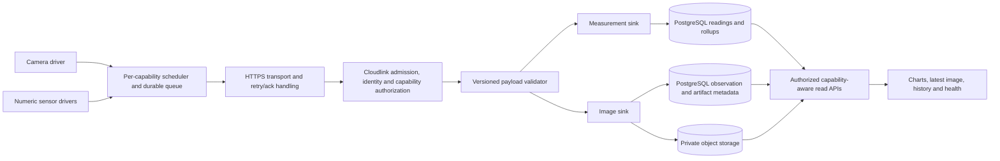

# Extensible sensor observation architecture

Proposed 2026-09-14. The user requires generic sensor readings to use the same
architecture as camera uploads. The camera's configured cadence is 900 seconds;
that cadence is not a global default for every sensor. This proposal complements
[the implementation work breakdown](CAMERA-CLOUD-IMPLEMENTATION.md).

## One device, several independently configured capabilities

A device has a tenant-owned identity, credential lifecycle, firmware/profile
identity and a set of server-approved capabilities. Each capability names a
physical/logical source, its kind, payload schema, cadence, units/ranges or media
constraints, quotas and retention policy. A capability may have several numeric
channels, such as temperature, humidity and pressure from one BME280.

Example capability configuration (illustrative intervals except camera):

```json
{
  "device_id": "<UUID>",
  "capabilities": [
    {"id":"camera.front","kind":"image","schema":"jpeg.v1","interval_s":900},
    {"id":"environment","kind":"measurement","schema":"readings.v1","interval_s":60},
    {"id":"soil","kind":"measurement","schema":"readings.v1","interval_s":300},
    {"id":"light","kind":"measurement","schema":"readings.v1","interval_s":30}
  ]
}
```

These IDs bind to immutable reviewed registry/profile evidence. They are not
unrestricted user-supplied driver names. A device may be camera-only,
measurement-only or mixed. Empty numeric channels are valid only when another
approved capability exists; a device with no approved capability cannot enroll.
The provisioning UI and setup completion enumerate required capabilities, not
an assumption that every device has at least one numeric reading.

Application services know payload kinds and versioned contracts, not Freenove,
BH1750, BME280 or camera pin numbers. Hardware knowledge stays in registry
profiles and firmware drivers. Multiple identical sensor types on one board
remain distinguishable by capability ID; numeric channel IDs stay unambiguous
within the existing per-device channel namespace.

## Common lifecycle with typed payloads and storage



| Shared across capabilities | Specific to the payload kind |
| --- | --- |
| Device auth, revocation and tenant attribution | Numeric units/ranges vs JPEG structure/dimensions |
| Capability/schema authorization | Camera acquisition vs I2C/ADC driver code |
| Request/byte quotas and bounded admission | JSON numeric batches vs binary image bodies |
| Stable observation identity and immutable fingerprint | SQL-only commit vs SQL + object finalization |
| Retry classification and durable acknowledgment | Numeric rollups vs image retention |
| Usage dimensions and per-capability presence | Chart renderer vs image renderer |
| Credential-free build + separate secure config | Sensor-specific calibration and hardware evidence |
| Retention/deletion intents and operations interfaces | Exact storage layout and cleanup actions |

The storage abstraction exposes meaningful operations such as validate,
commit/finalize, read and expire. Do not wrap every numeric reading in a blob,
base64-encode JPEGs into the numeric envelope, or invent numeric channels to
represent an image. Numeric ingestion can commit in one PostgreSQL transaction;
only artifact sinks need two-store recovery. Sinks must declare that distinction.

## Observation identity and versioned transport

A normalized observation has:

- Device ID and immutable observation ID.
- Capability ID, approved kind and payload schema version.
- Capture time (or bounded sample times for a batch), received time and clock
  quality supported by the contract.
- Server-verified immutable payload fingerprint, length and typed metadata.
- Storage/finalization state, stable acknowledgment and receipt identity.

Kind/schema/capability are part of the fingerprint. An ID cannot be replayed
with another kind, source, timestamp or payload. Usage is counted on durable
acceptance once, by kind and bytes; retries and API traffic have separate
operational counters. Device ownership always comes from the authenticated
record and never from the observation body.

New extensible endpoint:

```http
POST /ingest/v2/devices/{device_uuid}/observations
Authorization: Bearer <device-token>
X-Observation-Id: <UUID>
X-Capability-Id: camera.front
X-Payload-Schema: jpeg.v1
X-Captured-At: <UTC epoch seconds>
X-Content-SHA256: <sha256>
Content-Type: image/jpeg

<raw JPEG bytes>
```

The approved capability selects the validator/sink. Header schema and MIME must
match it; a device cannot select arbitrary storage by naming another MIME type.
Image responses and errors use the shared observation acknowledgment documented
in CAMERA-CLOUD-IMPLEMENTATION. JSON-based kinds use application/json and a
versioned typed payload. For numeric JSON, canonicalization must preserve the
existing equivalent-key-order retry behavior; raw JPEG fingerprints hash exact
bytes. Fingerprints also include immutable envelope metadata in canonical form.

Keep the deployed `POST /ingest/v1` numeric route as a compatibility adapter.
It retains its existing numeric sequence, validation, 128 KiB limit, 202 response
and transactional receipt. Share auth/admission/policy interfaces by extracting
code with tests, not by silently changing v1's wire or replay semantics.

For v1, normalized observation identity can reference its existing `(device,seq)`
receipt in a reserved legacy namespace; do not create a second independently
committed receipt or double-count usage. Numeric batches remain one receipt
with multiple samples. Image UUIDs do not increment `last_seq` or consume the
numeric sequence namespace.

A future numeric v2 codec needs explicit sequence/storage migration work because
current raw readings use device/sequence keys. The initial compatible option is
to retain the per-device numeric sequence in that validated payload, bind it
one-to-one to its observation UUID, and atomically maintain its receipt mapping.
Reject attempts to reuse a sequence or observation ID with different identity.
Do not invent a server-generated counter that can collide with a device's v1
sequence. Supporting numeric v2 is not required to put cameras and existing
numeric sensors behind the shared lifecycle interfaces.

## Shared backend and firmware organization

Suggested logical modules (names are proposed, not existing packages):

- `packages/schema`: capabilities, observation metadata/ack/errors; separate
  measurement and image payload schemas and read-model schemas.
- `packages/db`: existing numeric repository plus observation receipts,
  capability presence, image metadata, usage and durable maintenance work.
- `packages/ingestion`: auth/policy/admission/fingerprint/receipt interfaces and
  typed sink contracts if extraction justifies a shared package; otherwise keep
  those internal to Cloudlink initially. Do not create an unused plugin framework.
- `packages/storage`: private object storage adapter used by image ingest,
  gateway and maintenance. Numeric reads do not depend on GCS.
- `apps/cloudlink`: v1 compatibility route, v2 observation dispatcher, built-in
  allowlisted measurement/image validators and sink composition.
- `apps/gateway`: session/tenant checks plus capability-specific latest/history
  projections. Existing numeric query APIs remain supported.
- Firmware SDK: driver interface, capability scheduler, owned observation buffers,
  durable queue/storage interface, HTTPS client, retry/ack state machine and
  per-capability diagnostics. Payload codecs and drivers implement small adapters.

Share transport and retry code without coupling sampling schedules. Fairly drain
queues so a photo backlog cannot starve fresh measurements; enforce total and
per-capability byte/count limits. Numeric observations can batch where their
contract permits; images remain one frame per observation. Device RAM/NVS/SD
storage choices depend on the profile and payload sizes. A generic sensor must
not require an SD card simply because the camera profile requires one.

Presence is capability-specific: a healthy temperature upload does not mask a
failed camera. Track last successful receipt and last capture separately; latest
uses capture/sample time, not arrival order. Status thresholds use that
capability's configured cadence and grace period. Device summary is an explicit
aggregation, not a single timer that assumes all sensors sample at 15 minutes.
Setup confirmation is durable receipt for each required capability plus required
numeric channels, with partial/complete/degraded states. Optional capabilities
do not block completion. Preserve historical access when only an upload
credential is revoked, subject to current user membership and retention.

## What adding another sensor should require

For another ordinary numeric sensor: reviewed registry part/profile/channel
metadata, firmware driver and calibration, provisioning capability configuration,
and hardware acceptance. Existing measurement ingestion, PostgreSQL storage,
rollups, chart APIs and retry/auth code should serve it without another Cloud
Run service, custom cloud endpoint, bucket or per-sensor credentials.

For another image-capable board: new hardware/profile/driver validation with the
same jpeg.v1 upload contract and image sink. Do not assume its pin map or JPEG
encoding capabilities match GC0308.

For a genuinely new payload kind (for example audio later): a versioned schema,
validator, resource limits, storage/retention implementation and UI renderer;
then explicit server and profile allowlisting. Credentials, transport, receipts
and quotas are reused. Arbitrary file upload, executable plugins, remote code
loading and an unbounded universal schema are not introduced.

## Additional acceptance criteria

- One mixed device uploads a photo every 900s and a numeric sensor on a different
  cadence; both are attributed to the correct capability and tenant.
- Camera backlog/failure does not stop numeric readings, and numeric arrivals
  do not conceal a stale camera. Limits are fair under concurrent producers.
- A second numeric sensor type works through metadata/driver changes and the
  existing cloud measurement path, without sensor-specific backend branches.
- Multiple same-type sensors have distinct channel/capability identities.
- Camera-only, numeric-only and mixed provisioning/setup are tested, including
  required/optional capabilities and revoked/deleted devices.
- Wrong kind/MIME/schema/capability and cross-kind observation-ID reuse reject.
- All deployed numeric v1 retry, sequence, usage, retention and authorization
  tests pass unchanged. Numeric ingestion still works if GCS is unavailable.
- Shared receipts/usage do not double-count v1 compatibility-adapter traffic.
- Per-capability policy versions remain pinned to trusted profile/config identity;
  a cadence/profile change follows the accepted-plan/config lifecycle.

Implementation C02/C04/C07/C09–C12 in the camera work breakdown include these
shared boundaries. Future payload kinds remain extensions rather than work
required for the first camera release.
