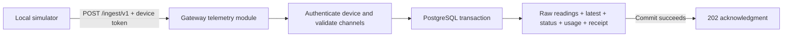

# M6a — Simulator-backed telemetry ingestion

This brings the first M6 backend slice forward alongside M2. The implementation is a module in **the existing gateway**, enabled explicitly with `TELEMETRY_ENABLED=true`; it adds no service, infrastructure resource or deployment workflow. The flag defaults to false. No cloud deployment or physical sensor connection is part of this slice.

The target design calls this capability `cloudlink`. [ADR 0003](adr/0003-edge-lb-only-ingress-and-separate-ingest-backend.md) still requires separate production ingest infrastructure for failure isolation. Hosting the initial simulator slice in gateway does not supersede that decision. Before public device rollout, either extract the module into the planned service or explicitly revise the ADR with the reliability tradeoff. The existing LB routes `/ingest/*` to web, so setting the flag alone does not expose public ingestion.

## Implemented boundary

`POST /ingest/v1` authenticates a random 256-bit device bearer credential, validates the v1 envelope and provisioned channel ranges, resolves timestamps, then commits raw readings, per-channel latest values, device status, a deduplication receipt and monthly usage together. Only a successful database commit gets a `202` acknowledgment. PostgreSQL stores the SHA-256 credential hash; tenant ownership comes from the device row. There is no client-supplied tenant identity or public provisioning endpoint.



The schema and migration live in `packages/db`; the shared wire schema lives in `packages/schema/src/telemetry.ts`. The gateway inherits existing request IDs, redacted request logs, bounded database waits and graceful shutdown. Telemetry failures do not log SQL or input values.

## Wire contract

```json
{
  "v": 1,
  "dev": "a72c44e8-5df4-4b1c-80b0-882de5903029",
  "seq": 1,
  "ts": 1789300000,
  "r": [
    { "c": "temperature_c", "t": -60, "v": 4.2 },
    { "c": "humidity_pct", "t": 1789300000, "v": 0 }
  ],
  "st": { "rssi": -62, "up_s": 60, "health": ["OK"] }
}
```

- Device IDs are UUIDs; the prefixed IDs in the platform design are illustrative.
- `seq` is a nonnegative JavaScript-safe integer, persisted across firmware reboots. The database uses `bigint`.
- `ts` is send time in epoch seconds. A negative reading `t` offsets `ts`; nonnegative `t` is epoch seconds. Samples must be at most 90 days old and no later than send time. Send time may be up to 5 minutes ahead of server time. Devices without synchronized wall time need clock synchronization before uploading; offsets alone cannot establish epoch time.
- Batches contain 1–500 finite numeric readings and are limited to 128 KiB. Undeclared channels, out-of-range values and unknown object fields reject the whole batch. Units and inclusive ranges come from the stored channel contract; values already use those canonical units. No inferred unit conversion.
- `st.up_s` and `st.health` are required. Battery and RSSI are optional so USB-powered devices need not invent battery readings. Unavailable sensor samples must be omitted and reported through health; zero humidity remains valid. Health-only envelopes and command acknowledgments are not implemented in v1 of this slice.
- A retry with the same device, sequence and parsed payload gets the original acknowledgment, without additional readings or usage. Object-key order is irrelevant. Changing that payload returns `409 sequence_conflict`. Revoked credentials fail even when replaying a previously accepted packet.
- Latest values use sample time, then sequence, then position in the packet as tie-breakers. Backfill cannot replace a newer sample. Device status follows the highest sequence; last-seen records fresh accepted arrivals. Exact retries do not update last-seen.

Success: `202 {"ok":2,"next_s":300,"cmd":[]}`. `ok` is accepted reading count, `next_s` is the provisioned upload interval; `cmd` is empty until downlink exists. Errors follow the gateway `{error:{code,message}}` shape: `400` malformed envelope, `401` device credentials, `409` conflicting retry, `413` body size, `422` channel/value/time validation, `503` storage failure. Firmware should retry transient failures with the original envelope and backoff, rather than incrementing its sequence to resend the same samples.

## Storage semantics and limits

| Table in `telemetry` | Purpose |
| --- | --- |
| `devices` | Tenant ownership, hashed credential and revocation, channel/source snapshot, upload interval, last-seen/sequence/status |
| `packets` | `(device_id, seq)` receipt, payload fingerprint and original acknowledgment |
| `readings` | Append-only samples keyed by device, sequence and ordinal; indexed by device/channel/time |
| `latest` | Latest sample per device/channel |
| `usage` | UTC receipt-month accepted-reading count and canonical JSON payload bytes per device |

Tenant attribution for readings and usage is through the device FK. Future user-facing queries must constrain that join using authenticated tenant membership; this slice exposes no read API. Channel/source snapshots are provisioned once by the local tool; the database app role is trusted and can modify them. Production provisioning must pin a BuildPlan and enforce lifecycle/immutability rules.

Raw storage is ordinary PostgreSQL tables for this bounded development slice. **Partitioning, retention deletion, rollups, Redis, event fan-out and a durable event outbox are not implemented.** Receipts are retained indefinitely; do not add the proposed 48-hour receipt TTL without resolving replay handling across the 90-day backfill window. Payload bytes measure canonical UTF-8 JSON accepted, not physical database size or compressed wire bytes. Identical channel timestamps from different sequences remain distinct raw samples; firmware must retain a sequence for retries.

## Run locally

Use a development PostgreSQL database. The provisioning tool allows only a loopback DB host, refuses Cloud Run, creates a dedicated simulator tenant/device, and writes the credential to a new mode-0600 file without printing it. It refuses to overwrite an existing file. These checks are development guardrails, not a substitute for selecting the correct database when using a local database proxy.

From the repository root:

```sh
docker compose up -d postgres
DB_HOST=localhost DB_NAME=albus DB_USER=albus_migrate DB_PASSWORD=albus_migrate DB_SSL=disable \
DB_APP_ROLE=albus_app DB_APP_PASSWORD=albus_app \
  pnpm --filter @albusforge/db db:migrate

export DB_HOST=localhost DB_NAME=albus DB_USER=albus_app DB_PASSWORD=albus_app DB_SSL=disable
pnpm --filter gateway telemetry:provision /tmp/albus-telemetry-device.json
TELEMETRY_ENABLED=true pnpm --filter gateway dev
```

In another terminal:

```sh
pnpm --filter gateway telemetry:simulate /tmp/albus-telemetry-device.json http://127.0.0.1:8080 1
```

The simulator posts one packet twice, expecting `202` both times. It allows only a loopback HTTP origin and refuses redirects. Use sequence `2`, then `3`, for later invocations because each invocation constructs new timestamps. Both sensor values are fixtures, not hardware measurements. Remove the credential file after use; delete the simulator tenant from the local database to cascade-delete its telemetry.

## Acceptance and next milestones

The integration suite runs actual PostgreSQL 16, the committed migrations and the restricted application role. It checks concurrent retries, credential isolation/revocation, spoofed tenant fields, normalization and ranges, backfill/latest ordering, rollback after a late storage failure, usage accounting and request limits. The existing gateway checks remain in the same test run.

1. **M6a review/integration:** review this slice and reconcile migration numbering with concurrent backend branches before merge. Then validate the local simulator workflow.
2. **M6b durable operations:** production BuildPlan provisioning/token lifecycle, choose the production process boundary, edge route/rate limiting, partitioning/retention, catch-up-safe rollups and durable events. Add load/failure testing before live devices.
3. **M6c dashboard:** session- and tenant-bound fleet/series/latest APIs, SSE with reconnect/backfill, portal live/history screens and offline alerts. This depends on M2 authentication and M6b event handling.
4. **M6.5 intelligence:** deterministic threshold/gap/drift detectors first; then the anomaly inbox, model narration and Ask using typed tenant-bound SQL tools and the M2 model/usage infrastructure.
5. **M4 hardware bridge, in parallel:** emit this envelope from the chosen firmware, persist sequence state, retry acknowledgments, and prove a physical sensor-to-database path.
