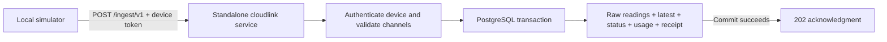

# M6a — Simulator-backed telemetry ingestion

This brings the first M6 backend slice forward alongside M2. **Sukrit’s decision, 2026-09-13: ingestion is a standalone service, never a gateway route.** `apps/cloudlink` owns `POST /ingest/v1`, its runtime, Dockerfile and CI Docker job. Gateway contains no ingest implementation or enablement flag. Shared envelope/validation types remain in `packages/schema` and the migration remains in `packages/db`.

`cloudlink` is our own service, not an external application. Its generic components are an HTTP handler, schema validation, SQL transactions and PostgreSQL storage. No external IoT platform, telemetry SaaS, dashboard, AI system, cache or message broker participates in acceptance. The Google Cloud SQL connector is an infrastructure connection adapter; local ingestion runs against ordinary PostgreSQL using the same handler.

Terraform is owned by **Claude session albusforge-44**: Cloud Run service, NEG, LB backend/path rule, service account and Armor policy. Application coordination is posted on [infra PR #29](https://github.com/guitarpastdusk/albusforge/pull/29#issuecomment-5654124527). This application branch does not change `.tf` files or deploy resources. The owner [accepted the service/scaling/edge contract](https://github.com/guitarpastdusk/albusforge/pull/29#issuecomment-5654127928), with staging max instances 2 and the production cap pending measured connection budgets. They requested direct private-IP PostgreSQL in place of the originally specified connector; that transport change is awaiting Sukrit’s answer. This branch retains the explicit connector requirement in the meantime. Deployment/promotion workflows are handed to the M6 infra PR so updates to shared migration jobs can be sequenced with other services; this application PR adds CI, not deployment workflows.

## Implemented boundary

`POST /ingest/v1` authenticates a random 256-bit device bearer credential, validates the v1 envelope and provisioned channel ranges, resolves timestamps, then commits raw readings, per-channel latest values, device status, a deduplication receipt and monthly usage together. Only a successful database commit gets a `202` acknowledgment. PostgreSQL stores the SHA-256 credential hash; tenant ownership comes from the device row. There is no client-supplied tenant identity or public provisioning endpoint.



The schema and migration live in `packages/db`; the shared wire schema lives in `packages/schema/src/telemetry.ts`. Cloudlink supplies its own generated request IDs, redacted request logs, bounded database waits and graceful shutdown. Telemetry failures do not log SQL or input values.

## Wire contract

```json
{
  "v": 1,
  "dev": "a72c44e8-5df4-4b1c-80b0-882de5903029",
  "seq": 1,
  "ts": 1789300000,
  "r": [
    { "c": "temperature_c", "t": -60, "v": 4.2 },
    { "c": "humidity_pct", "t": 1789300000, "v": 0 }
  ],
  "st": { "rssi": -62, "up_s": 60, "health": ["OK"] }
}
```

- Device IDs are UUIDs; the prefixed IDs in the platform design are illustrative.
- `seq` is a nonnegative JavaScript-safe integer, persisted across firmware reboots. The database uses `bigint`.
- `ts` is send time in epoch seconds. A negative reading `t` offsets `ts`; nonnegative `t` is epoch seconds. Samples must be at most 90 days old and no later than send time. Send time may be up to 5 minutes ahead of server time. Devices without synchronized wall time need clock synchronization before uploading; offsets alone cannot establish epoch time.
- Batches contain 1–500 finite numeric readings and are limited to 128 KiB. Undeclared channels, out-of-range values and unknown object fields reject the whole batch. Units and inclusive ranges come from the stored channel contract; values already use those canonical units. No inferred unit conversion.
- `st.up_s` and `st.health` are required. Battery and RSSI are optional so USB-powered devices need not invent battery readings. Unavailable sensor samples must be omitted and reported through health; zero humidity remains valid. Health-only envelopes and command acknowledgments are not implemented in v1 of this slice.
- A retry with the same device, sequence and parsed payload gets the original acknowledgment, without additional readings or usage. Object-key order is irrelevant. Changing that payload returns `409 sequence_conflict`. Revoked credentials fail even when replaying a previously accepted packet.
- Latest values use sample time, then sequence, then position in the packet as tie-breakers. Backfill cannot replace a newer sample. Device status follows the highest sequence; last-seen records fresh accepted arrivals. Exact retries do not update last-seen.

Success: `202 {"ok":2,"next_s":300,"cmd":[]}`. `ok` is accepted reading count, `next_s` is the provisioned upload interval; `cmd` is empty until downlink exists. Errors follow the gateway `{error:{code,message}}` shape: `400` malformed envelope, `401` device credentials, `409` conflicting retry, `413` body size, `422` channel/value/time validation, `503` storage failure or admission overload (the latter includes `Retry-After: 1`). Firmware should retry transient failures with the original envelope and backoff, rather than incrementing its sequence to resend the same samples.

## Storage semantics and limits

| Table in `telemetry` | Purpose |
| --- | --- |
| `devices` | Tenant ownership, hashed credential and revocation, channel/source snapshot, upload interval, last-seen/sequence/status |
| `packets` | `(device_id, seq)` receipt, payload fingerprint and original acknowledgment |
| `readings` | Append-only samples keyed by device, sequence and ordinal; indexed by device/channel/time |
| `latest` | Latest sample per device/channel |
| `usage` | UTC receipt-month accepted-reading count and canonical JSON payload bytes per device |

Tenant attribution for readings and usage is through the device FK. Future user-facing queries must constrain that join using authenticated tenant membership; this slice exposes no read API. Channel/source snapshots are provisioned once by the local tool; the database app role is trusted and can modify them. Production provisioning must pin a BuildPlan and enforce lifecycle/immutability rules.

Raw storage is ordinary PostgreSQL tables for this bounded development slice. **Partitioning, retention deletion, rollups, Redis, event fan-out and a durable event outbox are not implemented.** Receipts are retained indefinitely; do not add the proposed 48-hour receipt TTL without resolving replay handling across the 90-day backfill window. Payload bytes measure canonical UTF-8 JSON accepted, not physical database size or compressed wire bytes. Identical channel timestamps from different sequences remain distinct raw samples; firmware must retain a sequence for retries.

## Service contract and production scaling

| Setting | Contract for the infra owner |
| --- | --- |
| Service / image | `cloudlink`, built from `apps/cloudlink/Dockerfile` |
| Listen / routes | `0.0.0.0`, `PORT=8080`; `POST /ingest/v1`, `GET /healthz`, `GET /readyz` |
| Public edge | `/ingest/*` → cloudlink’s own NEG/backend; prefer dedicated `ingest.` hostname; `INGRESS_TRAFFIC_INTERNAL_LOAD_BALANCER` |
| Edge protection | Own Cloud Armor policy rate-limited by `Authorization`; never log the header or its value. Add a coarse invalid/missing-auth abuse limit too. The handler still validates the credential. |
| Cloud SQL | Required in Cloud Run: `INSTANCE_CONNECTION_NAME=project:region:instance`; connector uses PRIVATE IP, ADC and Cloud SQL Client IAM role; VPC reachability is still required |
| DB credentials | `DB_NAME`, `DB_USER`, `DB_PASSWORD` from Secret Manager; SQL application permissions, no migration DDL privileges |
| Pool | `DB_POOL_MAX=5`, permitted 1–10; separate pool per process |
| Admission / Cloud Run concurrency | `INGEST_MAX_INFLIGHT=8`, permitted 1–32; initial Cloud Run concurrency **8**. Excess ingest gets `503` + `Retry-After` without entering the DB pool queue. |
| Timeouts | `DB_CONNECT_TIMEOUT_MS=5000`, `DB_QUERY_TIMEOUT_MS=10000`, client read timeout = statement timeout + 1000; `DB_IDLE_TIMEOUT_MS=30000`; Cloud Run request timeout proposed **60 s** |
| Production floor | **At least 1 min instance**; staging may use 0. A warm floor avoids routine scale-from-zero latency, but replacement/scale-out can still cold-start. Firmware must buffer and retry. |
| Maximum instances | Infra must set an explicit cap from the Cloud SQL connection budget below, not a fleet-size guess. |

The handler is stateless across requests and instances: credentials, retry receipts, device sequence/status and latest samples reside in PostgreSQL. Database uniqueness and per-device row locks serialize concurrent retries, including those reaching different instances. Batches write each table with bulk SQL, bounded at 500 samples. The in-process counter is only overload protection; it is not identity, deduplication or durable state.

Choose the cap using `max_instances × DB_POOL_MAX × rollout_overlap <= telemetry_connection_budget`. Reserve connections first for the database itself, administration, gateway, other services and migration/rollup jobs. Account for old and new revisions overlapping and platform limit overshoot; per-service maxima alone are not a strict database connection guarantee. Example only: if 40 connections remain for telemetry and overlap factor is 2, pool size 5 permits a proposed maximum of 4 instances. **That is not an approved production cap** until infra measures `SHOW max_connections`, reserves other workloads’ worst-case budgets, and checks database CPU/I/O headroom. Apply the cap across all traffic-serving revisions and re-evaluate whenever pool size changes.

Separate Cloud Run compute removes the shared gateway process, queue and deployment failure domain. Cloud SQL remains a shared dependency; reserved capacity and load tests are necessary to prevent ingestion from exhausting it. Prove throughput/latency for representative 1/100/500-sample batches, multiple devices, hot-device retries, rolling revisions and DB failure before claiming production-scale capacity. Monitor acceptance latency, 503 rates, pool waits, database connections, CPU and write latency. Do not raise max instances to work around a saturated database.

Start with synchronous durable SQL acknowledgment; no broker is required. If write latency/throughput becomes the bottleneck after batching and indexing, introduce a **durable queue boundary** (for example Pub/Sub on GCP or a portable durable broker) with idempotent consumers and a dead-letter/replay policy. Acknowledge only after the queue’s durable acceptance, and explicitly revise the current meaning of `202` (database commit) and the time-to-dashboard contract. Never acknowledge an in-memory queue. Scheduled SQL jobs can provide rollups and retention without an external application.

Connector integration follows the [official PostgreSQL connector example](https://github.com/GoogleCloudPlatform/cloud-sql-nodejs-connector#using-with-postgresql). The connector uses IAM for the connection transport; database login here still uses the provisioned SQL user/password. `DB_HOST`, `DB_PORT` and `DB_SSL` are used only for direct PostgreSQL development connections; Cloud Run refuses to start without `INSTANCE_CONNECTION_NAME`.

## Run locally

Use a development PostgreSQL database. The provisioning tool allows only a loopback DB host, refuses Cloud Run, creates a dedicated simulator tenant/device, and writes the credential to a new mode-0600 file without printing it. It refuses to overwrite an existing file. These checks are development guardrails, not a substitute for selecting the correct database when using a local database proxy.

From the repository root:

```sh
docker compose up -d postgres
DB_HOST=localhost DB_NAME=albus DB_USER=albus_migrate DB_PASSWORD=albus_migrate DB_SSL=disable \
DB_APP_ROLE=albus_app DB_APP_PASSWORD=albus_app \
  pnpm --filter @albusforge/db db:migrate

export DB_HOST=localhost DB_NAME=albus DB_USER=albus_app DB_PASSWORD=albus_app DB_SSL=disable
pnpm --filter cloudlink provision /tmp/albus-telemetry-device.json
PORT=8081 pnpm --filter cloudlink dev
```

In another terminal:

```sh
pnpm --filter cloudlink simulate /tmp/albus-telemetry-device.json http://127.0.0.1:8081 1
```

The simulator posts one packet twice, expecting `202` both times. It allows only a loopback HTTP origin and refuses redirects. Use sequence `2`, then `3`, for later invocations because each invocation constructs new timestamps. Both sensor values are fixtures, not hardware measurements. Remove the credential file after use; delete the simulator tenant from the local database to cascade-delete its telemetry.

## Acceptance and next milestones

The integration suite runs actual PostgreSQL 16, the committed migrations and the restricted application role. It checks concurrent retries, credential isolation/revocation, spoofed tenant fields, normalization and ranges, backfill/latest ordering, rollback after a late storage failure, usage accounting and request limits. Separate gateway regression tests verify its existing API. The `docker-cloudlink` CI job builds the image, applies migrations, provisions an isolated fixture, exercises authenticated ingestion/retry/conflict over HTTP, checks the stored row count and verifies graceful shutdown.

1. **M6a review/integration:** review this slice and reconcile migration numbering with concurrent backend branches before merge. The local simulator workflow is covered by the integration suite.
2. **M6b durable operations:** production BuildPlan provisioning/token lifecycle, the separate production service and edge route/rate limiting, partitioning/retention, catch-up-safe rollups and durable events. Add load/failure testing before live devices.
3. **M6c dashboard:** session- and tenant-bound fleet/series/latest APIs, SSE with reconnect/backfill, portal live/history screens and offline alerts. This depends on M2 authentication and M6b event handling.
4. **M6.5 intelligence:** deterministic threshold/gap/drift detectors first; then the anomaly inbox, model narration and Ask using typed tenant-bound SQL tools and the M2 model/usage infrastructure.
5. **M4 hardware bridge, in parallel:** emit this envelope from the chosen firmware, persist sequence state, retry acknowledgments, and prove a physical sensor-to-database path.
