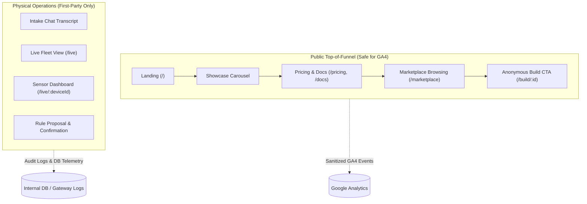

# Albus Forge — UI Usage Analytics & Scoping

**Status:** Proposed scoping document, post-M2.  
**Companion documents:** [`PORTAL.md`](PORTAL.md) (screens and routes), [`ARCHITECTURE.md`](ARCHITECTURE.md) (system context & invariants), [`CLOUD-PLATFORM.md`](CLOUD-PLATFORM.md) (telemetry & privacy), [ADR 0005](adr/0005-ci-owns-images-terraform-owns-shape.md) (image promotion), and [ADR 0007](adr/0007-portal-routing.md) (portal routing & SSR contract).

---

## 1. Context & Objective

Albus Forge turns a plain-language prompt into real hardware: parts cart, printable enclosure, firmware, and cloud operation. The web portal (`apps/web`) spans two distinct operational domains:

1. **An open public onboarding surface:** landing page, showcase carousel, pricing, documentation, marketplace listings, and anonymous build creation (`/build/:id`).
2. **A private Physical AI operations hub:** live device fleet management (`/live`), per-device dashboards (`/live/:deviceId`), real-time sensor streams, and closed-loop rule creation/confirmation.

This document scopes the feasibility, architectural integration, privacy boundaries, and trade-offs of using **Google Analytics (GA4)** to track UI usage across the portal.

---

## 2. Executive Assessment

| Criterion | Evaluation | Detail |
|---|---|---|
| **Technical Feasibility** | **High** | Client integration in Next.js 16 (`apps/web`) with asynchronous script hydration and minimal bundle impact. |
| **Auth & Security Impact** | **None** | Host-only authentication cookies (`__Host-albus_session`, `__Host-albus_anon`) and the internal SSR header contract ([ADR 0007](adr/0007-portal-routing.md)) remain strictly isolated from Google Analytics client cookies. |
| **Network & CDN** | **Zero Overhead** | Tags load directly from Google's CDN (`googletagmanager.com`), bypassing Cloud Armor rate limits (600 req/min) enforced on the Albus Forge load balancer. |
| **Image Promotion Contract** | **Must be Server-Injected** | Per [ADR 0005](adr/0005-ci-owns-images-terraform-owns-shape.md), container images are built once in CI and promoted by exact digest. `NEXT_PUBLIC_*` variables are inlined at build time; measurement IDs must therefore be resolved server-side at runtime and passed down to client components. |
| **Privacy & Security Pledge** | **High Risk if unconstrained** | Passing user prompts, hardware designs, or physical sensor telemetry to third parties compromises the [Security Pledge](../apps/web/src/app/(static)/security/page.tsx) *(currently a placeholder; operational safeguards here are the primary control)*. Strict surface, host, and parameter whitelisting is required. |
| **Data Fidelity & Ad-blockers** | **Medium (30–50% loss)** | High ad-blocker adoption (uBlock, Brave, Pi-hole) among makers, engineers, and lab operators means GA will systematically undercount technical engagement. |
| **Regulatory (GDPR/ePrivacy)** | **Friction** | GA4 uses non-essential cookies (`_ga`), requiring a consent banner in the EU/UK. This conflicts with the zero-friction *"one question in → device out"* anonymous onboarding philosophy. |

---

## 3. Surface Partitioning: What to Track vs. What to Exclude

To satisfy the platform's security and tenant isolation invariants, UI tracking must enforce an impermeable boundary between public marketing and private physical device control:



### 3.1 Public Surface (Permitted for GA4)
Tracking on public and static routes focuses exclusively on conversion funnels and product discovery:
* **Landing Page (`/`):** Hero CTA clicks ("Start building"), example build card clicks, carousel navigation.
* **Static Content (`/about`, `/pricing`, `/docs`, `/security`):** Scroll depth, document section viewings.
* **Marketplace (`/marketplace`):** Category pill clicks (`Garden`, `Home`, `Workshop`, `Industrial`), listing detail views, clone/remix initiation.
* **Onboarding Funnel Events (Whitelisted Names):**
  * `build_initiated`: Anonymous build creation.
  * `signup_prompt_reached`: Visitor reaches the save/claim gate.
  * `signup_completed`: Verified email code authentication.

### 3.2 Private & Operational Surface (Strictly Excluded from GA4)
The following data and surfaces must **never** be transmitted to Google Analytics:
* **Build Prompts & Chat Content:** Proprietary device concepts, internal specifications, and customer requirements entered into `/build/:id`.
* **Tenant & Device Identifiers:** Raw UUIDs, device tokens, or tenant slugs.
* **Sensor & Telemetry Streams:** Real-time sensor readings (temperatures, moisture levels, presence indicators) displayed on `/live` or `/live/:deviceId`.
* **Closed-Loop Rule Executions:** Triggering or confirming physical actions (e.g. servo activation, pump relays, alert configurations). These belong exclusively in the gateway's auditable database tables (`audit_log`, `device_actions`).

---

## 4. Technical Architecture & Next.js 16 Integration

### 4.1 Image Promotion & Runtime Environment Binding ([ADR 0005](adr/0005-ci-owns-images-terraform-owns-shape.md))
In Next.js, `NEXT_PUBLIC_*` variables are inlined at build time. Because Albus Forge mandates that container images are built once in CI and promoted by exact digest across staging and production without rebuilding, measurement IDs **cannot** be baked into the image.

Instead, the measurement ID is configured as a server-only environment variable (`GA_MEASUREMENT_ID`) set in the Cloud Run service definition by Terraform:
* **Staging Cloud Run:** `GA_MEASUREMENT_ID` is unset (disabled) or points to a dedicated staging test stream.
* **Production Cloud Run:** `GA_MEASUREMENT_ID` is set to the production GA4 measurement ID (`G-XXXXXXXXXX`).

The root layout (Server Component) reads `process.env.GA_MEASUREMENT_ID` at runtime and passes it to an interactive `<AnalyticsProvider>`:

```tsx
// apps/web/src/app/layout.tsx (Server Component)
import { AnalyticsProvider } from "@/components/analytics/AnalyticsProvider";

export default function RootLayout({ children }: { children: React.ReactNode }) {
  // Read at runtime per Cloud Run revision, preserving build-once image immutability
  const gaMeasurementId = process.env.GA_MEASUREMENT_ID;

  return (
    <html lang="en">
      <body>
        <AnalyticsProvider measurementId={gaMeasurementId}>
          {children}
        </AnalyticsProvider>
      </body>
    </html>
  );
}
```

### 4.2 Gating Script Injection, Host Eligibility, and Lifecycle Disablement
A default GA4 snippet or standard `<GoogleAnalytics>` tag causes immediate data leakage across three vectors:
1. **Tenant Subdomain Exposure:** ADR 0007 routes both the apex and tenant subdomains (`<tenant>.albusforge.ai`) to `web`. If a visitor hits a public path like `/docs` on `acme.albusforge.ai`, injecting the Google script would leak the tenant name via HTTP `Referer` headers and script request origins.
2. **Persistent Script Lifecycle in SPAs:** Next.js caches injected `<Script>` tags in the document. Once loaded, unmounting React components does **not** unload `gtag.js` from `window`. GA continues listening to events.
3. **Enhanced Measurement Automatic Events:** Even with `send_page_view: false`, GA4's default Enhanced Measurement fires on browser History API changes (`replaceState`, `pushState`), scroll events, engagement timing, and form submissions. When `BuildConversation.tsx` calls `history.replaceState` turning `/` into `/build/<UUID>`, or a user interacts on `/live/<device-UUID>`, GA automatically logs private URLs and engagement pings.

To enforce an airtight boundary, **four coordinated controls are required**:

1. **Administrative Stream Setting:** In the GA4 property settings under *Data Streams > Web Stream > Enhanced Measurement*, toggle **OFF** "Page changes based on browser history events".
2. **Host & Consent Pre-Gate:** The `<Script>` tag is **never inserted into the DOM** unless:
   * The host is an approved public apex host (`isApprovedPublicHost(hostname)` is true: `albusforge.ai`, `staging.albusforge.ai`, or `localhost`). Any tenant subdomain (`*.albusforge.ai`) is strictly ineligible.
   * `hasAnalyticsConsent() === true`.
   * The initial route is a public path (`isPublicPath(pathname)`).
3. **Programmatic Opt-Out (`window['ga-disable-<ID>']`):** When navigating from a public page into a private surface (`/build/*`, `/live/*`, `/projects/*`) or when consent is revoked, the client sets `window['ga-disable-' + measurementId] = true`. This is Google's documented programmatic kill-switch that completely prevents all hits, engagement timers, scrolls, and cookieless pings from being transmitted.
4. **Consent Mode v2 Defaults:** Default all consent states (`analytics_storage`, `ad_storage`, etc.) to `denied` prior to any library initialization.

```tsx
// apps/web/src/components/analytics/AnalyticsProvider.tsx (Client Component)
"use client";

import Script from "next/script";
import { usePathname } from "next/navigation";
import { useEffect, useState } from "react";
import {
  isEligibleTrackingTarget,
  hasAnalyticsConsent,
  trackSanitizedPageView,
  setTrackingDisabled,
  subscribeToConsentChanges,
} from "@/lib/analytics";

export function AnalyticsProvider({
  measurementId,
  children,
}: {
  measurementId?: string;
  children: React.ReactNode;
}) {
  const pathname = usePathname();
  const [hasConsent, setHasConsent] = useState(false);
  const [hostname, setHostname] = useState<string>("");

  useEffect(() => {
    setHostname(window.location.hostname);
    setHasConsent(hasAnalyticsConsent());
    return subscribeToConsentChanges((consent) => {
      setHasConsent(consent);
    });
  }, []);

  // Strict pre-gate: requires valid measurement ID, consent, approved apex host, and public route
  const isEligible = Boolean(
    measurementId && isEligibleTrackingTarget(hostname, pathname, hasConsent)
  );

  useEffect(() => {
    if (!measurementId) return;

    if (isEligible) {
      // Re-enable tracking and record sanitized virtual pageview
      setTrackingDisabled(measurementId, false);
      trackSanitizedPageView(measurementId, pathname);
    } else {
      // Hard disable GA4: halts all hits, engagement timing, and background pings
      setTrackingDisabled(measurementId, true);
    }
  }, [isEligible, measurementId, pathname]);

  return (
    <>
      {isEligible && (
        <>
          <Script
            src={`https://www.googletagmanager.com/gtag/js?id=${measurementId}`}
            strategy="afterInteractive"
          />
          <Script id="ga-init" strategy="afterInteractive">
            {`
              window.dataLayer = window.dataLayer || [];
              function gtag(){dataLayer.push(arguments);}
              gtag('consent', 'default', {
                analytics_storage: 'denied',
                ad_storage: 'denied',
                ad_user_data: 'denied',
                ad_personalization: 'denied',
              });
              gtag('js', new Date());
              gtag('config', '${measurementId}', {
                send_page_view: false,
                cookie_domain: 'auto',
                restricted_data_processing: true
              });
              gtag('consent', 'update', {
                analytics_storage: 'granted',
              });
            `}
          </Script>
        </>
      )}
      {children}
    </>
  );
}
```

### 4.3 Sanitized SPA Route Listener & Normalization
The analytics library (`apps/web/src/lib/analytics.ts`) manages host verification, route pattern templating, and referrer scrubbing:

```ts
// apps/web/src/lib/analytics.ts
const APPROVED_APEX_HOSTS = new Set([
  "albusforge.ai",
  "staging.albusforge.ai",
  "localhost",
  "127.0.0.1",
]);

const PUBLIC_ROUTE_DEFINITIONS: Array<{ pattern: RegExp; template: string }> = [
  { pattern: /^\/$/, template: "/" },
  { pattern: /^\/about$/, template: "/about" },
  { pattern: /^\/pricing$/, template: "/pricing" },
  { pattern: /^\/docs$/, template: "/docs" },
  { pattern: /^\/docs\/(.+)$/, template: "/docs/[slug]" },
  { pattern: /^\/security$/, template: "/security" },
  { pattern: /^\/marketplace$/, template: "/marketplace" },
  { pattern: /^\/marketplace\/[a-zA-Z0-9_-]+$/, template: "/marketplace/[listingId]" },
];

export function isApprovedPublicHost(hostname: string): boolean {
  return APPROVED_APEX_HOSTS.has(hostname.toLowerCase());
}

export function getPublicRouteTemplate(pathname: string): string | null {
  for (const { pattern, template } of PUBLIC_ROUTE_DEFINITIONS) {
    if (pattern.test(pathname)) {
      return template;
    }
  }
  return null;
}

export function isPublicPath(pathname: string): boolean {
  return getPublicRouteTemplate(pathname) !== null;
}

export function isEligibleTrackingTarget(
  hostname: string,
  pathname: string,
  hasConsent: boolean
): boolean {
  return hasConsent && isApprovedPublicHost(hostname) && isPublicPath(pathname);
}

export function setTrackingDisabled(measurementId: string, disabled: boolean) {
  if (typeof window !== "undefined") {
    (window as any)[`ga-disable-${measurementId}`] = disabled;
  }
}

export function sanitizeReferrer(referrer: string): string {
  if (!referrer) return "";
  try {
    const url = new URL(referrer);
    // If incoming referrer came from an internal tenant subdomain or non-public path, strip to apex
    if (!isApprovedPublicHost(url.hostname) || !isPublicPath(url.pathname)) {
      return "https://albusforge.ai/";
    }
    const template = getPublicRouteTemplate(url.pathname);
    return `https://albusforge.ai${template}`;
  } catch {
    return "";
  }
}

export function trackSanitizedPageView(measurementId: string, pathname: string) {
  if (typeof window === "undefined" || !isPublicPath(pathname)) {
    return;
  }

  const template = getPublicRouteTemplate(pathname) || pathname;
  const sanitizedLocation = `https://albusforge.ai${template}`;

  if (typeof (window as any).gtag === "function") {
    (window as any).gtag("event", "page_view", {
      page_title: document.title,
      page_location: sanitizedLocation,
      page_referrer: sanitizeReferrer(document.referrer),
    });
  }
}
```

### 4.4 Automated Acceptance Test Matrix
Before any analytics code reaches staging, the automated end-to-end test suite must assert:

| Scenario | Trigger / Route | Expected Verification |
|---|---|---|
| **Direct Private Entry** | Cold load on `https://acme.albusforge.ai/live/dev_123` | `<Script>` not rendered; zero network calls to Google; `window.gtag` undefined; tenant slug and device UUID absent from all headers. |
| **Consented Tenant Public Route** | Cold load on `https://acme.albusforge.ai/docs` with consent active | Host fails `isApprovedPublicHost`; zero scripts mounted; zero network requests to Google (guards against tenant header exposure on shared routing). |
| **Public-to-Private SPA Transition** | Consented visit on `/` $\rightarrow$ user enters prompt $\rightarrow$ `replaceState` to `/build/bld_456` | Initial `/` fires sanitized pageview; on navigation to `/build/*`, `window['ga-disable-<ID>'] = true` is immediately set; zero network hits or history events fired. |
| **Private Surface Interaction Post-Load** | User navigates from `/` into `/live/dev_123` and scrolls/clicks forms | `ga-disable` remains true; Enhanced Measurement automatic scroll, click, and engagement pings emit zero outbound network traffic. |
| **Private-to-Public Return** | User navigates from `/live` back to `/pricing` | `ga-disable` reset to false; pageview dispatched with apex URL `https://albusforge.ai/pricing` and scrubbed referrer `https://albusforge.ai/`. |
| **In-Session Consent Revocation** | User toggles off analytics consent while on `/docs` | Consent subscriber immediately invokes `setTrackingDisabled(id, true)`; subsequent navigations or events are completely silenced without requiring a page reload. |

---

## 5. Alternatives & Privacy-First Considerations

| Approach | Setup Effort | Ad-Blocker Resilience | Privacy / Cookie Banner | Operational Cost |
|---|---|---|---|---|
| **Google Analytics 4 (GA4)** | Low (1–2 days with custom wrapper) | Poor (30–50% blocked) | Requires Cookie Consent Banner (EU/UK) | Free tier |
| **Privacy-First (Plausible / Umami)** | Low (1 day) | High (when proxied via Gateway) | No cookies, fully GDPR compliant without banner | ~$9/mo or self-hosted Cloud Run |
| **First-Party Gateway Logging** | Low (already in progress) | Immune (100% accurate) | First-party server logs, no client tracking | $0 (included in Cloud Run/DB) |

---

## 6. Recommendations & Phased Rollout

1. **Phase 1 — Public Funnel GA4 (Immediate, if requested):**
   * Implement `<AnalyticsProvider>` reading server runtime `process.env.GA_MEASUREMENT_ID` to preserve [ADR 0005](adr/0005-ci-owns-images-terraform-owns-shape.md).
   * Disable GA4 Enhanced Measurement history-change tracking in stream settings.
   * Gate `<Script>` DOM injection behind `isEligibleTrackingTarget(hostname, pathname, hasConsent)`.
   * Enforce `window['ga-disable-<ID>'] = true` whenever crossing into private surfaces or on consent revocation.
   * Bind `GA_MEASUREMENT_ID` via Terraform in `infra/env/apps.tf` for production only.

2. **Phase 2 — Server-Side & First-Party Analytics (Post-M2):**
   * Rely on `apps/gateway` structured access logs and Cloud Platform usage records ([`CLOUD-PLATFORM.md §9`](CLOUD-PLATFORM.md)) for authenticated operational metrics (active projects, live device counts, rule executions).
   * Evaluate cookieless analytics (such as Plausible) if international regulatory requirements or developer ad-blocker loss justify the additional tooling.
