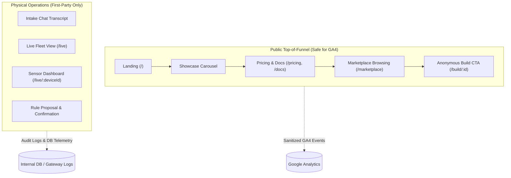

# Albus Forge — UI Usage Analytics & Scoping

**Status:** Proposed scoping document, post-M2.  
**Companion documents:** [`PORTAL.md`](PORTAL.md) (screens and routes), [`ARCHITECTURE.md`](ARCHITECTURE.md) (system context & invariants), [`CLOUD-PLATFORM.md`](CLOUD-PLATFORM.md) (telemetry & privacy), [ADR 0005](adr/0005-ci-owns-images-terraform-owns-shape.md) (image promotion), and [ADR 0007](adr/0007-portal-routing.md) (portal routing & SSR contract).

---

## 1. Context & Objective

Albus Forge turns a plain-language prompt into real hardware: parts cart, printable enclosure, firmware, and cloud operation. The web portal (`apps/web`) spans two distinct operational domains:

1. **An open public onboarding surface:** landing page, showcase carousel, pricing, documentation, marketplace listings, and anonymous build creation (`/build/:id`).
2. **A private Physical AI operations hub:** live device fleet management (`/live`), per-device dashboards (`/live/:deviceId`), real-time sensor streams, and closed-loop rule creation/confirmation.

This document scopes the feasibility, architectural integration, privacy boundaries, and trade-offs of using **Google Analytics (GA4)** to track UI usage across the portal.

---

## 2. Executive Assessment

| Criterion | Evaluation | Detail |
|---|---|---|
| **Technical Feasibility** | **High** | Client integration in Next.js 16 (`apps/web`) with asynchronous script hydration and minimal bundle impact. |
| **Auth & Security Impact** | **None** | Host-only authentication cookies (`__Host-albus_session`, `__Host-albus_anon`) and the internal SSR header contract ([ADR 0007](adr/0007-portal-routing.md)) remain strictly isolated from Google Analytics client cookies. |
| **Network & CDN** | **Zero Overhead** | Tags load directly from Google's CDN (`googletagmanager.com`), bypassing Cloud Armor rate limits (600 req/min) enforced on the Albus Forge load balancer. |
| **Image Promotion Contract** | **Must be Server-Injected** | Per [ADR 0005](adr/0005-ci-owns-images-terraform-owns-shape.md), container images are built once in CI and promoted by exact digest. `NEXT_PUBLIC_*` variables are inlined at build time; measurement IDs must therefore be resolved server-side at runtime and passed down to client components. |
| **Privacy & Security Pledge** | **High Risk if unconstrained** | Passing user prompts, hardware designs, or physical sensor telemetry to third parties compromises the [Security Pledge](../apps/web/src/app/(static)/security/page.tsx) *(currently a placeholder; operational safeguards here are the primary control)*. Strict surface and parameter whitelisting is required. |
| **Data Fidelity & Ad-blockers** | **Medium (30–50% loss)** | High ad-blocker adoption (uBlock, Brave, Pi-hole) among makers, engineers, and lab operators means GA will systematically undercount technical engagement. |
| **Regulatory (GDPR/ePrivacy)** | **Friction** | GA4 uses non-essential cookies (`_ga`), requiring a consent banner in the EU/UK. This conflicts with the zero-friction *"one question in → device out"* anonymous onboarding philosophy. |

---

## 3. Surface Partitioning: What to Track vs. What to Exclude

To satisfy the platform's security and tenant isolation invariants, UI tracking must enforce an impermeable boundary between public marketing and private physical device control:



### 3.1 Public Surface (Permitted for GA4)
Tracking on public and static routes focuses exclusively on conversion funnels and product discovery:
* **Landing Page (`/`):** Hero CTA clicks ("Start building"), example build card clicks, carousel navigation.
* **Static Content (`/about`, `/pricing`, `/docs`, `/security`):** Scroll depth, document section viewings.
* **Marketplace (`/marketplace`):** Category pill clicks (`Garden`, `Home`, `Workshop`, `Industrial`), listing detail views, clone/remix initiation.
* **Onboarding Funnel Events (Whitelisted Names):**
  * `build_initiated`: Anonymous build creation.
  * `signup_prompt_reached`: Visitor reaches the save/claim gate.
  * `signup_completed`: Verified email code authentication.

### 3.2 Private & Operational Surface (Strictly Excluded from GA4)
The following data and surfaces must **never** be transmitted to Google Analytics:
* **Build Prompts & Chat Content:** Proprietary device concepts, internal specifications, and customer requirements entered into `/build/:id`.
* **Tenant & Device Identifiers:** Raw UUIDs, device tokens, or tenant slugs.
* **Sensor & Telemetry Streams:** Real-time sensor readings (temperatures, moisture levels, presence indicators) displayed on `/live` or `/live/:deviceId`.
* **Closed-Loop Rule Executions:** Triggering or confirming physical actions (e.g. servo activation, pump relays, alert configurations). These belong exclusively in the gateway's auditable database tables (`audit_log`, `device_actions`).

---

## 4. Technical Architecture & Next.js 16 Integration

### 4.1 Image Promotion & Runtime Environment Binding ([ADR 0005](adr/0005-ci-owns-images-terraform-owns-shape.md))
In Next.js, `NEXT_PUBLIC_*` variables are inlined at build time. Because Albus Forge mandates that container images are built once in CI and promoted by exact digest across staging and production without rebuilding, measurement IDs **cannot** be baked into the image.

Instead, the measurement ID is configured as a server-only environment variable (`GA_MEASUREMENT_ID`) set in the Cloud Run service definition by Terraform:
* **Staging Cloud Run:** `GA_MEASUREMENT_ID` is unset (disabled) or points to a dedicated staging test stream.
* **Production Cloud Run:** `GA_MEASUREMENT_ID` is set to the production GA4 measurement ID (`G-XXXXXXXXXX`).

The root layout (Server Component) reads `process.env.GA_MEASUREMENT_ID` at runtime and passes it to an interactive `<AnalyticsProvider>`:

```tsx
// apps/web/src/app/layout.tsx (Server Component)
import { AnalyticsProvider } from "@/components/analytics/AnalyticsProvider";

export default function RootLayout({ children }: { children: React.ReactNode }) {
  // Read at runtime per Cloud Run revision, preserving build-once image immutability
  const gaMeasurementId = process.env.GA_MEASUREMENT_ID;

  return (
    <html lang="en">
      <body>
        <AnalyticsProvider measurementId={gaMeasurementId}>
          {children}
        </AnalyticsProvider>
      </body>
    </html>
  );
}
```

### 4.2 Gating Automatic Collection & Enhanced Measurement
Default GA4 installations immediately fire pageviews on initial load and use Enhanced Measurement to capture browser History API updates (`pushState`, `replaceState`). This leaks private data:
1. `BuildConversation.tsx` invokes `history.replaceState` when `/` turns into `/build/<UUID>`.
2. Navigation into `/live/<device-UUID>` triggers history pageview listeners.
3. Loading a tenant host (`<tenant>.albusforge.ai`) leaks tenant identifiers through `page_location`.

To enforce the boundary, **automatic collection must be completely disabled at the script level**:

```tsx
// apps/web/src/components/analytics/AnalyticsProvider.tsx (Client Component)
"use client";

import Script from "next/script";
import { usePathname } from "next/navigation";
import { useEffect } from "react";
import { isPublicPath, sanitizeUrl, hasAnalyticsConsent } from "@/lib/analytics";

export function AnalyticsProvider({
  measurementId,
  children,
}: {
  measurementId?: string;
  children: React.ReactNode;
}) {
  const pathname = usePathname();

  if (!measurementId) return <>{children}</>;

  return (
    <>
      <Script
        src={`https://www.googletagmanager.com/gtag/js?id=${measurementId}`}
        strategy="afterInteractive"
      />
      <Script id="ga-init" strategy="afterInteractive">
        {`
          window.dataLayer = window.dataLayer || [];
          function gtag(){dataLayer.push(arguments);}
          gtag('js', new Date());
          // CRITICAL: Disable automatic pageview collection
          gtag('config', '${measurementId}', {
            send_page_view: false,
            cookie_domain: 'auto'
          });
        `}
      </Script>
      <RouteAnalyticsTracker measurementId={measurementId} pathname={pathname} />
      {children}
    </>
  );
}
```

### 4.3 Sanitized SPA Route Listener & Privacy Controls
A custom client listener (`<RouteAnalyticsTracker>`) governs virtual pageviews on client-side route transitions:

1. **Consent Check:** Verifies `hasAnalyticsConsent() === true` before dispatching any event.
2. **Surface Eligibility:** Checks `isPublicPath(pathname)`. If the user is on `/build/*`, `/live/*`, or `/projects/*`, tracking is **halted** and no event is emitted.
3. **URL & Referrer Normalization:**
   * **Hostname:** Strips tenant subdomains, normalizing `page_location` to `https://albusforge.ai${sanitizedPath}`.
   * **Path Sanitization:** Replaces dynamic entity IDs with template tokens (e.g. `/marketplace/[listingId]`).
   * **Referrer Scrubbing:** Masks `page_referrer` so tenant slugs or internal build URLs are never exposed in incoming referrer headers.

```ts
// apps/web/src/lib/analytics.ts
const PUBLIC_ROUTE_PATTERNS = [
  /^\/$/,
  /^\/about$/,
  /^\/pricing$/,
  /^\/docs(\/.*)?$/,
  /^\/security$/,
  /^\/marketplace$/,
  /^\/marketplace\/[a-zA-Z0-9_-]+$/,
];

export function isPublicPath(pathname: string): boolean {
  return PUBLIC_ROUTE_PATTERNS.some((pattern) => pattern.test(pathname));
}

export function trackSanitizedPageView(measurementId: string, pathname: string) {
  if (!hasAnalyticsConsent() || !isPublicPath(pathname)) {
    return;
  }

  // Normalize host to apex to prevent tenant leakage
  const sanitizedLocation = `https://albusforge.ai${pathname}`;

  window.gtag("event", "page_view", {
    page_title: document.title,
    page_location: sanitizedLocation,
    page_referrer: sanitizeReferrer(document.referrer),
  });
}
```

### 4.4 Acceptance Test Matrix
Before deploying any UI tracking integration, the following automated regression suite must pass:

| Scenario | Trigger / Route | Expected Verification |
|---|---|---|
| **Direct Private Entry** | Cold load on `https://acme.albusforge.ai/live/dev_123` | Zero network calls to `google-analytics.com`; `gtag` emits no events; tenant slug and device UUID absent from all headers. |
| **Public-to-Private SPA Transition** | User enters prompt on `/` $\rightarrow$ `replaceState` to `/build/bld_456` | Initial `/` logs sanitized pageview (if consent granted); transition to `/build/*` triggers zero network requests or history events. |
| **Private-to-Public Return** | User navigates from `/live` back to `/docs` | Pageview tracking re-engages cleanly on `/docs` with apex location (`https://albusforge.ai/docs`) and empty/sanitized referrer. |
| **Consent Denial** | User rejects or has not accepted analytics cookies | All tracking functions no-op; no cookies (`_ga`) created. |

---

## 5. Alternatives & Privacy-First Considerations

| Approach | Setup Effort | Ad-Blocker Resilience | Privacy / Cookie Banner | Operational Cost |
|---|---|---|---|---|
| **Google Analytics 4 (GA4)** | Low (1–2 days with custom wrapper) | Poor (30–50% blocked) | Requires Cookie Consent Banner (EU/UK) | Free tier |
| **Privacy-First (Plausible / Umami)** | Low (1 day) | High (when proxied via Gateway) | No cookies, fully GDPR compliant without banner | ~$9/mo or self-hosted Cloud Run |
| **First-Party Gateway Logging** | Low (already in progress) | Immune (100% accurate) | First-party server logs, no client tracking | $0 (included in Cloud Run/DB) |

---

## 6. Recommendations & Phased Rollout

1. **Phase 1 — Public Funnel GA4 (Immediate, if requested):**
   * Implement `<AnalyticsProvider>` reading server runtime `process.env.GA_MEASUREMENT_ID` to preserve [ADR 0005](adr/0005-ci-owns-images-terraform-owns-shape.md).
   * Disable automatic pageviews (`send_page_view: false`) and history-change tracking.
   * Restrict pageviews and events to the whitelisted public surface via `trackSanitizedPageView`.
   * Bind `GA_MEASUREMENT_ID` via Terraform in `infra/env/apps.tf` for production only.

2. **Phase 2 — Server-Side & First-Party Analytics (Post-M2):**
   * Rely on `apps/gateway` structured access logs and Cloud Platform usage records ([`CLOUD-PLATFORM.md §9`](CLOUD-PLATFORM.md)) for authenticated operational metrics (active projects, live device counts, rule executions).
   * Evaluate cookieless analytics (such as Plausible) if international regulatory requirements or developer ad-blocker loss justify the additional tooling.
