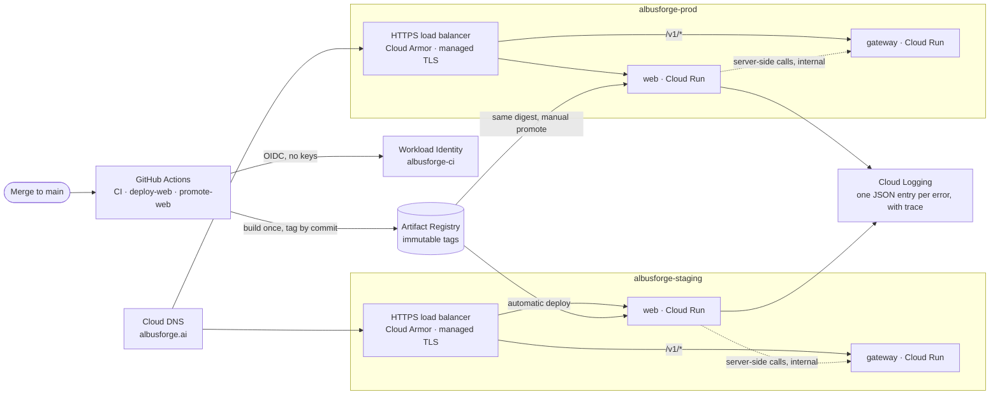

# Albus Forge — Check-in 1

**Battle of the Coasts · Hour 12 · 13 Sep 2026** · Track: **Deep Tech / Physical AI**

**Team:** Albus · **Solo hacker:** Sukrit Dasgupta · **Email:** sukritd@mit.edu · **Website:** [albusforge.ai](https://albusforge.ai)

> **One question in. A working device out, and an AI cloud that closes the loop.** Albus Forge turns a plain-language request ("keep my greenhouse soil moist") into a real parts cart, a 3D-printable enclosure and working firmware, all generated from a single curated part registry. Then it doesn't stop at a dashboard: the device connects to an **AI cloud platform** that watches its data, reasons about it and **acts back on the device**.

---

## The moat: AI closed-loop control

Dashboards and alerts are a commodity. The moat is an AI cloud platform that closes the control loop for every device it generates: **sense → detect → reason → act → confirm**.

| Step | What happens |
| --- | --- |
| **Sense** | Telemetry arrives already typed. The part registry declares each channel's unit, range and meaning before the first packet, so there's nothing for the user to configure. |
| **Detect** | Statistics run on every data window: learned baselines, seasonality and drift. This finds the anomalies cheaply, without a model. |
| **Reason** | A small model names and triages each detection. A frontier model answers questions ("why is bed B drying faster?") through typed queries, so **every number comes from the data, never from the model**. |
| **Act** | The platform sends commands back to the device (thresholds, setpoints, schedules) or opens a work order. Actions a model proposes need a person, or a policy, to confirm them. |
| **Confirm** | The next telemetry shows whether the action worked, and every confirmed outcome improves the baselines for that tenant. |

The loop starts on the device: reflex rules keep working offline, and the cloud adds judgment on top. In this version, commands ride back on the device's next check-in. Real-time actuation comes later over MQTT. The full design is in [`docs/CLOUD-PLATFORM.md`](../CLOUD-PLATFORM.md).

---

## 1. Goals for this check-in

This first 12 hours built the ground floor: everything the product runs on, in the right order, so later check-ins add features instead of fighting infrastructure.

| Goal | Status | Evidence |
| --- | --- | --- |
| **Working infrastructure, all in Terraform** | ✅ Done | Three GCP projects, staging and prod environments applied, 0 drift on `terraform plan` |
| **First iteration of the front end** | ✅ Live | Portal deployed to `staging.albusforge.ai` and `albusforge.ai` |
| **Tests and quality gates in place** | ✅ Done | 152 web tests, 25 deploy-script tests, 3 CI jobs, independent review of every PR |
| **Automated delivery** | ✅ Proven | A merge that changes the web app reaches staging with no human involved. Prod is promoted by hand. |

---

## 2. Where it runs

**Code:** [`github.com/guitarpastdusk/albusforge`](https://github.com/guitarpastdusk/albusforge) (public), trunk-based on `main`

**Cloud:** Google Cloud, region `us-central1`, in three isolated projects

| Project | Role | Public endpoint |
| --- | --- | --- |
| `albusforge-ci` | Terraform state, container registry, GitHub identity trust | none |
| `albusforge-staging` | Merges that change the web app land here automatically | https://staging.albusforge.ai |
| `albusforge-prod` | Only images that passed staging, promoted by hand | https://albusforge.ai |

---

## 3. Architecture

**How a request flows.**
- A request enters through a **global HTTPS load balancer** protected by **Cloud Armor**. `/v1/*` goes to the API gateway, and everything else goes to the **Next.js portal**. Tenant subdomains (`acme.albusforge.ai`) route the same way.
- **Public traffic can only reach the services through the load balancer.** Their direct `run.app` URLs return 404 from the internet. Internal callers are still allowed: the portal's server-side rendering calls the gateway directly over the VPC.
- Outbound traffic leaves through **Cloud NAT**.

**How code ships.**
- When a merge changes the web app or its deploy files, CI builds **one deployable image for that commit** and deploys it to staging. Docs-only and Terraform-only merges don't deploy.
- A freshness check stops an older commit from overwriting a newer one.
- After a successful staging deploy, the image is tagged `staging-deployed-<commit>`.
- Prod accepts **only images carrying that tag, by exact digest**. Promotion reuses the image staging ran, and nothing is rebuilt for prod.

**Design decisions** are recorded as 9 ADRs in `docs/adr/`: project layout, DNS, edge routing, egress, image ownership, Terraform layout, portal routing, sign-in and tenancy.

---

## 4. The infrastructure, bottom up

1. **Bootstrap** (`infra/bootstrap`, 66 resources)
   - three projects with their APIs, and the Terraform state bucket
   - the Artifact Registry, and GitHub Workload Identity Federation bound to per-environment deployers
   - Cloud DNS for `albusforge.ai`, delegated from GoDaddy
   - a prod budget alert
   - Editor removed from the default service accounts
2. **Environments** (`infra/env`, one workspace each for staging and prod, 37 resources each)
   - a VPC with Cloud NAT and private services access
   - web and gateway on Cloud Run, each with its own service account
   - the load balancer, a Certificate Manager wildcard cert, Cloud Armor, and DNS records
3. **Delivery** (`.github/workflows`)
   - `ci`: typecheck, lint, test, build, Docker smoke test, deploy-script tests
   - `deploy-web`: automatic deploy to staging
   - `promote-web`: manual promotion to prod
4. **Application** (`apps/web`, `packages/schema`)
   - the Next.js portal and a shared Zod API contract
   - structured logging linked to Cloud Trace
   - an error page for when the gateway can't be reached

**Security choices:**
- no service-account keys anywhere
- deployers trust GitHub's immutable OIDC subject, pinned to the repository and owner IDs
- prod can only pull images, never build them
- both environments deploy from `main` only
- Terraform changes to a service never run while its deploy workflow could run (ADR 0005)

---

## 5. Pull requests: 14 merged by hour 12

| Area | PRs | What landed |
| --- | --- | --- |
| **Infrastructure** | #1, #5, #7, #10, #11 | Terraform scaffold, remote state, least-privilege service accounts, OIDC trust fix, trace env var |
| **Delivery** | #6, #9 | Staging deploy and prod promotion workflows with freshness, provenance and credential checks |
| **Portal** | #3, #12, #13, #14 | App scaffold, structured logging, service-unavailable page, per-request error dedupe |
| **Design docs** | #2, #4, #8 | Portal spec, API contract, sign-in and tenancy ADRs, header rules verified on staging |

Every PR went through an **independent reviewer**, and every finding was fixed or answered before merge. Findings caught this way included:
- a deploy race that could roll staging back
- prod accepting images that had never run on staging
- errors from concurrent requests being silently dropped from the logs

---

## 6. Tests and verification

| Layer | What runs | Result |
| --- | --- | --- |
| **Web unit tests** | Vitest: schema parsing, API client, formatting, runtime config, logging, error UI | **152 passing** |
| **Deploy-script tests** | Bash, against a stubbed `gcloud` and a real git history | **25 passing** |
| **CI on every PR** | `check` (typecheck, lint, test, build) · `docker` (image builds and serves 5 routes) · `deploy-scripts` | Required green before merge |
| **Terraform** | `fmt`, `validate`, a reviewed plan before every apply, a no-drift plan after | 0 changes pending |
| **Live checks** | Staging and prod checked in GCP after every deploy, plus browser checks of each page | Verified on both |

Things verified against the real environments, not just in tests:
- TLS and routing on both domains
- trace headers preserved end to end
- one log entry per failed request, including under concurrency
- the placeholder → staging → prod image path

---

## 7. Where the build stands at hour 12

- **Live now:** landing page, docs, sign-in and pricing on both domains. Data pages (`/projects`, `/live`, `/marketplace`) render a designed "service unavailable" state, because the API gateway is still a placeholder.
- **Honest gaps:** no database yet, no real API behind `/v1`, and neither the AI pipeline nor the closed loop is wired in yet. This check-in laid the foundations the loop runs on: per-environment infrastructure, safe delivery, and request-traced structured logs.

**Next check-in (hour 24):**
- Cloud SQL and the database schema
- a real gateway serving the part registry
- the first AI step: turning a plain-language ask into a structured spec
