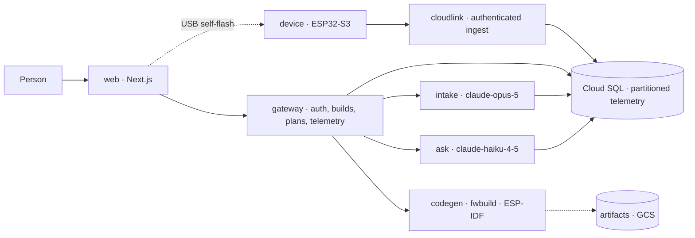

# Albus Forge — Check-in 3

**Battle of the Coasts · Hour 36 · 14 Sep 2026** · Track: **Deep Tech / Physical AI**

**Team:** Albus · **Solo hacker:** Sukrit Dasgupta · **Website:** [albusforge.ai](https://albusforge.ai) · **Code:** [guitarpastdusk/albusforge](https://github.com/guitarpastdusk/albusforge)

> **One question in. A working device out, with a cloud that helps it improve.** Ask "keep my greenhouse soil moist." Albus Forge turns that intent into a checked parts list, a printable enclosure and real firmware, then connects the device to a **sense → detect → reason → act → confirm** loop.

**What changed:** Check-in 2 had components. This interval connected them into a path a person can walk: **the AI conversation is live in production**, sign-in and workspaces are real, telemetry is stored and queryable, and a device can now be **provisioned, compiled for, and flashed by its owner over USB**. **37 PRs merged since `CHECKIN2`; 1,395 automated tests pass in CI**, plus 9 real browser journeys, 92 delivery checks and 132 local CAD tests. The whole platform runs in production. The product's own firmware has **not** yet run on physical hardware — that boundary is stated precisely in §5.

**Snapshot:** `CHECKIN2` (`28c4ac1`) → `CHECKIN3` (`38c93d0`, 14 Sep, 00:49 EDT). [Full statistics and evidence](CHECKIN-3-EVIDENCE.md).

---

## 1. Goals we set at Check-in 2

| Check-in 2 commitment | Result at this snapshot |
| --- | --- |
| **Finish the conversational path** — land intake, show one real request producing a persisted spec with visible assumptions and metered model calls | **Delivered and live.** A real request on staging returned a specific clarifying question, wrote the spec version, and logged `cost_usd 0.103305` against the build. Intake runs in production. |
| **Turn software evidence into hardware evidence** — real parts, one printed enclosure, one flashed sensor delivering authenticated readings | **Partly.** Firmware, a pinned compiler, provisioning and a USB self-flash installer are merged and tested; a physical ESP32-S3 was flashed, joined Wi-Fi and streamed video. **The product's firmware has not run on a board, and no enclosure has been printed.** |
| **Connect action to outcome** — live dashboard and confirmed rules wired to a device acknowledgment | **Not yet.** Telemetry read APIs, fleet views and live streaming are merged; the gateway's SSE telemetry endpoint still answers `501`. No closed loop is claimed. |

## 2. Innovation: the plan is the contract, all the way to the board

The differentiator is still one versioned part model feeding every stage — but this interval made it **binding in both directions**. A build plan is now persisted with an `input_digest` over its canonicalised spec, runtime and evidence, and a partial unique index enforces **one accepted plan per spec version**. The firmware compiler will only accept that exact tuple: part `C-001@1.0.0`, profile `esp32s3-bh1750-usb-v1@1.0.0`, runtime `0.1.0`. The device itself refuses to boot unless the configuration flashed into it matches the `build_id`, `plan_version` and `code_version` compiled into the image.

That is the interesting claim: **an accepted plan, a compiled artifact and a running device are the same identity, checked three times by three different components that do not trust each other.** The browser cannot inject parts — plan requests accept only `{expected_tenant_id, spec_version}`. The compiler cannot be asked for arbitrary code — the only supported edit is "set interval to N seconds", bounded 10–86400 and never below the accepted plan. The cloud never sees the owner's Wi-Fi password, because flashing happens on their machine.

**Build loop.** ask → spec (live) → checked plan (merged, fails closed in production) → firmware compile (merged, pinned ESP-IDF 5.5.3) → self-flash over USB (merged, tested).
**Operating loop.** device → authenticated ingest (live) → partitioned storage with rollups and retention (live) → fleet, latest and history APIs (live) → Ask over your own readings (live, `claude-haiku-4-5`) → confirmed rule → device action (**not built**).

## 3. Value and impact: the first useful device, attainable in an evening

Our user is a maker, small grower or lab operator with a concrete monitoring need and no appetite for assembling CAD, firmware, electronics and a dashboard separately.

This interval removed three specific costs. **Identity:** sign-in, tenants and workspaces mean a build survives, belongs to someone and can be shared — an anonymous build is claimed into your account at first sign-in rather than lost. **Trust:** every number a user sees about their own devices is computed by SQL from stored readings; the model is only allowed to classify *what was asked*, never to produce the value. **Secrecy:** device credentials are a 256-bit token stored only as a hash, handed over once inside a 10-minute AES-256-GCM envelope bound to the session that requested it.

**The proposed business model remains a hardware/build transaction plus recurring cloud operation.** We have no customers and no revenue. Willingness to pay and unit economics are still hypotheses.

<!-- pagebreak -->

## 4. Technical implementation: what runs in production today

| Component | Working evidence | Boundary |
| --- | --- | --- |
| **Conversation (intake)** | `POST /v1/turns`, one advisory lock and one connection per turn; scope filter refuses unsafe asks with no model call; 2-round cap; every failure still writes one assistant reply. Verified live with a real Claude turn and attributed cost | Registry parts are all drafts, so drafts are enabled on staging only. Prod intake has not had a real turn put through it |
| **Identity and tenancy** | Email-code sign-in (6 digits, 10 min, 5 attempts, hashed), opaque session tokens, `__Host-` cookies, anonymous build claiming, tenant per sign-up, cross-tenant access returns 404 not 403 | Real email delivery through Resend is covered by no automated test; the domain is verified but no production code has been sent |
| **Telemetry platform** | Daily-partitioned readings, in-transaction dirty markers, minute/hour rollups, 90-day raw retention; fleet/latest/series APIs with resolution limits and `410`/`422` boundaries | Gateway SSE telemetry endpoint returns `501`. No physical device has ever reached the cloud |
| **Build plans** | Persisted plans, BOM acceptance, `input_digest`, one accepted plan per spec version, bounded planner (100k steps) | `registry/assembly-profiles.json` ships empty — production plan generation fails closed, by design |
| **Firmware pipeline** | Durable compile queue (`SKIP LOCKED`, 15-min leases, 3 attempts), pinned ESP-IDF image by digest, create-only GCS artifacts, SHA-256 verified downloads, 100-version cap | The `fwbuild` Cloud Run job is specified but **not in Terraform** — production compilation is not deployable at this tag |
| **Provisioning and self-flash** | 256-bit token stored hashed, AES-256-GCM handoff with AAD binding, 10-minute single-use window, installer verifies every artifact hash before writing | `registry/provisioning-profiles.json` ships empty — production registration fails closed |

### The system boundary

**Build:** request → **AI intake [live]** → **checked plan [merged, fails closed in prod]** → **firmware compile [merged, job not deployed]** → **self-flash [merged, tested]** → **enclosure [local spike]** → **physical validation [pending]**.

**Operate:** sensor → **durable ingest [live]** → **storage, rollups, retention [live]** → **fleet/history APIs [live]** → **Ask [live]** → **confirmed rule [UI merged, mocked]** → **device action [pending]**.

## 5. Physical and embedded engineering — two tracks, stated plainly

There are **two separate firmware efforts in this repository and they have not met.** Conflating them would be the easiest way to overstate this check-in, so:

**Track A — the product's firmware (`firmware/`, new this interval).** ESP32-S3 with a ROHM BH1750 illuminance sensor over I²C. A portable C encoder produces the v1 ingest envelope; the runtime loads config from an NVS partition, joins Wi-Fi, syncs time over SNTP, reads lux, persists one pending packet before upload, POSTs over HTTPS with the ESP-IDF CA bundle, and fails closed on 400/401/403/409/413. The generated application layer is deliberately two lines. **No physical board has run this firmware.** What *is* executed is the encoder itself: CI compiles it with `-Wall -Wextra -Werror`, runs its assertions, and the browser acceptance suite feeds its real output through the actual Cloudlink handler into PostgreSQL.

**Track B — real hardware bring-up (`hardware/freenove/`).** A Freenove ESP32-S3 board was genuinely put through its paces on 13–14 Sep: chip identified (QFN56 rev v0.2, 8 MB PSRAM, 16 MB flash), full 16 MB flash backed up and MD5-verified, ESPHome 2026.8.2 / ESP-IDF 5.5.5 image compiled (1,049,223 bytes), flashed over serial with hash verified, booted, joined Wi-Fi at −63 dBm, streamed MJPEG at **4.7–4.9 fps**, and accepted an OTA update in 6.25 s. A real defect was found and fixed: the GC0308 sensor mapped ESPHome's default `agc_value: 0` to hardware gain zero, producing uniformly black frames; `agc_value: 10` fixed it, confirmed by a decoded 14,088-byte JPEG.

**This is ESPHome camera firmware, not Albus firmware, and it does not talk to our cloud.** It proves the toolchain, the board and the operator's workflow — flash, boot, network, OTA, recover — which is exactly the risk that stops most physical projects. It does not prove our device path.

The enclosure spike is unchanged since Check-in 2: 45 configurations, 132 CAD tests, **zero physical measurements, no first print**.

<!-- pagebreak -->

## 6. Cloud infrastructure: the platform is live in production

Both environments run **5 Cloud Run services** (`web`, `gateway`, `intake`, `ask`, `cloudlink`) and **4 jobs** (`db-migrate`, `registry-load`, `telemetry-rollup`, `telemetry-maintain`), all from Terraform, with images owned by CI and promoted by digest — never rebuilt for production.

- **Edge.** Cloud Armor rate-limits ingest on malformed bearers (60/min/IP) and per credential (120/min), both denying `429`. Load-balancer request logging is deliberately **off** so bearer tokens are never written to logs.
- **Storage.** Readings are partitioned daily by UTC; a statement-level trigger marks dirty hours in the same transaction; the rollup job claims markers `FOR UPDATE SKIP LOCKED` and recomputes minute and hourly aggregates by replacement. Raw data is kept 90 days behind a monotonic watermark; partitions are dropped only once no dirty markers remain.
- **Observability.** **15 alert policies per environment** — backlog depth and age, rollup and maintenance heartbeats, SQL CPU/disk/connections, ingest pool wait, per-job failures, 5xx rates for `cloudlink` and `ask`, and LLM spend on 1-hour and 22-hour windows.
- **Capacity.** Connection budgets were measured, not guessed: staging reserves 40 of 50, production 266 of 400, each with an alert below the ceiling.
- **Governance.** `infra/env` is applied by hand, by exactly one owner at a time. This interval recorded that rule in `ARCHITECTURE.md` §12.3.1 after two agents applied the same state on non-conflicting instructions — the state lock prevented collision but cannot prevent contradiction.

**Not proven:** daily maintenance has never been observed firing on schedule (only manual runs); alert delivery was proven on staging only; there is no sustained-load certification; and the `fwbuild` job has no Terraform yet.

## 7. Interface: from a chat box to a device you can hold

`apps/web` gained 5 new component areas and 3 route segments. **Project workspace** with build continuation through sign-up; **usage dashboard** showing per-stage tokens, cache hits and cost as exact decimals (labelled an estimate, not an invoice); **live device views** with reconnect recovery and mobile layouts; **device setup** and **firmware/self-flash** pages; **email-code sign-in with recovery** and server-backed retry countdowns; **workspace switching** with cross-tab state reset; **fleet search** with literal substring matching and role-gated renames; **accessible loading and recovery states** across 10 new boundary files; and **public guides** at `/docs` and `/security`.

Marketplace and the enclosure viewer remain fixture-backed, unchanged from Check-in 2.

## 8. Quality: evidence at the captured revision

| Layer | Passing | What it protects |
| --- | ---: | --- |
| Web | 671 | Rendering, credentials, workspace state, viewer and stream helpers |
| Gateway | 320 | Auth, sessions, ownership, plans, firmware routes, replay and stream limits |
| Registry | 125 | Part contracts, catalogue and cross-part validation |
| Intake | 108 | Turn locking, scope refusal, deadlines, repair and cleanup budgets |
| Matcher | 60 | Feasibility, power, wiring and bounded search |
| LLM | 32 | Request shape, metering, pricing, repair retry |
| Ask | 28 | Intent classification, quota, evidence-only answers |
| Cloudlink | 23 | Transactional writes, replay and identity isolation |
| Database | 22 | Migrations, partitions, constraints and restricted-role behavior |
| Codegen | 6 | Candidate bounding and artifact integrity |
| **CI subtotal** | **1,395** | **Up from 871 TypeScript tests at Check-in 2** |
| Browser journeys | 9 | Real Chromium, real gateway binary, disposable PostgreSQL, real migrations |
| Delivery checks | 92 | Freshness, provenance, schema gates and ordered promotion |
| CAD spike (local) | 132 | Geometry, printability and export contracts |

CI now runs **8 jobs**, up from 5 — adding intake and ask image smokes and a **`firmware-compile`** job that builds with the real pinned ESP-IDF toolchain and runs the encoder's own assertions. A 15th workflow runs the browser journeys against a production build.

## 9. What judges can inspect now

1. **[albusforge.ai](https://albusforge.ai)** — live, HTTP 200. [`/v1/parts`](https://albusforge.ai/v1/parts) returns 12 versioned definitions in production and on [staging](https://staging.albusforge.ai/v1/parts). `/v1/me` returns `401` rather than the old `501`: sign-in is real.
2. **The conversation.** Ask for a device on staging and watch it come back with a specific question about power and battery life, an assumption list, and a metered model call.
3. **The firmware path.** [`firmware/`](../../firmware/), [`docs/FIRMWARE-PIPELINE.md`](../FIRMWARE-PIPELINE.md) and [`docs/DEVICE-PROVISIONING.md`](../DEVICE-PROVISIONING.md) — including the sentence "no physical board has been flashed or measured" for our own firmware, and [`hardware/freenove/README.md`](../../hardware/freenove/README.md) for the board that was.

## 10. Next check-in: close the last two gaps

**Run our own firmware on our own board.** Deploy the `fwbuild` job, compile an accepted plan for real, flash it over USB with the installer, and land one authenticated reading from that device in production. That single journey converts every "merged and tested" claim in §4 into a physical one.

**Then close the loop.** Implement the gateway telemetry stream so `live` is live against production, wire the confirmed-rule backend to a device acknowledgment, and demonstrate one person-approved action followed by the sensor reading that confirms its effect.

**And print one enclosure.** The CAD spike still has zero physical measurements; the ≥90% first-print fit rate remains a target, not a result.

*Prepared against the Team Playbook's four judging categories: innovation 30%, implementation 25%, impact 25%, communication 20%. Claims describe the captured build, not the promised finished product.*
