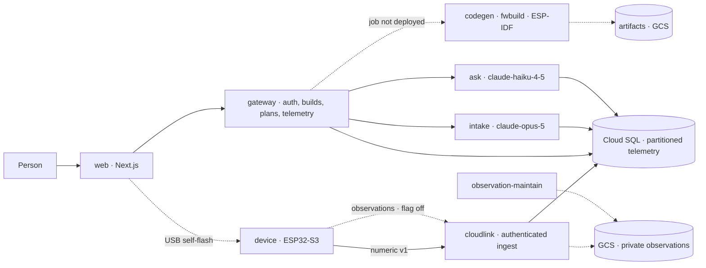

# Albus Forge — Check-in 4

**Battle of the Coasts · Hour 48 · 14 Sep 2026** · Track: **Deep Tech / Physical AI**

**Team:** Albus · **Solo hacker:** Sukrit Dasgupta · **Website:** [albusforge.ai](https://albusforge.ai) · **Code:** [guitarpastdusk/albusforge](https://github.com/guitarpastdusk/albusforge)

> **One question in. A working device out, with a cloud that helps it improve.** Ask "keep my greenhouse soil moist." Albus Forge turns that intent into a checked parts list, a printable enclosure and real firmware, then connects the device to a **sense → detect → reason → act → confirm** loop.

**What changed:** Check-in 3 had a device path that was built but switched off — the production catalogue shipped empty, so asking for a device failed closed at part selection. **This interval opened it.** The registry now describes the hardware sitting on the bench, a plan solves against the real catalogue, and every screen a visitor can reach has something on it. Alongside that, a second sensing modality — **camera observations** — went in end to end behind a disabled flag, and the physical board grew real sensors. **22 PRs merged since `CHECKIN3`; 1,691 automated tests pass in CI**, up from 1,395.

**Snapshot:** `CHECKIN3` (`38c93d0`) → `CHECKIN4` (`e6baa1d`, 14 Sep, 11:53 EDT).

---

## 1. What you can do today

This is the walkthrough a judge can follow, in order. Everything in this section is reachable from [albusforge.ai](https://albusforge.ai).

| Step | What happens | State |
| --- | --- | --- |
| **1 · Ask** | Type "monitor my plant's light and climate" into the chat box. Intake replies with a *specific* clarifying question — power source, battery life — not a generic prompt. The spec builds in front of you with its assumptions listed | **Live** |
| **2 · See the plan** | "Generate plans" now returns a real assembly: Freenove ESP32-S3 host, BME280 climate, BH1750 light, USB-C supply, wired on the `qt-i2c` port. Capability coverage, I²C addresses, connectors, ports and power budget are all checked before it is offered | **Live — newly opened this interval** |
| **3 · Inspect the wiring** | Each example build shows its wiring diagram and the readings it would send. I²C parts daisy-chain on the diagram and loose ends are coloured, so you can see what connects to what | **Live, example builds** |
| **4 · Hold the enclosure** | A 360° viewer with orbit, exploded and parts views | **Live, fixture-backed** |
| **5 · Take the firmware** | Accepted plan → compiled artifact → USB self-flash in the browser. Your Wi-Fi password never leaves your machine | **Merged and tested; compile job not yet deployed** |
| **6 · Watch it** | Device page, fleet list with search, live readings, history | **Live.** Before a device's first packet the page explains what will appear and shows labelled sample readings rather than an empty screen |
| **7 · Ask your data** | "What was the warmest hour yesterday?" — answered from your own stored readings. The number is computed by SQL; the model only classifies the question | **Live** |
| **8 · See what it costs** | Usage dashboard: per-stage tokens, cache hits, exact decimal cost | **Live, labelled an estimate** |

**Sign-in, tenants, workspaces and billing-shaped pricing are all real.** An anonymous build you start before signing in is claimed into your account at first sign-in rather than lost, and the project workspace now links each build to its delivery stage, so a build has a visible position in the pipeline rather than being a dead row.

### No dead ends

A deliberate sweep this interval: **every page a visitor can land on has content, and every stand-in says so.** Marketplace cards open builds; a listing's "Clone build" drops the design into the home page as your ask. The home carousel falls back to labelled example builds on any showcase failure. The camera gallery says observation reads aren't switched on yet rather than showing an error. Build chat surfaces its reconnecting state and offers "Check for a reply" after 30 seconds. `error.tsx` and `not-found.tsx` exist for every dynamic route.

Every one of those stand-ins is listed in [`docs/DEMO-ASSUMPTIONS.md`](../DEMO-ASSUMPTIONS.md) with what would replace it. **That file is the honest centre of this submission** — it names every guessed dimension, every uncalibrated mapping and every compatibility row that asserts a compile which never ran.

## 2. The device on the bench

"Plant A" is a Freenove ESP32-S3-WROOM CAM board — 16 MiB flash, 8 MiB octal PSRAM — sitting next to a plant with three sensors on an I²C bus.

It is **reading live**: ambient light 577.6 lx, air temperature 25.3 °C, pressure 1004.6 hPa, humidity 56.3% RH, Wi-Fi at −58 dBm. Its camera streams, its dashboard serves, and it took an OTA update in 6.25 s. A full 16 MiB recovery image was taken and MD5-verified before anything was changed.

Getting there found two real defects worth naming. **GPIO8 and GPIO9 are camera data pins on this board**, so the sensor bus the existing firmware profile assumed could never have worked — the bus moved to GPIO47/GPIO21 and became a second profile rather than an edit to the first, which stays correct for the DevKitC board. And the GC0308 camera mapped a default gain of 0 to hardware gain zero, producing uniformly black frames; `agc_value: 10` fixed it, confirmed against a decoded 14,088-byte JPEG.

**The boundary, stated plainly:** Plant A runs *ESPHome*, not our firmware, and has not been provisioned to our cloud. The soil sensor at `0x36` is present on the bus but has no driver and no calibration, so it must not be shown as a moisture percentage yet. Five gates — soil driver, reviewed profile, seeded handoff key, staging acceptance, physical soak — stand between this board and production ingestion, and they are written down in [`hardware/freenove/HANDOFF.md`](../../hardware/freenove/HANDOFF.md).

## 3. Value and impact

Our user is a maker, small grower or lab operator with a concrete monitoring need and no appetite for assembling CAD, firmware, electronics and a dashboard separately.

The cost removed this interval is **the blank page**. At Check-in 3 the honest answer to "can I ask for a device?" was *the conversation works, but the plan will fail closed.* Now the ask produces a plan made of parts that exist, on a board we own, with wiring you can look at. That is the difference between a demo of components and a product someone can walk through.

Two properties we hold onto because they are what makes this trustworthy rather than merely impressive:

- **No number is invented.** The firmware's wire encoder validates every channel key and range, and any value a driver could not actually measure is declared `synthetic:<channel>` in the packet's health field. No driver fabricates a reading. In the cloud, every figure a user sees is computed by SQL; the model classifies the question and never produces the value.
- **Secrets stay where they belong.** Device credentials are 256-bit tokens stored only as hashes, handed over once inside a 10-minute AES-256-GCM envelope bound to the requesting session. Flashing happens on the owner's machine, so the cloud never sees their Wi-Fi password.

**The proposed business model is a hardware/build transaction plus recurring cloud operation.** The pricing page now shows kits and cloud plans — labelled introductory and not billed. We have no customers and no revenue; willingness to pay remains a hypothesis.

<!-- pagebreak -->

## 4. Innovation: the plan is the contract, and the catalogue is now real

The differentiator remains one versioned part model feeding every stage. What this interval added is that **the contract now binds against hardware that physically exists.**

Opening the path was not a matter of flipping a switch. The twelve original parts were already loaded into `registry.parts` at `1.0.0` as drafts, and the loader treats `(id, version)` as immutable — editing a part in place would throw and roll back the entire deploy. So promotion happens by **adding a version beside the old one**: `V-005@1.1.0` active alongside `V-005@1.0.0` draft. Parts can now carry several versions, and the compat matrix gained a file-based seed it never had.

The identity chain is unchanged and still checked three times by three components that do not trust each other: a build plan carries an `input_digest` over its canonicalised spec, runtime and evidence, with a partial unique index enforcing **one accepted plan per spec version**; the compiler accepts only that exact tuple and writes `hsx-profile.h` from the validated candidate, so board identity can never come from a plan string; and the device refuses to boot unless its flashed configuration matches the `build_id`, `plan_version` and `code_version` compiled into the image.

**New this interval: a second modality.** Camera observations run the same contract end to end — shared capability contracts, private handoff, create-only immutable storage generations, a 15-minute capture cadence, durable SD spooling with ownership binding across reprovisioning, bounded reconciliation and durable deletion. It ships **disabled by flag** with its buckets, IAM, jobs and alerts defined but switched off.

**Build loop.** ask → spec **[live]** → checked plan **[live]** → firmware compile **[merged, job not deployed]** → self-flash **[merged, tested]** → enclosure **[local spike]** → physical validation **[pending]**.
**Operating loop.** device → authenticated ingest **[live]** → storage, rollups, retention **[live]** → fleet, latest and history **[live]** → Ask over your own readings **[live]** → confirmed rule → device action **[not built]**.

## 5. Technical implementation

Solid arrows are deployed and serving production traffic. Dotted arrows are merged and tested in software, behind a flag or missing deployment.

| Component | Working evidence | Boundary |
| --- | --- | --- |
| **Registry and catalogue** | 18 part versions, 6 active, 7 connectors. New `C-002` Freenove host and `P-006` STEMMA soil sensor; `stemma-i2c-ph-4pin-v1` connector; multi-version layout; compat matrix seeded from file | Compat rows are **asserted, not compiled** — CI generation does not exist yet. `footprint.step` files are placeholder bounding boxes, not models |
| **Build plans** | `assembly-profiles.json` and `provisioning-profiles.json` ship populated; a plan solves for real against the shipped catalogue rather than a fixture | Browser-supplied solver inputs are still refused; accepting a historical spec is still refused |
| **Numeric firmware runtime** | Shared I²C master, BH1750, a real BME280 driver with datasheet fixed-point compensation verified against the reference vector, and an Adafruit seesaw soil driver. Multi-sensor packets | Soil publishes raw counts — no calibration. No physical board has run *this* firmware |
| **Camera / observations** | Contracts, migrations 0008–0010, create-only storage generations, ingestion with replay and quota handling, bounded maintenance, native ESP-IDF capture candidate, portal surfaces | **Disabled by flag.** Staging GCS/IAM acceptance, deployed job execution and the 24-hour soak (96 captures) are unrun |
| **Conversation and Ask** | Intake live with advisory locking, scope refusal without a model call, 2-round cap, metered cost. Ask answers only from stored readings | Production intake has had no real load |
| **Telemetry platform** | Daily partitions, in-transaction dirty markers, minute/hour rollups, 90-day retention, fleet/latest/series APIs | Gateway SSE telemetry endpoint still `501`; marketplace remix still `501` |

## 6. Cloud infrastructure

Both environments run Cloud Run services and jobs from Terraform, images owned by CI and promoted by digest — never rebuilt for production. This interval added the **`observation-maintain`** worker and the **`fwbuild`** deploy and promote workflows, taking the repository to **20 workflows** and **8 CI jobs**.

- **Storage.** Readings partitioned daily by UTC; a statement-level trigger marks dirty hours in the same transaction; the rollup job claims markers `FOR UPDATE SKIP LOCKED` and recomputes by replacement. Raw data kept 90 days behind a monotonic watermark. Observation objects are create-only with immutable generations and durable deletion.
- **Edge.** Cloud Armor rate-limits ingest on malformed bearers (60/min/IP) and per credential (120/min). Load-balancer request logging is deliberately off so bearer tokens are never written to logs.
- **Observability.** Alert policies per environment now cover upload backlog, lease and stale-camera conditions and compiler health alongside the existing SQL, heartbeat, 5xx and LLM-spend policies.
- **Governance.** `infra/env` is applied by hand, by exactly one coordinator at a time — a rule added after two agents applied the same state on non-conflicting instructions.

**Not proven:** observation infrastructure has never been activated; the `fwbuild` job has workflows but no completed production deployment; daily maintenance has not been observed firing on schedule; there is no sustained-load certification.

## 7. Quality

| Suite | Passing | Δ since Check-in 3 |
| --- | ---: | ---: |
| Web | 823 | +152 |
| Gateway | 351 | +31 |
| Registry | 125 | — |
| Intake | 108 | — |
| Cloudlink | 74 | +51 |
| Matcher | 60 | — |
| LLM | 32 | — |
| Observation-maintain | 29 | **new** |
| Ask | 28 | — |
| Database | 23 | +1 |
| Codegen | 20 | +14 |
| Storage | 17 | **new** |
| Firmware encoder | 1 | — |
| **Total** | **1,691** | **+296** |

Plus browser journeys against a real Chromium, a real gateway binary and disposable PostgreSQL with real migrations; delivery checks for freshness, provenance and ordered promotion; and the local CAD suite, unchanged at 132 tests and **still zero physical measurements**.

Two CI reliability fixes are worth noting because they were the *right* fix rather than a weakened assertion: tests that asserted "the product is switched off" were rewritten to assert the new invariant, keeping the safety property — the build-plan test still rejects browser-supplied solver inputs, and provisioning is still refused without paired secret configuration. Inventory assertions now derive expectations from the registry instead of hard-coding twelve parts.

## 8. What judges can inspect now

1. **[albusforge.ai](https://albusforge.ai)** — ask for a device, get a real plan from the real catalogue, look at the wiring, walk the pages and find no dead ends.
2. **[`/v1/parts`](https://albusforge.ai/v1/parts)** — the promoted catalogue in production, including `C-002` and `P-006`.
3. **[`docs/DEMO-ASSUMPTIONS.md`](../DEMO-ASSUMPTIONS.md)** — every guess, mock and estimate in the demo, with what replaces it. Read this before quoting any registry number as fact.
4. **[`hardware/freenove/`](../../hardware/freenove/)** — the board that is genuinely running, its evidence, and the five gates before it may touch production.

## 9. Next: put our firmware on our board, then close the loop

**Flash our own firmware on Plant A** and land one authenticated reading from it in production. That single journey converts every "merged and tested" claim above into a physical one. It needs the `0x36` soil driver with real dry/wet calibration, the `fwbuild` job deployed, and the handoff keyring configured.

**Activate observations on staging** — GCS/IAM acceptance, deployed maintenance execution, then the 24-hour soak at 96 scheduled captures.

**Close the loop.** Implement the gateway telemetry stream so `live` is live against production, wire the confirmed-rule backend to a device acknowledgment, and demonstrate one person-approved action followed by the reading that confirms its effect.

**And print one enclosure.** The CAD spike still has zero physical measurements; ≥90% first-print fit remains a target, not a result.

*Prepared against the Team Playbook's four judging categories: innovation 30%, implementation 25%, impact 25%, communication 20%. Claims describe the captured build, not the promised finished product.*
