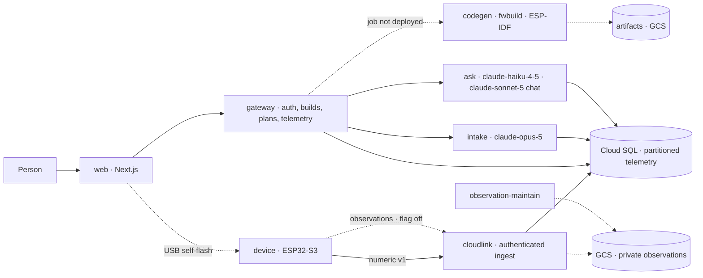

# Albus Forge — Check-in 5

**Battle of the Coasts · Hour 60 · 15 Sep 2026** · Track: **Deep Tech / Physical AI**

**Team:** Albus · **Solo hacker:** Sukrit Dasgupta · **Website:** [albusforge.ai](https://albusforge.ai) · **Code:** [guitarpastdusk/albusforge](https://github.com/guitarpastdusk/albusforge)

> **One question in. A working device out, with a cloud that helps it improve.** Ask "keep my greenhouse soil moist." Albus Forge turns that intent into a checked parts list, a printable enclosure and real firmware, then connects the device to a **sense → detect → reason → act → confirm** loop.

**What changed:** Check-in 4 opened the ask-to-device path. **This interval made it survive contact with production.** The build chat had been answering *"Sorry, could you say that another way?"* to four of the six turns it had ever served — every one of them an infrastructure failure wearing a user's-fault apology. Finding out why exposed a cold-start defect that affects every model-calling service, and fixing it properly took a retry stack, a measurement, and two corrections to my own first attempt. Alongside that, the device page became readable at a glance and the setup page learned to draw the board you actually have. **8 PRs merged since `CHECKIN4`; 1,802 automated tests pass in CI**, up from 1,691.

**Snapshot:** `CHECKIN4` (`e6baa1d`) → `CHECKIN5` (`3f28329`, 15 Sep, 00:24 EDT).

---

## 1. What you can do today

Everything in this section is reachable from [albusforge.ai](https://albusforge.ai) and running the image that is in production as this is written.

| Step | What happens | State |
| --- | --- | --- |
| **1 · Ask** | Type "monitor my plant's light and climate". Intake asks **one** question at a time, and where the answers are a small closed set it offers them as taps rather than making you type prose | **Live — reworked this interval** |
| **2 · See the plan** | A real assembly against the shipped catalogue: Freenove ESP32-S3 host, BME280 climate, BH1750 light, USB-C supply, checked for coverage, addresses, connectors and power | **Live** |
| **3 · Inspect the wiring** | Example builds show their wiring. The **setup page now draws the board you were actually provisioned**, from its assembly profile rather than an example pin map | **Live — new this interval** |
| **4 · Hold the enclosure** | A 360° viewer with orbit, exploded and parts views | **Live, fixture-backed** |
| **5 · Take the firmware** | Accepted plan → compiled artifact → USB self-flash in the browser | **Merged and tested; compile job not yet deployed** |
| **6 · Watch it** | Device page, fleet search, live readings, history. **Every channel is plotted at once**, one small multiple each, over one shared window — no more picking one channel and remembering the last | **Live — new this interval** |
| **7 · Ask your data** | "What was the warmest hour yesterday?" — computed by SQL, the model only classifies. Beside it, a **written conversation about the device** that runs real queries against your readings | **Live — the conversation shipped this interval** |
| **8 · See what it costs** | Usage dashboard: per-stage tokens, cache hits, exact decimal cost | **Live, labelled an estimate** |

## 2. The interval's real work: making the conversation trustworthy

A user reported the landing-page chat replying *"Sorry, could you say that another way?"*. That sentence was wrong twice over — it was our failure, and it asked the person to rework a message that was fine. The production log showed it was not rare: **four of the six turns intake had ever answered** ended that way.

**The cause.** A cold Cloud Run instance passes its TCP startup probe as soon as its port opens, but the NAT-translated route to the public internet is not usable for tens of seconds after that. Private-range traffic already is — so the database answers while `api.anthropic.com` does not. Every turn arriving in that window died on a connection error that carried no status, no request id and no message our diagnostics kept.

**The diagnostics were blind, and that was our bug too.** The Anthropic SDK's error classes do not set `name`, so every failure logged as `"Error"`; the request id was read from `request_id` where the SDK writes `requestID`, so it had never once been captured; the transport's own cause code was not recorded at all. The test that covered this asserted error shapes the SDK does not produce, which is why it stayed hidden. All three are fixed, with a test that uses real shapes.

**The first fix was wrong, and production said so.** A readiness gate that waited for the API before listening shipped in #102. Its first cold start on staging timed out for its whole 28-second budget and served anyway — so it prevented nothing and cost every cold start 28 seconds. #104 replaced it with a measurement that runs *after* listening and never blocks. That produced the number nobody had:

| Service | Cold-start window before the model API is reachable |
| --- | ---: |
| intake | 38.2 s |
| ask | 28.8 s · 26.4 s · 41.9 s |

It is not a constant. It ranges from **26 to 42 seconds**, always ending `ETIMEDOUT`, which is precisely why a tuned timeout was the wrong instrument.

**What protects a message now** is depth rather than a guess: transport retries inside the model wrapper (1 s, 3 s, 6 s — the SDK's own three attempts all land inside two seconds, far too fast to outlast this); a new `may_retry` contract where intake hands a transient failure back as a 503 with **nothing written**, so gateway's retry can answer the message properly instead of a fallback occupying its only reply slot; and a portal that chases a late reply itself at 30 s, 30 s and 60 s — each a refetch, never a resend — before it says anything. Together that is over two minutes of cover against a window measured in tens of seconds.

**And the copy tells the truth.** The fallback now says the failure was ours and never asks anyone to rephrase, because rephrasing cannot help and sends a person round the same loop believing it was their fault.

**Scope control shipped with it.** `SpecTurn` gained a `reply_kind`, so a message that is not about building a device is answered by code rather than by whatever the model felt like saying — no spec version written, no clarification round spent, and a second stray message closes the exchange rather than repeating the invitation.

## 3. Value and impact

Our user is a maker, small grower or lab operator with a concrete monitoring need and no appetite for assembling CAD, firmware, electronics and a dashboard separately.

The cost removed this interval is **doubt**. A demo that answers "could you say that another way?" to a perfectly good sentence does not read as a rough edge; it reads as a system that does not work. The same is true of a device page that shows one channel behind a picker when the question is "how do these two relate?", and of a setup page that draws an example board rather than yours.

Two properties we hold onto, unchanged and now better defended:

- **No number is invented.** Every figure a user sees is computed by SQL; the model classifies or writes, never produces the value. The device conversation runs real queries and shows them.
- **A failure is never silently a user's fault.** The honest-failure work above is a product property, not a bug fix — the system now distinguishes "we failed" from "I did not understand you" and says which.

**The proposed business model is a hardware/build transaction plus recurring cloud operation.** Pricing shows kits and cloud plans, labelled introductory and not billed. We have no customers and no revenue.

<!-- pagebreak -->

## 4. Innovation: the contract held while four services changed under it

The differentiator remains one versioned part model feeding every stage. What this interval tested is whether that contract survives **concurrent change** — two agents editing the same intake prompt, the same reply constants and the same new wiring helper within an hour of each other.

It did, and the mechanism is worth naming: the prompt is a **versioned file**, not a string literal, so a behaviour change is a new file and a route-name change (`intake.extract.v1` → `v2`) and the cache hash moves with it. Two independent changes to how intake asks questions — one adding scope control, one making it ask one question at a time with tappable answers — merged into a coherent `extract.v2.md` because neither could silently edit the other's text in place.

The identity chain is unchanged and still checked three times by components that do not trust each other: `input_digest` over the canonicalised spec with one accepted plan per spec version; a compiler that accepts only that exact tuple; a device that refuses to boot unless its flashed configuration matches the `build_id`, `plan_version` and `code_version` compiled into its image.

**Build loop.** ask → spec **[live]** → checked plan **[live]** → firmware compile **[merged, job not deployed]** → self-flash **[merged, tested]** → enclosure **[local spike]** → physical validation **[pending]**.
**Operating loop.** device → authenticated ingest **[live]** → storage, rollups, retention **[live]** → fleet, latest and history **[live]** → Ask and converse over your own readings **[live]** → confirmed rule → device action **[not built]**.

## 5. Technical implementation

Solid arrows are deployed and serving production traffic. Dotted arrows are merged and tested in software, behind a flag or missing deployment.

| Component | Working evidence | Boundary |
| --- | --- | --- |
| **Conversation** | Verified end to end in production with a real message: a greenhouse ask returned a specific spec with its assumptions listed. One question per turn, up to four rounds, tappable answers where the set is closed. Off-topic messages answered by code, not the model | Production intake has still seen only light traffic. The one-question rework and scope control have not met a stranger |
| **Model reliability** | Transport retries, the `may_retry` 503 hand-back, and the portal's 30/30/60 chase. Cold-start window measured at 26–42 s across four production instances | **`ask` has none of it.** Its chat provider runs `maxRetries: 0` and does not use the shared wrapper, so a cold instance loses that conversation outright — papered over with a warm instance, not fixed |
| **Device conversation** | Sonnet-backed chat beside the plots, running real queries against stored readings, with the queries shown | Reached production having **never run in any other environment**; staging has the image with the flag off |
| **Device page** | Every channel plotted at once, one small multiple each, colours validated for CVD separation and contrast; a failing channel degrades inside its own card | Series are fetched one request per channel — the page fans out where one query would do |
| **Setup page** | Draws the provisioned device's own wiring, and the bench device's layout | New; two PRs an hour apart both editing the same new helper |
| **Registry and catalogue** | 18 part versions, 6 active, 7 connectors; multi-version layout; compat matrix seeded from file | Compat rows are **asserted, not compiled**. `footprint.step` files are placeholder bounding boxes |
| **Telemetry platform** | Daily partitions, in-transaction dirty markers, minute/hour rollups, 90-day retention, fleet/latest/series APIs | Gateway SSE telemetry endpoint still `501`; marketplace remix still `501` |

## 6. Cloud infrastructure

Both environments run Cloud Run services and jobs from Terraform, images owned by CI and promoted by digest — never rebuilt for production. **20 workflows, 8 CI jobs**, unchanged in count.

Everything merged this interval is deployed: prod matches staging digest-for-digest across gateway, intake, web, ask and cloudlink, verified by reading the live services rather than trusting a workflow's exit status.

**A structural defect found while deploying, worth more than the deploy.** Only **three of eight** `deploy-*` workflows fire on push — gateway, intake and web. `ask`, `cloudlink`, `fwbuild`, `telemetry` and `observation-maintain` are dispatch-only. That is why the device conversation shipped its UI in #101 with **no backend behind it**: nothing built `apps/ask`, and nothing said so. It was found by a user hitting the error, not by CI. The other four happen to be current only because nobody has changed them.

- **Storage, edge and observability** are unchanged from Check-in 4.
- **Governance.** `infra/env` is applied by hand by one coordinator at a time. Two production settings were set directly on Cloud Run this interval — the device-chat flag and a warm `ask` instance — and **both will be reverted by the next `terraform apply`** until they are written into `rollout-prod.tfvars.json`. They are recorded here because an undocumented manual change is how an environment stops matching its code.

**Not proven:** observation infrastructure has never been activated; the `fwbuild` job has workflows but no completed production deployment; there is no sustained-load certification; `llm_calls.cost_usd` is currently **inflated** because `response.model` arrives null and every call prices at the unknown-model ceiling.

## 7. Quality

| Suite | Passing | Δ since Check-in 4 |
| --- | ---: | ---: |
| Web | 862 | +39 |
| Gateway | 366 | +15 |
| Registry | 125 | — |
| Intake | 116 | +8 |
| Cloudlink | 74 | — |
| Matcher | 60 | — |
| Ask | 58 | +30 |
| LLM | 51 | +19 |
| Observation-maintain | 29 | — |
| Database | 23 | — |
| Codegen | 20 | — |
| Storage | 17 | — |
| Firmware encoder | 1 | — |
| **Total** | **1,802** | **+111** |

Per-suite totals are the CI runner's own, from run [34928703846](https://github.com/guitarpastdusk/albusforge/actions/runs/34928703846) on `3f28329`. Plus browser journeys against a real Chromium, a real gateway binary and disposable PostgreSQL with real migrations; and the local CAD suite, unchanged at 132 tests and **still zero physical measurements**.

**Three defects this interval were found by a reviewer or by production, not by the suite**, and each one's fix included the test that would have caught it:

- A hand-written route lambda dropped the `may_retry` argument, making the whole retry contract **dead code in the deployed service** while every test passed — because the tests called the handler directly rather than through the route. The handler now comes from a typed factory with no call site to drop an argument, and the regression runs through the real route against a real database. The previous suite passed 112/112 with the defect present; that was verified by stashing the fix.
- The egress probe's budget was wall-clock only, so a caller whose `sleep` returned early looped until the process ended. Now bounded by intended backoff as well.
- The SDK-error test asserted shapes the SDK does not produce, hiding two broken diagnostic fields.

## 8. What judges can inspect now

1. **[albusforge.ai](https://albusforge.ai)** — ask for a device and watch it ask you one thing at a time; open a device page and read every channel at once.
2. **[`docs/DEMO-ASSUMPTIONS.md`](../DEMO-ASSUMPTIONS.md)** — every guess, mock and estimate, with what replaces it. Read this before quoting any registry number as fact.
3. **[`docs/ASK-TO-ENCLOSURE.md`](../ASK-TO-ENCLOSURE.md) §3** — the turn contract, including the retry and hand-back rules written down as a contract rather than as behaviour.
4. **[`hardware/freenove/`](../../hardware/freenove/)** — the board that is genuinely running, and the five gates before it may touch production.

## 9. Next

**Give `ask` the reliability intake now has.** Its device conversation is the newest user-facing surface and the least protected one; a warm instance hides the problem rather than solving it.

**Make every service deploy on push,** or make the absence loud. A UI shipping without its backend should be impossible to do quietly.

**Flash our own firmware on Plant A** and land one authenticated reading in production — the journey that converts every "merged and tested" claim into a physical one.

**Close the loop.** Gateway telemetry stream, confirmed-rule backend, one person-approved action and the reading that confirms its effect.

**And print one enclosure.** ≥90% first-print fit remains a target, not a result.

*Prepared against the Team Playbook's four judging categories: innovation 30%, implementation 25%, impact 25%, communication 20%. Claims describe the captured build, not the promised finished product.*
